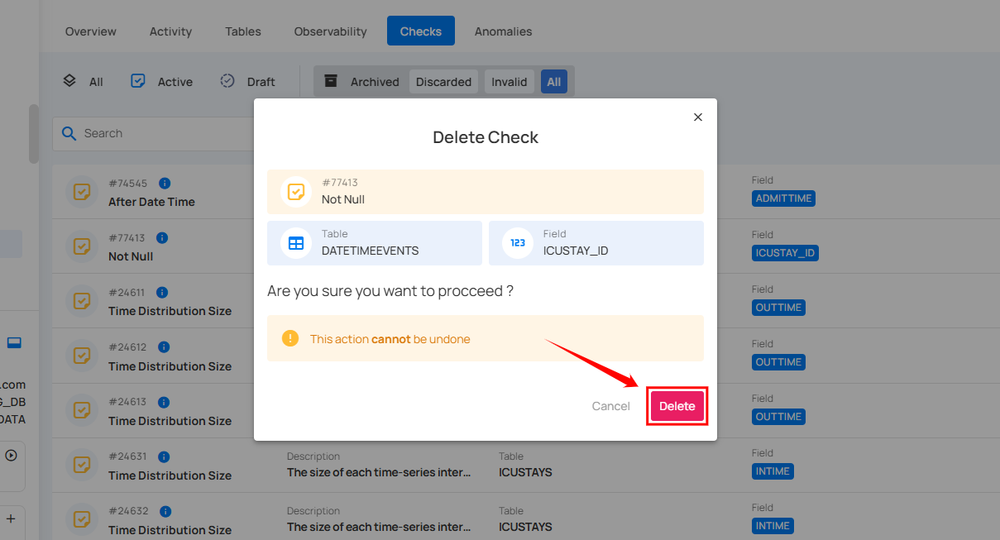
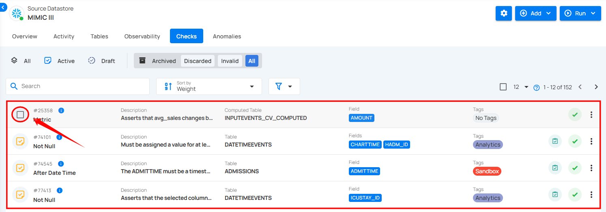
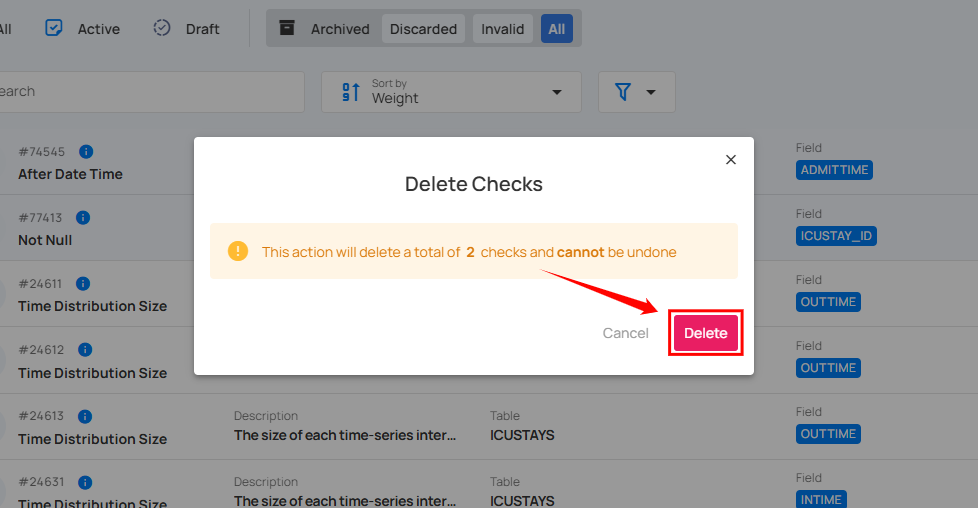

# Delete Checks

There are two methods for deleting checks: you can either delete individual checks or delete multiple checks in bulk.

!!! note 
       You can only delete archived checks. If you want to delete an active or draft check, you must first move it to the archive, and then you can delete it.

!!! warning 
       Deleting a check is a one-time action. It cannot be restored after deletion.

## Method I. Delete Specific Check

**Step 1:** Click **Archived** from the **navigation bar** in the **Checks** section to view all archived checks.

**Step 2:** Locate the check that you want to delete and click the **vertical ellipsis (⋮)** and select **Delete** from the dropdown menu.

For demonstration purposes, we have selected the **"Contains Email"** check.

**Step 3:** A confirmation modal window will appear. Click the **Delete** button to permanently remove the check from the system.

After clicking the **Delete** button, your check is successfully deleted, and a success message will appear on the screen.

## Method II. Delete Checks in Bulk

You can permanently delete multiple checks from the system in one action. This process is irreversible, so it should be used when you are certain that the checks are no longer needed.

**Step 1:** Hover over the archived checks and click the checkbox to select checks in bulk.  

When multiple checks are selected, an action toolbar appears, displaying the total number of selected checks along with a vertical ellipsis for additional bulk action options.

**Step 2:** Click the **vertical ellipsis (⋮)** and choose **"Delete"** from the dropdown menu to delete the selected checks.  

**Step 3:** A confirmation modal window will appear. Click the **"Delete"** button to permanently delete the selected checks.

After clicking the **Delete** button, your selected checks will be permanently deleted, and a success message will appear on the screen.