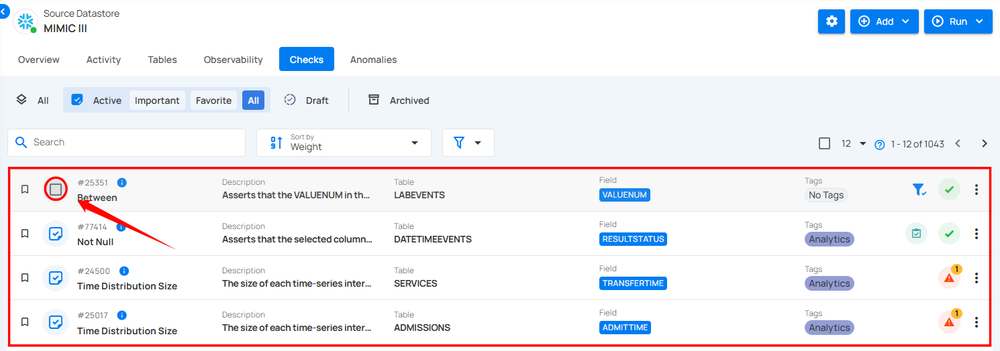
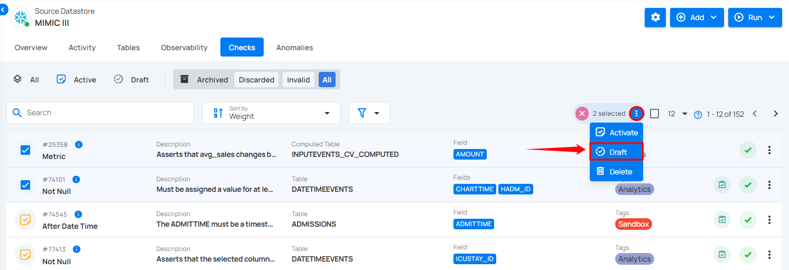

# Draft Archived Checks

You can draft archived checks individually or in bulk.

## Method I: Draft Specific Check

**Step 1:** Navigate to the **Archived** checks section. Click the vertical ellipsis (⋮) next to the archived check you want to move to the draft state, and select **"Draft"** from the dropdown menu.

For demonstration purposes, we have selected the **"Not Null"** check.

After clicking **"Draft"**, the check will be successfully moved to the draft state, and a success message will appear on the screen.

## Method II: Draft Archived Checks in Bulk

**Step 1:** Hover over the archived checks and click the checkbox to select multiple checks in bulk.

When multiple checks are selected, an action toolbar appears, displaying the total number of checks chosen along with a vertical ellipsis for additional bulk action options.

**Step 2:** Click the vertical ellipsis (⋮) and select **"Draft"** from the dropdown menu to move archived checks to the draft state.

**Step 3:** A confirmation modal window **"Bulk Update Checks to Draft"** will appear. Click the **"Update"** button to move the selected archived checks to draft.

After clicking the **"Update"** button, your archived checks will be moved to draft, and a success message will appear on the screen.