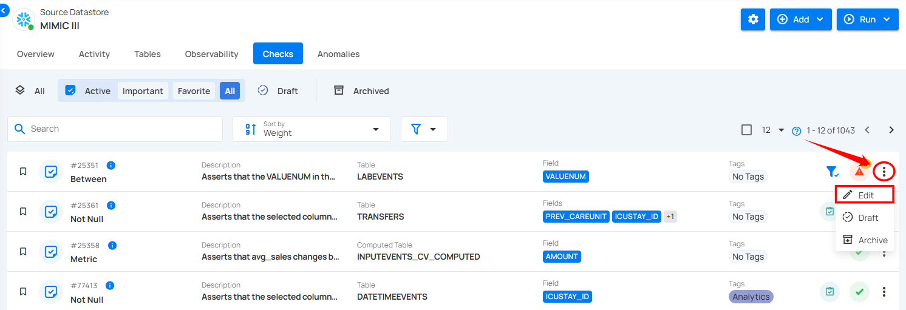
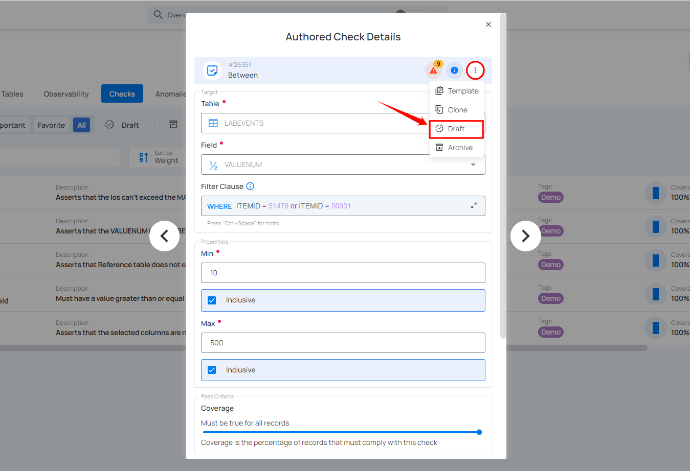
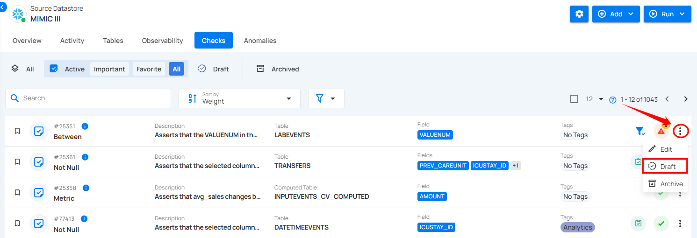
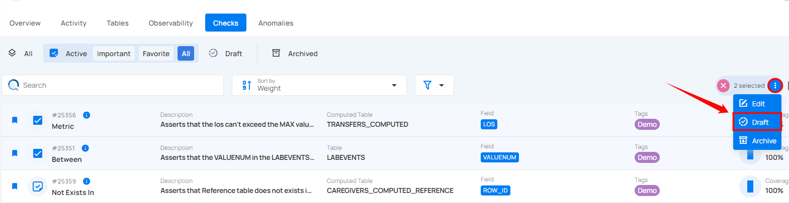
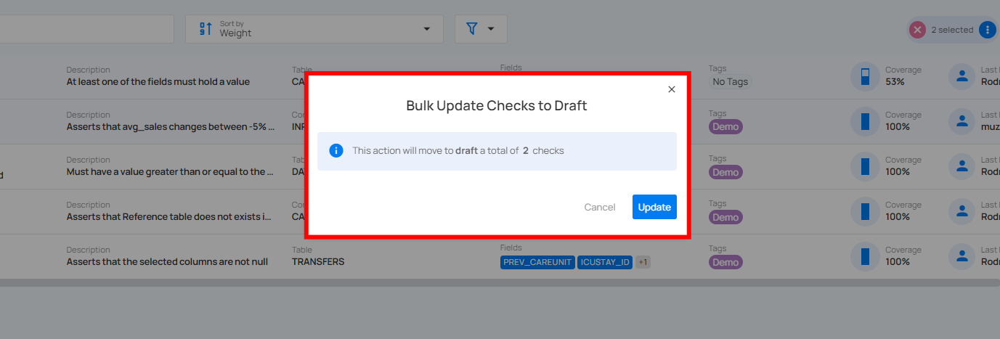
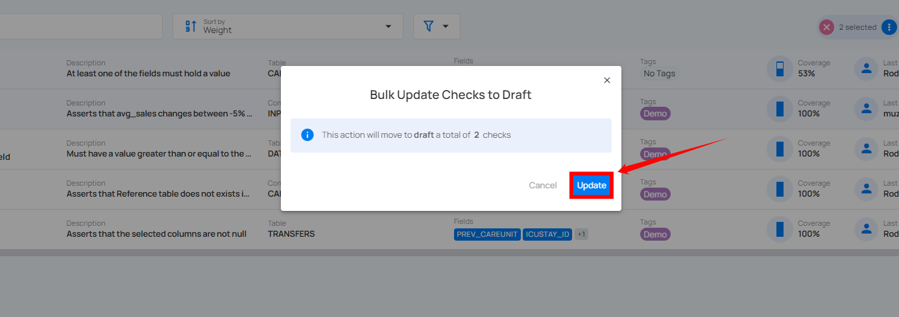

# Draft Checks

There are two methods from which you can move your active check to draft: you can either draft specific checks or draft multiple checks in bulk.

## Method I: Draft Specific Check

**Step 1:** Click on the vertical ellipsis (⋮) next to the active check you want to move to the draft state, and select Edit from the drop-down menu.

For Demonstration purposes, we have selected the **"Between"** check.

**Step 2:** A modal window will appear displaying the check details. Click on the **vertical ellipsis (⋮)** located in the upper-right corner of the modal window, and select **"Draft"** from the drop-down menu.

After clicking **Draft**, the selected item will move to the draft state, and a success message will appear on the screen.

Alternatively, you can move an active check to the draft state by clicking the **vertical ellipsis (⋮)** next to the check and select **“Draft”** from the drop-down menu.

## Method II. Draft Checks in Bulk

You can move multiple checks into the draft state in one action, allowing you to pause or make adjustments to several checks without affecting your active validation process.

**Step 1:** Hover over the active checks and click on the checkbox to select multiple checks.

**Step 2:** Click on the vertical ellipsis **(⋮)** and select **"Draft"** from the drop-down menu to move active checks to the draft state.

A confirmation modal window titled **"Bulk Update Checks to Draft"** will appear, indicating the number of checks being moved to draft. 

**Step 3:** Click the **"Update"** button to move the selected active checks to draft.

After clicking the **Update** button, your selected checks will be moved to draft, and a success message will appear on the screen.