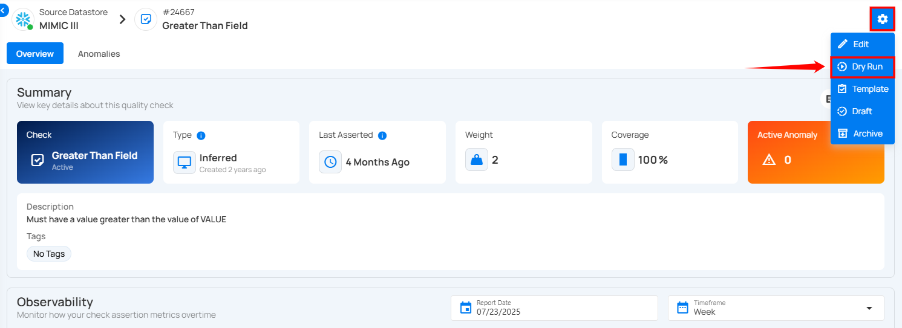
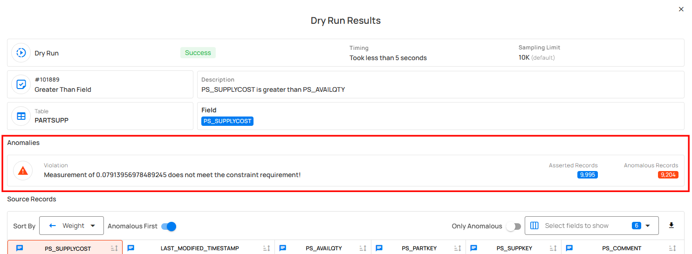
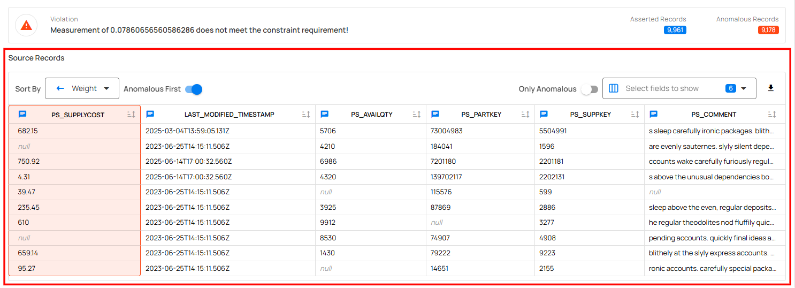
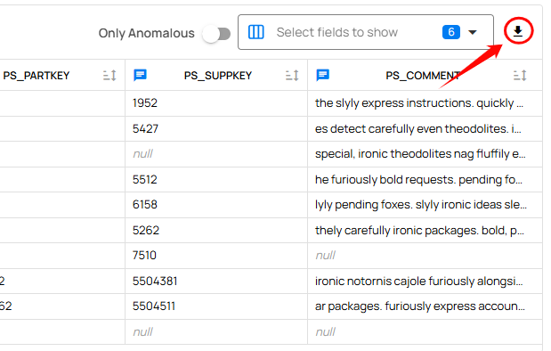

# Dry Run

**Step 1:** Click on the specific check you want to test using the Dry Run feature.

**Step 2:** Click on the **Settings** icon located at the top-right corner of the interface and select **“Dry Run”** from the drop-down menu.

A modal window titled **Dry Run Results** will appear.

This window enables you to confidently evaluate and refine data quality checks before running full scans, helping maintain high-quality standards without unnecessary noise or misconfiguration.

| No. | Field | Description |
| :---- | :---- | :---- |
| **1** | **Status** | Indicates whether the dry run completed successfully. |
| **2** | **Timing** | Displays the total time taken to execute the dry run. |
| **3** | **Sampling Limit** | Shows the number of records sampled during the dry run (default is 10K records). |
| **4** | **Check ID and Name** | The unique identifier and name of the data quality check. This provides both a reference ID and a descriptive label indicating the rule type. |
| **5** | **Description** | A concise explanation of the check rule being tested. For example, “PS_SUPPLYCOST is greater than PS_AVAILQTY.” |
| **6** | **Table** | The name of the table on which the check is being applied. |
| **7** | **Field** | The specific column or field within the table that the rule targets. |

## Anomalies

Highlights any violations detected during the dry run, such as constraint breaches or unexpected value patterns.

| No. | Field | Description |
| :---- | :---- | :---- |
| **1** | **Violation** | Clearly states the reason for failure. This message helps users quickly understand what went wrong and why the data didn't pass the quality check. |
| **2** | **Asserted Records** | Displays the total number of records evaluated in the dry run. |
| **3** | **Anomalous Records** | Shows how many of those records violated the constraint logic. |

## Source Records

The **Source Records** section presents a detailed, tabular view of all records that were evaluated by the selected quality check. This section is designed to help users investigate the underlying data issues that may have led to anomalies, offering clear visibility into the records that failed to meet the defined constraint.

### Sort Options

Users can sort the records based on different fields using the **Sort By** drop-down.

| No. | Sort By | Description |
| :---- | :---- | :---- |
| **1** | **Name** | Sorts the records alphabetically based on the field name. |
| **2** | **Weight** | Sorts records based on the weight or severity of the failure. Higher-weighted issues appear first. |
| **3** | **Quality Score** | Sorts records by their quality score, helping you prioritize records with the lowest data quality. |

### Download Source Records

The Download Source Records option allows users to export the records evaluated during the Dry Run process for further offline analysis or documentation purposes. A file containing the asserted records and their anomaly status will be downloaded in a CSV format.

!!! note
    When no issues are detected, users receive a clear confirmation message indicating no anomalies were identified.

!!! info
    You can perform a Dry Run on draft checks to validate the logic before they are finalized and published.