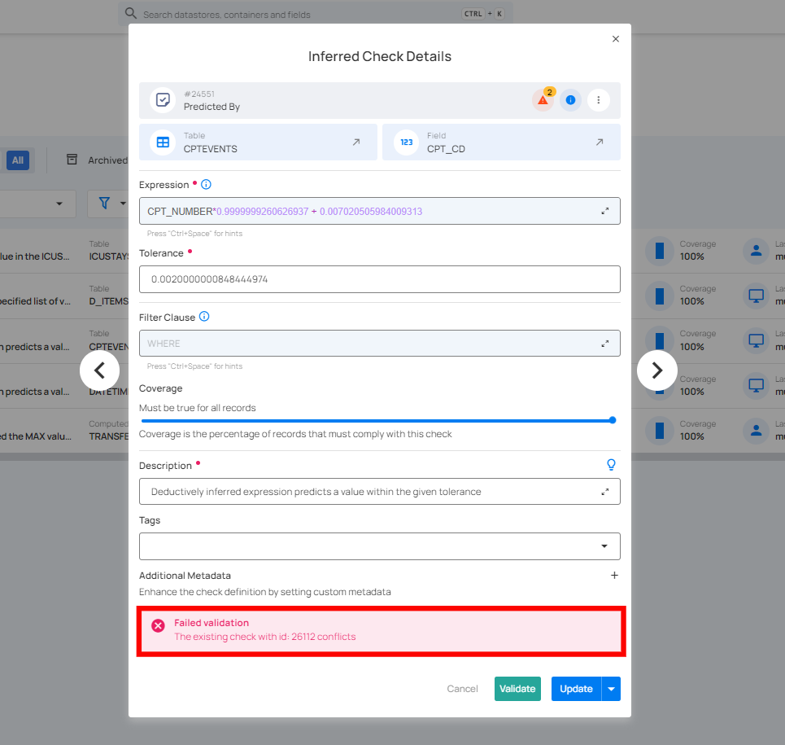

# Edit Check

There are two methods for editing checks: you can either edit specific checks or edit multiple checks in bulk.

!!! note 
       When editing multiple checks in bulk, only the filter clause and tags can be modified. 

## Method I. Edit Specific Check

**Step 1:** Click on the vertical ellipsis (⋮) next to the check you want to edit, whether it is an active or draft check and select **Edit** from the drop-down menu.

For Demonstration purposes, we have selected the **"Between"** check.

A modal window will appear with the check details. 

**Step 2:** Modify the [check details](https://userguide.qualytics.io/checks/checks-template/#:~:text=Enter%20the%20following%20details%20to%20add%20the%20check%20template%3A) as needed based on your preferences.

**Step 3:** Once you have edited the check details, then click on the **Validate** button. This will perform a validation operation on the check without saving it. The validation allows you to verify that the logic and parameters defined for the check are correct.

If the validation is successful, a green message saying **"Validation Successful"** will appear. 

If the validation fails, a red message saying **"Failed Validation"** will appear. This typically occurs when the check logic or parameters do not match the data properly.

**Step 4:** Once you have a successful validation, click the **"Update"** button. The system will update the changes you've made to the check, including changes to the fields, filter clause, coverage, description, tags, or metadata.

After clicking on the **Update** button, your check is successfully updated and a success message will appear on the screen.

## Method II. Edit Checks in Bulk

You can easily apply changes to multiple checks at once, saving time by editing several checks simultaneously without having to modify each one individually.

**Step 1:** Hover over the checks (whether Active or Draft) and click on the checkbox to select multiple checks.

When multiple checks are selected, an action toolbar appears, displaying the total number of selected checks along with a vertical ellipsis for additional bulk action options.

**Step 2:** Click on the vertical ellipsis **(⋮)** and select **"Edit"** from the drop-down menu to make changes to the selected checks.

**Step 3:** A modal window titled **"Bulk Edit Checks"** will appear. Here you can only modify the **"filter clause"**, **"tags"**, and **"metadata"** of the selected checks.

**Step 4:** Toggle on the options (Filter Clause, Tags or Additional Metadata) that you want to modify for the selected checks, and make the necessary changes.

!!! note
       This action will overwrite the existing data for the selected checks.

**Step 5:** Once you have made the changes, click on the **"Save"** button.

After clicking the **"Save"** button, your selected checks will be updated with the new changes and a success message will appear on the screen.