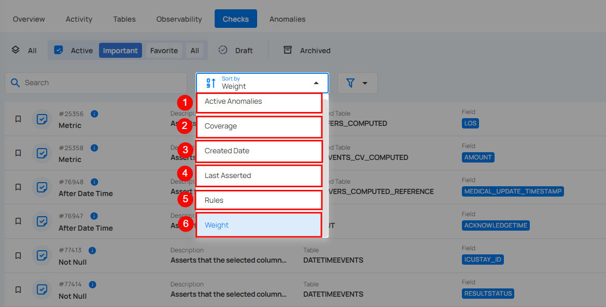
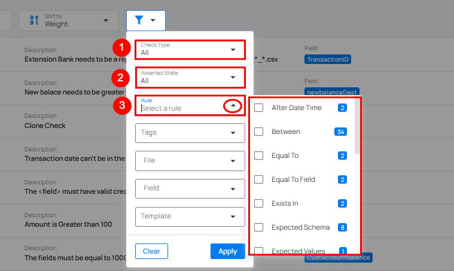

# Filter and Sort

You can easily organize your checks using the available sort and filter options.

## Sort

You can sort your checks by **Active Anomalies**, **Coverage**, **Created Date**, **Last Asserted**, **Rules**, and **Weight** to easily organize and prioritize them according to your needs.

| No  | Sort By Option | Description |
| :---- | :---- | :---- |
| **1** | **Active Anomalies** | Sort checks based on the number of active anomalies. |
| **2** | **Coverage** | Sort checks by data coverage percentage. |
| **3** | **Created Date** | Sort checks according to the date they were created. |
| **4** | **Last Asserted** | Sorts by the last time the check was executed. |
| **5** | **Rules** | Sort checks based on specific rules applied to the checks. |
| **6** | **Weight** | Sort checks by their assigned weight or importance level. |

Whatever sorting option is selected, you can arrange the data either in ascending or descending order by clicking the caret button next to the selected sorting criteria.

## Filter

You can filter your checks based on values like **Check Type**, **Asserted State**, **Rule**, **Tags**, **Table**, **Field**, and **Template**.



|No     |     Filter  |   Filter Value  |  Description|
| :---- |  :----       |  :----         |  :----      |
| **1** | **Check Type** | **All** | Displays all types of checks, both [inferred](../checks/inferred-check.md) and [authored](../checks/authored-check.md). |
|  |  | **Inferred** | Shows system-generated checks that automatically validate data based on detected patterns or logic. |
|  |  | **Authored** | Displays user-created checks, allowing the user to focus on custom validations tailored to specific requirements. |
| **2** | **Asserted State** | **All** | Displays all checks, regardless of their asserted status. This provides a full overview of both passed, failed, and not asserted checks. |
|  |  | **Passed** | Shows checks that have been asserted successfully, meaning no active anomalies were found during the validation process. |
|  |  | **Failed** | Displays checks that have failed assertion, indicating active anomalies or issues that need attention. |
|  |  | **Not Asserted** | Filters out checks that have not yet been asserted, either because they haven’t been processed or validated yet. |
| **3** | **Rule** | **N/A** | Select this to filter the checks based on a specific rule type for data validation, such as checking non-null values, matching patterns, comparing numerical ranges, or verifying date-time constraints. By clicking on the caret down button next to the Rule field, the available rule types will be dynamically populated based on the rule types present in the results.   The rules displayed are based on the current dataset and provide more granular control over filtering. Each rule type will show a counter next to it, displaying the total number of occurrences for that rule in the dataset.   For example, the rule type **After Date Time** is displayed with a total of **2** occurrences.|

|No     |     Filter  |   Filter Value  |  Description|
| :---- |  :----       |  :----         |  :----      |
| **4** | **Tag** | **N/A** | Tag Filter displays only the tags associated with the currently visible items, along with their color icon, name, type, and the number of matching records. Selecting one or more tags refines the list based on your selection. If no matching items are found, a 'No options found' message is displayed.|
| **5** | **Table** | **N/A** | Filters checks by the table to which they are applied. |
| **6** | **Field** | **N/A** | Filters checks by the specific field/column name within a table. |
| **7** | **Template** | **N/A** | This filter allows users to view and apply predefined [check templates](../checks/checks-template.md). |