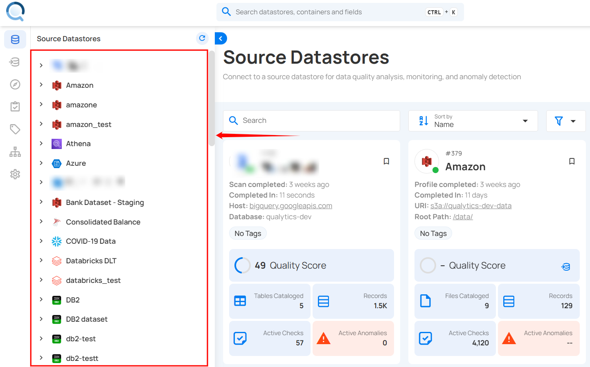

# Overview

Managing your checks within a datastore is important to maintain data integrity and ensure quality. You can categorize, create, update, archive, restore, delete, and clone checks, making it easier to apply validation rules across the datastores. The system allows for checks to be set as active, draft, or archived based on their current state of use. You can also define reusable templates for quality checks to streamline the creation of multiple checks with similar criteria. With options for important and favorite, users have full flexibility to manage data quality efficiently.

Let's get started 🚀

## Navigation

**Step 1:** Log in to your Qualytics account and select the datastore from the left menu on which you want to manage your checks.

**Step 2:** Click **"Checks"** from the navigation tab.

You will be navigated to the Checks section within the selected datastore. Here, you can view checks categorized as Active, Draft, Archived (including Invalid and Discarded), or All.

## Status Management of Checks

### Set Check as Draft

You can move an active check into a draft state, allowing you to work on the check, make adjustments, and refine the validation rules without affecting live data. This is useful when you need to temporarily deactivate a check for review and updates.

For more information on how to set a check as draft, please refer to the [Draft Checks](../datastore-checks/draft-checks.md) documentation.

### Activate Draft Check

You can activate the draft checks after you have worked on the check, made adjustments, and refined the validation rules. Activating the draft check and making it live ensures that the defined criteria are enforced on the data.

For more information on how to activate a draft check, please refer to the [Activate Draft Check](../datastore-checks/activate-draft-check.md) documentation.

### Set Check as Archived

You can move an active or draft check into the archive when it is no longer relevant but may still be needed for historical purposes or future use. Archiving helps keep your checks organized without permanently deleting them.

For more information on how to set a check as archived, please refer to the [Archive Checks](../datastore-checks/archive-check.md) documentation.

### Activate Archived Checks

You can activate archived checks when you need to restore previously defined validation rules. This is useful if a check was archived temporarily and is now relevant again for data quality enforcement.

For more information on how to activate archived checks, please refer to the [Activate Archived Checks](../datastore-checks/activate-archived-checks.md) documentation.

### Draft Archived Checks

You can move archived checks to the draft state when you want to update or refine them before activation. This is useful if a check is no longer archived but needs adjustments before going live.

For more information on how to draft archived checks, please refer to the [Draft Archived Checks](../datastore-checks/draft-archived-checks.md) documentation.

### Restore Archived Checks

If a check has been archived, then you can restore it back to an active state or in a draft state. This allows you to reuse your checks that were previously archived without having to recreate them from scratch.

For more information on how to restore archived checks, please refer to the [Restore Archived Checks](../datastore-checks/restore-archived-checks.md) documentation.

### Edit Check

You can edit an existing check to modify its properties, such as the rule type, coverage, filter clause, or description. Updating a check ensures that it stays aligned with evolving data requirements and maintains data quality as conditions change.

For more information on how to edit a check, please refer to the [Edit Check](../datastore-checks/edit-checks.md) documentation.

### Delete Checks

You can delete a check permanently, removing it from the system, and this is an **irreversible action**. Once you delete it, the check cannot be restored. By deleting the check, you ensure it will no longer appear in active or archived lists, making the system more streamlined and organized.

For more information on how to delete checks, please refer to the [Delete Checks](../datastore-checks/delete-checks.md) documentation.

## Dry Run

The **Dry Run** feature allows users to simulate the behavior of a Data Quality Check before enforcing it during a scan. This helps validate the check logic and preview potential anomalies without persisting the results or affecting any data.

For more information on dry run, please refer to the [Dry Run](../datastore-checks/dry-run.md) documentation.

## Clone Check

You can clone both active and draft checks to create a duplicate copy of an existing check. This is useful when you want to create a new check based on the structure of an existing one, allowing you to make adjustments without affecting the original check.

For more information on how to clone a check, please refer to the [Clone Check](../datastore-checks/clone-check.md) documentation.

## Create a Quality Check Template

You can add checks as templates, which allows you to create a reusable framework for quality checks. By using templates, you standardize the validation process, enabling the creation of multiple checks with similar rules and criteria across different datastores. This ensures consistency and efficiency in managing data quality checks.

For more information on how to create a quality check template, please refer to the [Quality Check Template](../datastore-checks/quality-check-template.md) documentation.

## Mark Check as Favorite

Marking a check as a favorite helps you quickly access and prioritize important checks during your data validation process. Favorited checks appear in the "Favorite" category, making them easier to manage and monitor.

For more information on how to mark a check as favorite, please refer to the [Mark Check as Favorite](../datastore-checks/check-favorite.md) documentation.

## Filter and Sort

Filter and Sort options allow you to organize your checks by various criteria, such as Weight, Active Anomalies, Coverage, Created Date, and Rules. You can also apply filters to refine your list of checks based on Check Type, Asserted State (Passed, Failed, Not Asserted), Tags, Tables, and Fields.

For more information on how to filter and sort, please refer to the [Filter and Sort](../datastore-checks/filter-and-sort.md) documentation.

## Quality Check Migration

Quality Check Migration allows you to transfer authored quality checks from one container to another, even across different datastores. This feature helps you reuse existing quality rules without manually recreating them in the target container. 

For more information about **Quality Check Migration**, please refer to the [Quality Check Migration](../datastore-checks/quality-check-migration.md) documentation.