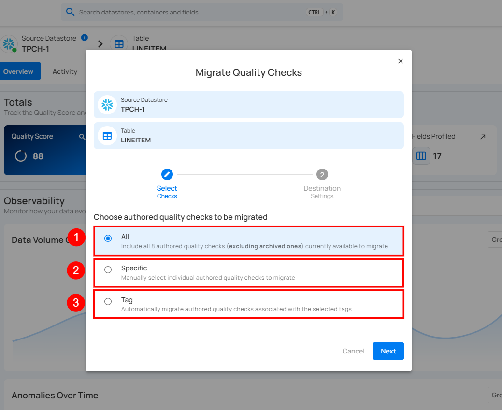

# Quality Check Migration

Quality Check Migration allows you to transfer authored quality checks from one container to another, even across different datastores. This feature helps you reuse existing quality rules without manually recreating them in the target container. This feature is useful when you want to:

* Reuse existing authored quality checks in another container or datastore.  
* Quickly set up quality checks for similar datasets without starting from scratch.  
* Standardize quality rules across multiple data stores.

!!! note 
    Archived and inferred checks are excluded from migration to ensure only active, relevant, authored checks are moved. All migrated checks are set to Draft status, allowing you to review and activate them in the new container.

Let’s get started 🚀

## How It Works

The **Migrate Quality Checks** process consists of two main steps:

### 1. Select Checks

Choose which authored quality checks to migrate:

| REF. | FIELDS | DESCRIPTION |
| :---- | :---- | :---- |
| 1. | All | Migrates all authored quality checks available in the source container, excluding archived ones. |
| 2. | Specific | Lets you manually select individual authored quality checks from a list. Useful when you only need certain checks in the target container. |
| 3. | Tag | Migrates all authored quality checks that match the selected tags, allowing for automated grouping. |



### 2. Destination Settings

Define where the selected checks will be migrated:

| REF. | FIELDS | DESCRIPTION |
| :---- | :---- | :---- |
| 1. | Source Datastore | The datastore where the selected quality checks will be migrated. |
| 2. | Table | The specific target container (e.g., table) within the datastore where the checks will be added. |
| 3. | Assign Additional Tags | Let's you add tags to migrated checks to help with categorization and filtering in the target datastore. |


!!! note 
    Migrated checks are set to Draft. Field(s) will be automatically matched by name when possible; unmatched fields remain unassigned. 

## Example Use Case

**Scenario**

You have two tables in the **COVID-19** **Data** datastore:

* **CDC_INPATIENT_BEDS_ALL –** contains all hospital inpatient bed records.

* **CDC_INPATIENT_BEDS_COVID –** contains only records related to COVID-19 cases.

The first table already has 12 authored quality checks to verify important fields like **hospital_id**, **report_date**, and **available_beds**.

The second table doesn’t have these checks yet, but it uses the same structure and fields.

Instead of creating all 12 checks again, you migrate them from **CDC_INPATIENT_BEDS_ALL** to **CDC_INPATIENT_BEDS_COVID**.

This way, both tables follow the same validation rules, saving time and keeping data quality consistent.

**Before and After Migration**

|         Item |          Before Migration |               After Migration |
| :---- | :---- | :---- |
| **Source Table** | CDC_INPATIENT_BEDS_ALL (authored checks already exist). | CDC_INPATIENT_BEDS_ALL (unchanged). |
| **Destination Table** | CDC_INPATIENT_BEDS_COVID (no authored checks). | CDC_INPATIENT_BEDS_COVID (authored checks in Draft status). |
| **Check Count** | 12 authored checks. | 12 authored checks (copied). |
| **Status of Checks** | Active in source. | Draft in destination. |
| **Benefit** | N/A | Saves time, ensures consistency, and avoids manual recreation. |

## Visual Diagram

```text

+------------------------------+  
|    CDC_INPATIENT_BEDS_ALL    |  
| (Source: 12 Authored Checks) |  
+------------------------------+  
             |  
             | Migrate  
             v  
+-------------------------------+  
|   CDC_INPATIENT_BEDS_COVID    |  
|  (Destination: Draft Checks)  |  
+-------------------------------+

```
## Tips

* **Review before activation:** Migrated checks are saved as Draft, so you can make adjustments before using them.

* **Use tags for tracking:** Assign a tag like Migrated\_Aug2025 to easily find migrated checks later.

* **Keep field names the same:** The system only assigns fields when names match. If a field name differs during migration, it will not be mapped—another reason checks start in Draft status and require user review.