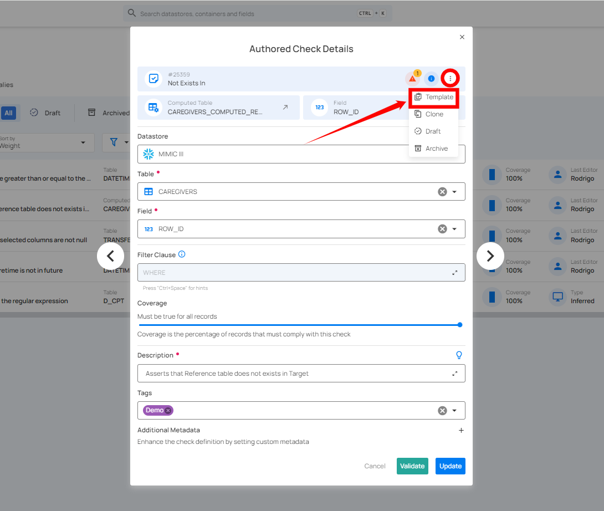

# Create a Quality Check template

**Step 1:** Locate the check (whether Active or Draft) that you want to convert into a template, and click that check.

For demonstration purposes, we have selected the **"Between"** check.

**Step 2:** A modal window will appear displaying the check details. Click the **vertical ellipsis (⋮)** located in the upper-right corner of the modal window, and select **"Template"** from the dropdown menu.

After clicking the **"Template"** button, the check will be saved and created as a template in the library, and a success message will appear on the screen. This allows you to reuse the template for future checks, streamlining the validation process.