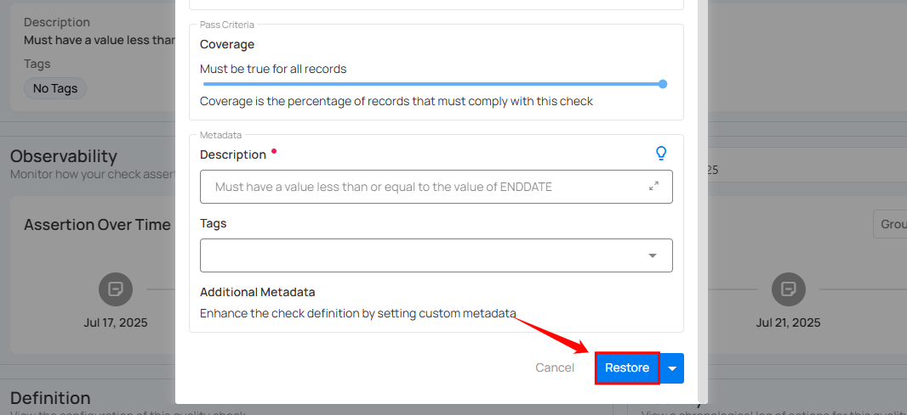
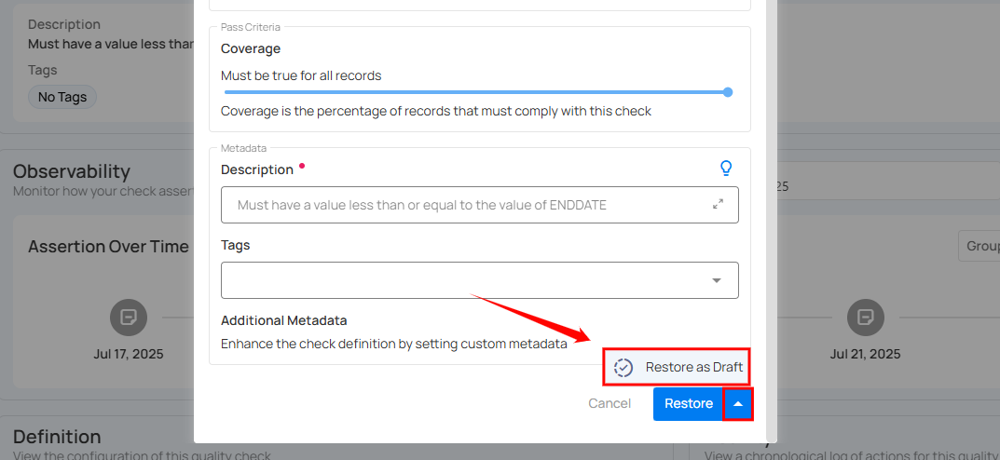

# Restore Archived Checks

**Step 1:** Click on **Archived** from the **navigation bar** in the **Checks** section to view all archived checks.

**Step 2:** Click on the archived check that you want to restore.

**Step 3:** You will be directed to the check details page. Click on the **Settings** icon located at the top right corner of the interface and select **“Edit”** from the drop-down menu.

A modal window will appear with the check details.

**Step 4**: If you want to make any changes to the check, you can edit it. Otherwise, click on the **Restore** button to restore it as an active check.

To restore the check as a draft, click on the arrow icon next to the **Restore** button. A drop-down menu will appear—select **Restore as Draft** from the options.

After clicking the **Restore** button, the check will be successfully restored as either an active or draft check, depending on your selection, and a success message will appear on the screen.