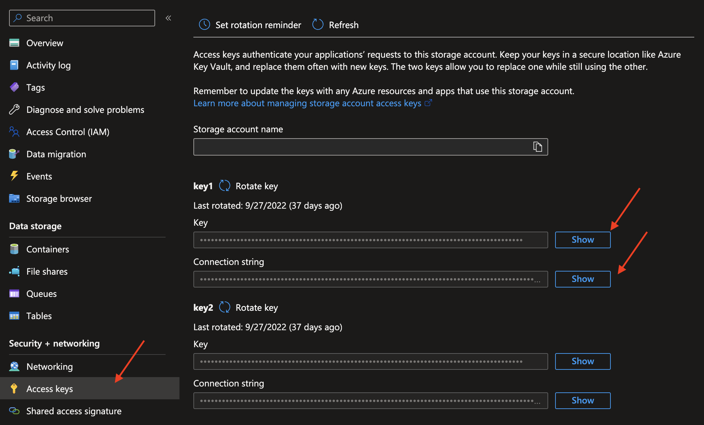

# Azure Blob Storage

## Steps to setup Azure Blob Storage

---

{: style="width:450px;"}
{: style="width:450px;"}

### `Name` <spam id='required'>`required`</spam>

* The datastore name  to be created in Qualytics App

### `URI` <spam id='required'>`required`</spam>

``` text
wasb[s]://<container-name>@<storage-account-name>.blob.core.windows.net/<path>
```

* `<container-name>`: the name of a container in your Azure Blob storage account.
* `<storage-account-name>`: the name of your Azure Blob storage account.
* `<path>`: A forward slash delimited (/) representation of the directory structure.
### `Account Name` and `Access Key` <spam id='required'>`required`</spam>

* Account Name and Access Key to access azure blob storage.

* To get the `account_name` and `access_key` you need to access your local storage in Azure.

* Click in `Access Keys` tab and copy the values.


