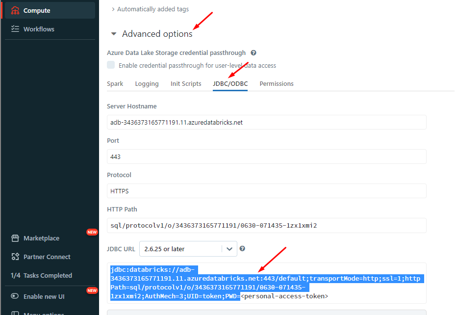
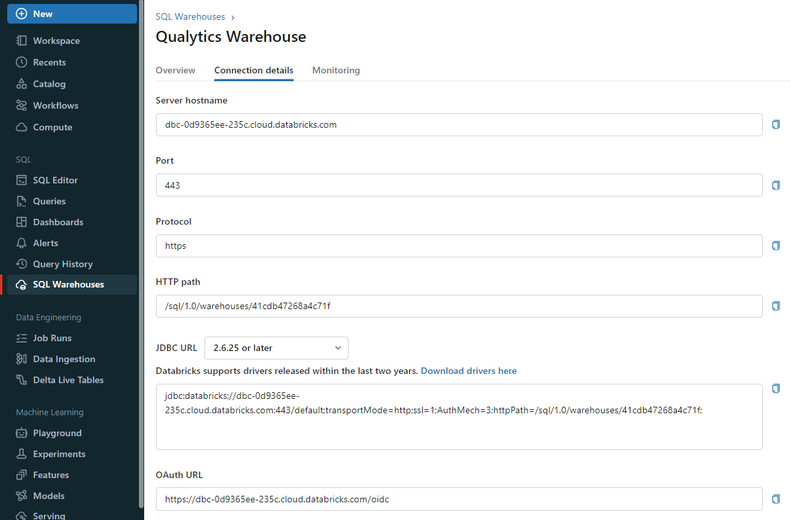
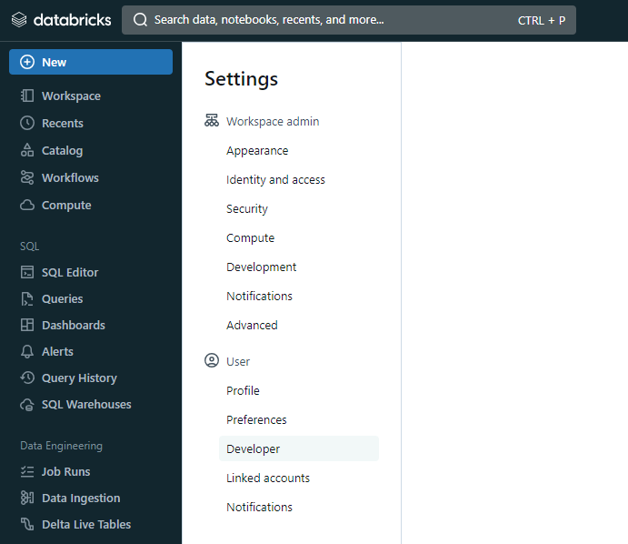
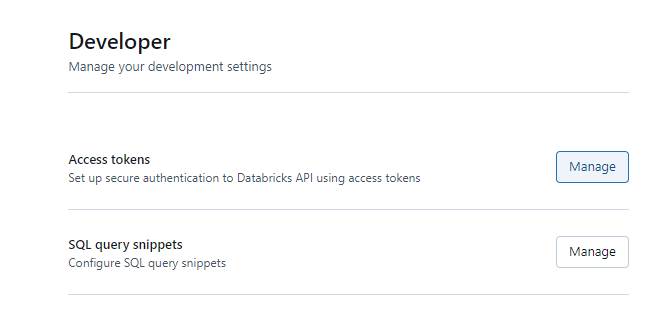
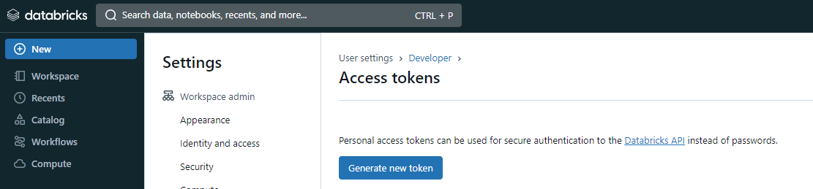
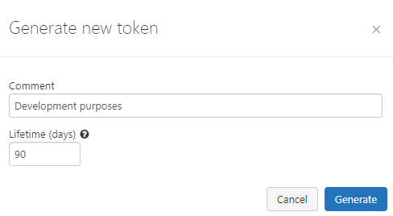
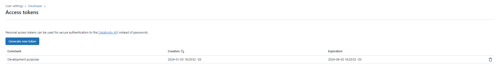

# Databricks

## Steps to setup Databricks
---
Fill the form with the credentials of your data source.

{: style="width:450px;"}
{: style="width:450px;"}

Once the form is completed, it's necessary to test the connection to verify if Qualytics is able to connect to your source of data. A successful message will be shown:

{: style="width:450px;"}
{: style="width:450px;"}

!!! warning 
    By clicking on the `Finish` button, it will create the Datastore and skipping the configuration of an Enrichment Datastore.

    - To configure an Enrichment Datastore in another moment, please refer [to this section](/userguide/enrichment/create-enrichment-datastore/)

!!! note 
    It is important to associate an `Enrichment Datastore` with your new Datastore

    - The `Enrichment Datastore` will allow Qualytics to record `enrichment data`, copies of the source `anomalous data` and additional `metadata` for your `Datastore`

## Configuring an Enrichment Datastore

- If you have an `Enrichment Datastore` already setup, you can link it by enable to use an existing Enrichment Datastore and select from the list

- If you don't have an `Enrichment Datastore`, you can create one at the same page:

    {: style="width:450px"}
    {: style="width:450px"}

Once the form is completed, it's necessary to test the connection. A successful message will be shown:

{: style="width:450px;"}
{: style="width:450px;"}

!!! warning 
    By clicking on the `Finish` button, it will create the Datastore and link or create the Enrichment Datastore

---
## Fields

### `Name` <spam id='required'>`required`</spam>

*   The datastore name  to be created in Qualytics App.

### `Server Hostname` <spam id='required'>`required`</spam>
    
* The address of the server to connect to.

### `Http Path` <spam id='required'>`required`</spam>

* The Databricks compute resources URL.
### `Catalog` <spam id='not-required'>`optional`</spam>

* The `Catalog` name to be accessed.

* You can return the list of `catalogs` running:

```text
    SHOW CATALOGS [ LIKE regex_pattern ]
```

### `Database` <spam id='not-required'>`optional`</spam>

* The `database` name to be accessed.

* You can return the list of `databases` running:

```text
    SHOW SCHEMAS [ LIKE regex_pattern ]
```
### `Personal Access Token` <spam id='required'>`required`</spam>

* The personal access token to access databricks.

* Get the token in [Authentication requirements](https://docs.databricks.com/integrations/jdbc-odbc-bi.html#authentication).


## Information on how to retrieve the connection details
---

This section explains how to retrieve the connection details that you need to connect to Databricks.

!!! info "Credentials to connect with Qualytics"
    - `Host`: `<host-name>.cloud.databricks.com` or `<host-name>.azuredatabricks.net`
    - `Http Path`: `sql/prodocolv1/o/xxxxx/xyz-xyz-xyz` or `/sql/1.0/warehouses/xyzpto`
    - `Catalog`: Your available catalog in Databricks
    - `Database`: Your available schema in Databricks
    - `Personal Access Token`: Retrieved from User settings

## Get connection details for a cluster


1. Click `Compute` in the sidebar.
2. Choose a cluster to connect to.
3. Navigate to `Advanced Options`.
4. Click on the `JDBC/ODBC` tab.
5. Copy the connection details.




## Get connection details for a SQL warehouse
1. Click `SQL Warehouses` in the sidebar.
2. Choose a warehouse to connect to.
3. Navigate to the `Connection Details` tab.
4. Copy the connection details.



## Get the Access Token

The token generation is documented as described in the [Databricks documentation](https://docs.databricks.com/en/dev-tools/auth/pat.html).

### 1. In your Databricks workspace, click your Databricks username in the top bar, and then select User `Settings` from the drop down menu


### 2. In `Settings` page, select the `Developer` option in `User` section



### 3. In `Developer` page, you will se below the Developer divisor the `Manage` Access Tokens



### 4. In `Developer` page, click on the `Manage` in Access Tokens


### 5. In `Access Tokens` page, click in `Generate new token` button



### 6. You will see a modal to add a description and validation time (in days) for the token:



### 7. After adding the contents, you can click in generate, it will show the `token`:


!!! warning
    Once you click in `Done` the modal will close and you will never see the token again.
    Please, save the Personal Access Token to a secure space.

### 8. You can see the new `token` in `Access Tokens` page:



### 9. You can also revoke a `token` on `Access Tokens` page by clicking on the `thresh` icon:

