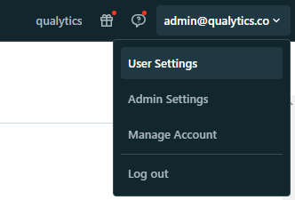

# Databricks

## Understanding SQL Warehouses and All-Purpose Compute

### SQL Warehouses (Serveless)

SQL Warehouses (Serveless) in Databricks refers to using serverless SQL endpoints for running SQL queries. 

Here's why it's recommended over all-purpose compute for certain tasks:

| Attribute             | Description                                                                                                                             |
|-----------------------|-----------------------------------------------------------------------------------------------------------------------------------------|
| Cost-effectiveness    | Serverless SQL endpoints allow you to pay only for the queries you execute, without the need to provision or manage dedicated infrastructure, making it more cost-effective for ad-hoc or sporadic queries. |
| Scalability           | Serverless architectures automatically scale resources based on demand, ensuring optimal performance for varying workloads.               |
| Simplified Management | With serverless SQL endpoints, you don't need to manage clusters or infrastructure, reducing operational overhead.                    |
| Minimum Requirements | The minimum requirements for using SQL warehouse with serverless typically include access to a Databricks workspace and appropriate permissions to create and run SQL queries. |


### All-purpose Compute

All-purpose compute in Databricks refers to clusters that are not optimized for specific tasks. While they offer flexibility, they may not provide the best performance or cost-effectiveness for certain workloads. Here's why they might not be recommended:

| Attribute              |  Description                                                                                                                                            |
|------------------------|--------------------------------------------------------------------------------------------------------------------------------------------------------|
| Slow Spin-up Time      | All-purpose compute clusters may take longer to spin up compared to specialized clusters, resulting in delays before processing can begin.            |
| Timeout Connections    | Due to longer spin-up times, there's a risk of timeout connections, especially for applications or services that expect quick responses.              |

#### Node pool and its usage

A node pool in Databricks is a set of homogeneous virtual machines (VMs) within a cluster. It allows you to have a fixed set of instances dedicated to specific tasks, ensuring consistent performance and resource isolation. Here's how node pools are typically used:

| Attribute              | Description                                                                                                                     |
|------------------------|---------------------------------------------------------------------------------------------------------------------------------|
| Resource Isolation     | Node pools provide resource isolation, allowing different workloads or applications to run without impacting each other's performance. |
| Optimized Performance  | By dedicating specific nodes to particular tasks, you can optimize performance for those workloads.                            |
| Cost-effectiveness     | Node pools can be more cost-effective than using all-purpose compute for certain workloads, as you can scale resources according to the specific requirements of each task. |


#### Improving "All-purpose compute" with node pool and minimum requirements

To improve the performance of all-purpose compute using node pools, you can follow these steps:


| Action                                | Description                                                                                                                             |
|---------------------------------------|-----------------------------------------------------------------------------------------------------------------------------------------|
| Define Workload-Specific Node Pools  | Identify the specific tasks or workloads that require optimized performance and create dedicated node pools for them.                   |
| Specify Minimum Requirements         | Determine the minimum resources (such as CPU, memory, and disk) required for each workload and configure the node pools accordingly.     |
| Monitor and Adjust                   | Continuously monitor the performance of your node pools and adjust resource allocations as needed to ensure optimal performance.         |

#### Node Pool minimum configuration


#### Attach the Compute with the Node Pool


## Information on how to retrieve the connection details
---

This section explains how to retrieve the connection details that you need to connect to Databricks.

!!! info "Credentials to connect with Qualytics"
    - `Host`: `<host-name>.cloud.databricks.com` or `<host-name>.azuredatabricks.net`
    - `Http Path`: `sql/prodocolv1/o/xxxxx/xyz-xyz-xyz` or `/sql/1.0/warehouses/xyzpto`
    - `Catalog`: Your available catalog in Databricks
    - `Database`: Your available schema in Databricks
    - `Personal Access Token`: Retrieved from User settings

## Get connection details for a SQL warehouse
1. Click `SQL Warehouses` in the sidebar.
2. Choose a warehouse to connect to.
3. Navigate to the `Connection Details` tab.
4. Copy the connection details.


## Get connection details for a cluster


1. Click `Compute` in the sidebar.
2. Choose a cluster to connect to.
3. Navigate to `Advanced Options`.
4. Click on the `JDBC/ODBC` tab.
5. Copy the connection details.


## Get the Access Token

The token generation is documented as described in the [Databricks documentation](https://docs.databricks.com/en/dev-tools/auth/pat.html).

**1. In your Databricks workspace, click your Databricks username in the top bar, and then select User `Settings` from the drop down menu**



**2. In `Settings` page, select the `Developer` option in `User` section**


**3. In `Developer` page, you will se below the Developer divisor the `Manage` Access Tokens**


**4. In `Developer` page, click on the `Manage` in Access Tokens**


**5. In `Access Tokens` page, click in `Generate new token` button**


**6. You will see a modal to add a description and validation time (in days) for the token:**


**7. After adding the contents, you can click in generate, it will show the `token`:**


!!! warning
    Once you click in `Done` the modal will close and you will never see the token again.
    Please, save the Personal Access Token to a secure space.

**8. You can see the new `token` in `Access Tokens` page:**


**You can also revoke a `token` on `Access Tokens` page by clicking on the `thresh` icon:**


## Steps to Set Up Databricks in Qualytics
---
Fill the form with the credentials of your data source.

{: style="width:450px;"}
{: style="width:450px;"}

Once the form is completed, it's necessary to test the connection to verify if Qualytics is able to connect to your source of data. A successful message will be shown:

{: style="width:450px;"}
{: style="width:450px;"}

!!! warning 
    By clicking on the `Finish` button, it will create the Datastore and skipping the configuration of an Enrichment Datastore.

    - To configure an Enrichment Datastore in another moment, please refer [to this section](/userguide/enrichment/create-enrichment-datastore/)

!!! note 
    It is important to associate an `Enrichment Datastore` with your new Datastore

    - The `Enrichment Datastore` will allow Qualytics to record `enrichment data`, copies of the source `anomalous data` and additional `metadata` for your `Datastore`

## Configuring an Enrichment Datastore

- If you have an `Enrichment Datastore` already setup, you can link it by enable to use an existing Enrichment Datastore and select from the list

- If you don't have an `Enrichment Datastore`, you can create one at the same page:

    {: style="width:450px"}
    {: style="width:450px"}

Once the form is completed, it's necessary to test the connection. A successful message will be shown:

{: style="width:450px;"}
{: style="width:450px;"}

!!! warning 
    By clicking on the `Finish` button, it will create the Datastore and link or create the Enrichment Datastore

---
## Fields

### `Name` <spam id='required'>`required`</spam>

*   The datastore name  to be created in Qualytics App.

### `Server Hostname` <spam id='required'>`required`</spam>
    
* The address of the server to connect to.

### `Http Path` <spam id='required'>`required`</spam>

* The Databricks compute resources URL.
### `Catalog` <spam id='not-required'>`optional`</spam>

* The `Catalog` name to be accessed.

* You can return the list of `catalogs` running:

```text
    SHOW CATALOGS [ LIKE regex_pattern ]
```

### `Database` <spam id='not-required'>`optional`</spam>

* The `database` name to be accessed.

* You can return the list of `databases` running:

```text
    SHOW SCHEMAS [ LIKE regex_pattern ]
```
### `Personal Access Token` <spam id='required'>`required`</spam>

* The personal access token to access databricks.

* Get the token in [Authentication requirements](https://docs.databricks.com/integrations/jdbc-odbc-bi.html#authentication).

## API Payload Examples

### Creating a Datastore

This section provides a sample payload for creating a datastore. Replace the placeholder values with actual data relevant to your setup.

#### Endpoint (Post)

`/api/datastores` _(post)_

=== "Creating a datastore with a new connection"
    ```json
        {
            "name": "your_datastore_name",
            "teams": ["Public"],
            "database": "databricks_database",
            "schema": "databricks_catalog",
            "enrich_only": false,
            "trigger_catalog": true,
            "connection": {
                "name": "your_connection_name",
                "type": "databricks",
                "host": "databricks_host",
                "password": "databricks_token",
                "parameters": {
                    "path": "databricks_http_path"
                }
            }
        }
    ```
=== "Creating a datastore with an existing connection"
    ```json
        {
            "name": "your_datastore_name",
            "teams": ["Public"],
            "database": "databricks_database",
            "schema": "databricks_catalog",
            "enrich_only": false,
            "trigger_catalog": true,
            "connection_id": connection-id
        }
    ```
### Creating an Enrichment Datastore

#### Endpoint (Post)

`/api/datastores` _(post)_

This section provides a sample payload for creating an enrichment datastore. Replace the placeholder values with actual data relevant to your setup.

=== "Creating an enrichment datastore with a new connection"
    ```json
        {
            "name": "your_datastore_name",
            "teams": ["Public"],
            "database": "databricks_database",
            "schema": "databricks_enrichment_catalog",
            "enrich_only": true,
            "connection": {
                "name": "your_connection_name",
                "type": "databricks",
                "host": "databricks_host",
                "password": "databricks_token",
                "parameters": {
                    "path": "databricks_http_path"
                }
            }
        }
    ```
=== "Creating an enrichment datastore with an existing connection"
    ```json
        {
            "name": "your_datastore_name",
            "teams": ["Public"],
            "database": "databricks_database",
            "schema": "databricks_enrichment_catalog",
            "enrich_only": true,
            "connection_id": connection-id
        }
    ```

### Linking Datastore to an Enrichment Datastore through API

#### Endpoint (Patch)

`/api/datastores/{datastore-id}/enrichment/{enrichment-id}` _(patch)_