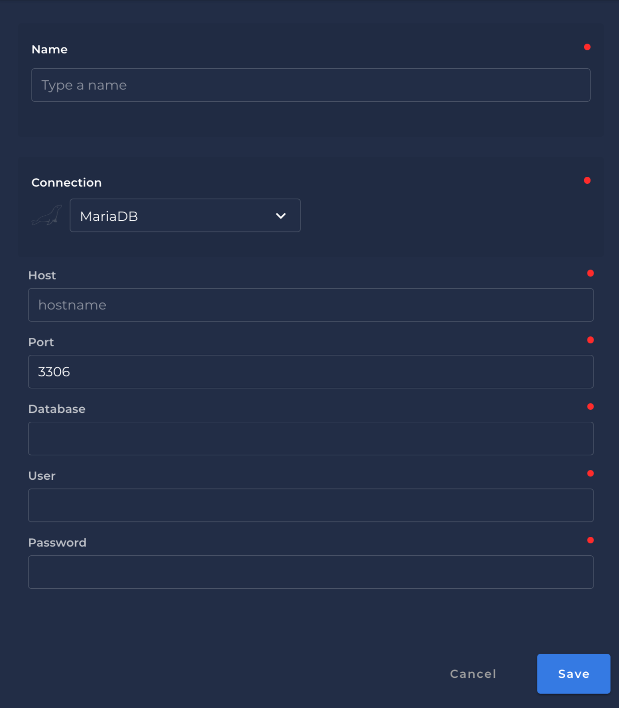

# MariaDB

## Steps to setup MariaDB

---

{: style="height:450px;width:450px"}

### `Name` <spam id='required'>`required`</spam>

* The datastore name  to be created in Qualytics App.

### `Host` <spam id='required'>`required`</spam>

* The `host` to Connect to the MariaDB.

### `Port` <spam id='required'>`required`</spam>
* The TCP/IP port number to use for the connection. The default is `3306`.
### `Database` <spam id='required'>`required`</spam>

* The `database` name of the MariaDB you want to connect.
### `User` <spam id='required'>`required`</spam>

* The MariaDB user name to use when connecting to the server.
### `Password` <spam id='required'>`required`</spam>

* The password of the MariaDB account.

## Information on how to connect with MariaDB

---

* [Connecting to MariaDB](https://mariadb.com/kb/en/connecting-to-mariadb/)

