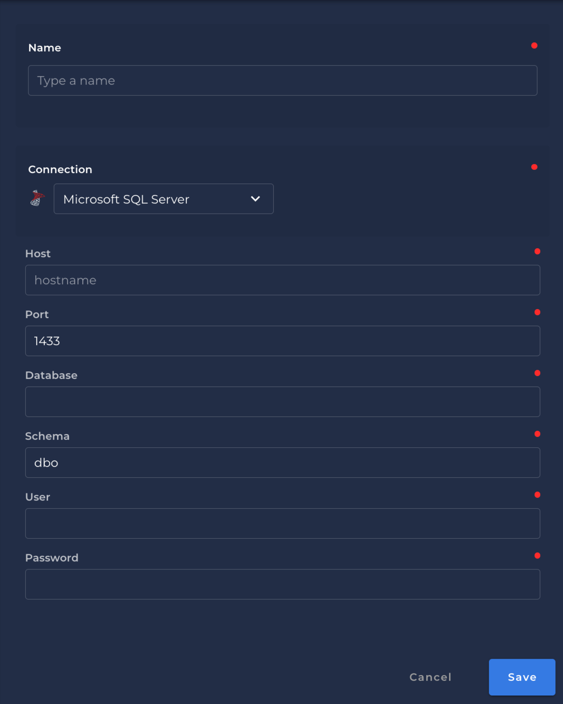

# Microsoft SQL Server DataStore!
{: style="height:450px;width:450px"}

### `Name`

* Is the name to be created in Qualytics App

### `Host`
​
### `Port`
​
### `Database`

### `Schema`

### `User`

### `Password`