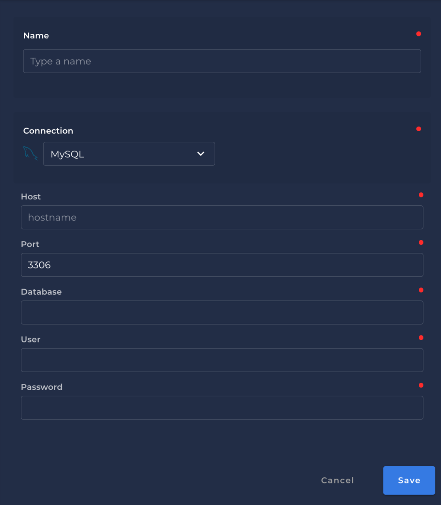

# MySQL

## Steps to setup MySQL

---

{: style="height:450px;width:450px"}

### `Name` <spam id='required'>`required`</spam>

* The datastore name  to be created in Qualytics App

### `Host` <spam id='required'>`required`</spam>

* The MySQL hostname that defines the location of your MySQL server and database
### `Port` <spam id='required'>`required`</spam>

* The port to access MySQL server. The default is `3306`.
### `Database` <spam id='required'>`required`</spam>

* The `database` name to be connected.

### `User` <spam id='required'>`required`</spam>

* The `user` that has access to the MySQL server.
### `Password` <spam id='required'>`required`</spam>

* The `password` that has access to the MySQL server.

## Information on how to connect with MySQL

---
(MySQL connection)[https://www.connectionstrings.com/mysql/]