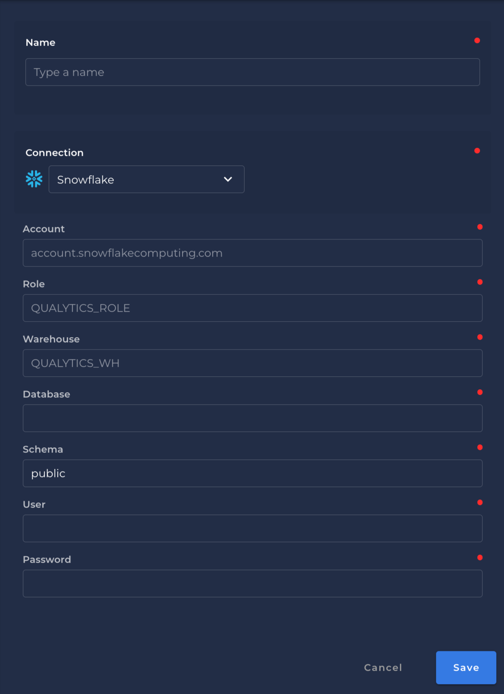

# Snowflake Data Warehouse

## Steps to setup Snowflake Data Warehouse

---

{: style="height:450px;width:450px"}

### `Name` <spam id='required'>`required`</spam>

* The datastore name  to be created in Qualytics App

### `Account` <spam id='required'>`required`</spam>

* Host url to be connected.
* Hostname in the form 
```text
    https://<account_name>.<region>.snowflakecomputing.com.
```

* You can check [here](https://docs.snowflake.com/en/user-guide/admin-account-identifier.html) for more details.

### `Role` <spam id='required'>`required`</spam>

* Set this to the name of role that you want to use or which the account user has access to.

### `Warehouse` <spam id='required'>`required`</spam>

* The `warehouse` name that you want to use or which the account user has access to.

### `Database` <spam id='required'>`required`</spam>

* The `database` name to be connected or which the account user has access to.

### `Schema` <spam id='required'>`required`</spam>

* The `schema` name to be connected or which the account user has access to.

### `User` <spam id='required'>`required`</spam>

* The `user` that has access to the `Snowflake Data Warehouse` application.
### `Password` <spam id='required'>`required`</spam>

* The `password` that has access to the `Snowflake Data Warehouse` application.

## Information on how to connect with Snowflake Data Warehouse

---

* [Configuring Snowflake Data Warehouse](https://docs.snowflake.com/en/user-guide/jdbc-configure.html)
* [Connectin Snowflake](https://docs.snowflake.com/en/user-guide-connecting.html)