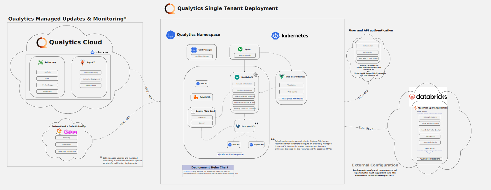

# Dataplane Deployment Guide for Databricks

This guide explains how to deploy the **Qualytics Dataplane** as a **continuous Databricks job** using a **Qualytics-provided Databricks Asset Bundle**.

While the dataplane is typically deployed as a Kubernetes service using the Kubeflow Spark Operator, Databricks deployment provides:

- Photon-accelerated compute

- Native Unity Catalog integration

- Higher performance compared to JDBC-based integrations

The public Helm chart for Kubernetes deployments is available at [qualytics-helm-public](https://github.com/Qualytics/qualytics-helm-public){:target="_blank"}.


<figure markdown>
  [](../assets/deployments/qualytics-with-databricks-architectural-diagram.svg)
  <figcaption>Deployment Architecture with Databricks</figcaption>
</figure>

## Prerequisites

Before starting, ensure you have:

- Access to a Databricks workspace with job creation permissions
- Databricks CLI installed
- RabbitMQ credentials provided by Qualytics
- Docker registry credentials provided by Qualytics

## Enable RabbitMQ Connectivity

Qualytics will provide:

- RabbitMQ DNS endpoint
- RabbitMQ username
- RabbitMQ password

These credentials are required for the dataplane to communicate with Qualytics services.

## Step 1: Install and Authenticate Databricks CLI

Install the Databricks CLI by following the official instructions:

[Install or update the Databricks CLI](https://docs.databricks.com/aws/en/dev-tools/cli/install)

Authenticate using:

```bash
databricks auth
```

## Step 2: Create a Secrets Scope

Create a Databricks secrets scope to store sensitive credentials:

```bash
databricks secrets create-scope qualytics
```

## Step 3: Add Required Secrets

Add the following secrets to the `qualytics` scope.

### RabbitMQ Password

```bash
databricks secrets put-secret qualytics rabbitmq-password
```
When prompted, enter the RabbitMQ password: `[RABBIT_PASSWORD_TO_BE_PROVIDED]`

### Docker Registry Username

```bash
databricks secrets put-secret qualytics docker-username
```

### Docker Registry Token

```bash
databricks secrets put-secret qualytics docker-token
```
When prompted, enter the Docker Hub token: `[DOCKER_TOKEN_TO_BE_PROVIDED]`

The CLI will prompt you to enter each value securely.

## Step 4: Customize the Databricks Asset Bundle

Create or update your Databricks Asset Bundle configuration file (for example, databricks.yml).

Replace all values wrapped in angle brackets **(<>)** with values specific to your environment.

```yaml
bundle:
  name: qualytics-dataplane
  
targets:
  prod:
    mode: production
    workspace:
      host: <workspace-url>
      root_path: /Users/${workspace.current_user.userName}/.bundle/${bundle.name}/${bundle.target}

    variables:
      rabbitmq_host: <rabbit-mq-host>
      rabbitmq_user: user
      secrets_scope: dev
      max_workers: 12
      node_type: r6gd.2xlarge
      jname: zulu21-ca-arm64

variables:
  # RabbitMQ Configuration
  rabbitmq_host:
    description: RabbitMQ host endpoint
    default: rabbitmq.us-east-1.elb.amazonaws.com

  rabbitmq_user:
    description: RabbitMQ username
    default: user

  # Spark Configuration
  spark_version:
    description: Databricks Spark version
    default: 17.3.x-scala2.13

  node_type:
    description: AWS EC2 node type for workers
    default: r6gd.2xlarge

  # Autoscaling Configuration
  min_workers:
    description: Minimum number of workers
    default: 1

  max_workers:
    description: Maximum number of workers
    default: 12

  # Executor Configuration
  num_cores_per_executor:
    description: Number of cores per executor
    default: 8

  max_memory_per_executor:
    description: Maximum memory per executor in MB
    default: 50000

  # Docker Configuration
  docker_image:
    description: Docker image for the cluster
    default: qualyticsai/dataplane-databricks:latest
    
  docker_username:
    description: Docker registry username
    default: qualyticsai

  # Secrets Configuration
  secrets_scope:
    description: Databricks secret scope name
    default: qualytics

  # Java Configuration
  jname:
    description: Zulu JDK directory name (zulu21-ca-amd64 or zulu21-ca-arm64)
    default: zulu21-ca-amd64

resources:
  jobs:
    QualyticsDataplane:
      name: QualyticsDataplane-${bundle.target}

      continuous:
        pause_status: PAUSED

      max_concurrent_runs: 1

      tasks:
        - task_key: QualyticsDataplane
          spark_jar_task:
            jar_uri: ""
            main_class_name: io.qualytics.dataplane.SparkMothership
            run_as_repl: true

          new_cluster:
            spark_version: ${var.spark_version}

            spark_conf:
              spark.driver.extraJavaOptions: >-
                -Dconfig.resource=prod.conf
                -Dlog4j2.configurationFile=file:/opt/qualytics/log4j2.properties
                -Djava.library.path=/databricks/libs:/usr/local/lib:/opt/qualytics/libs
                --add-opens=java.base/java.lang=ALL-UNNAMED
                --add-opens=java.base/java.util=ALL-UNNAMED
                --add-opens=java.base/java.lang.invoke=ALL-UNNAMED
                --add-opens=java.base/java.nio=ALL-UNNAMED
                --add-opens=java.base/sun.nio.ch=ALL-UNNAMED
                --add-opens=java.management/sun.management=ALL-UNNAMED
                --add-exports=java.management/sun.management=ALL-UNNAMED
                -Djava.security.manager=allow

              spark.executor.extraJavaOptions: >-
                -Dlog4j2.configurationFile=file:/opt/qualytics/log4j2.properties
                -Djava.library.path=/databricks/libs:/usr/local/lib:/opt/qualytics/libs
                --add-opens=java.base/java.lang=ALL-UNNAMED
                --add-opens=java.base/java.util=ALL-UNNAMED
                --add-opens=java.base/java.lang.invoke=ALL-UNNAMED
                --add-opens=java.base/java.nio=ALL-UNNAMED
                --add-opens=java.base/sun.nio.ch=ALL-UNNAMED
                --add-opens=java.management/sun.management=ALL-UNNAMED
                --add-exports=java.management/sun.management=ALL-UNNAMED
                -Djava.security.manager=allow

              # Disable Python/R to reduce attack surface
              spark.databricks.r.command: /bin/false
              spark.executorEnv.PYSPARK_PYTHON: /bin/false
              spark.executorEnv.PYSPARK_DRIVER_PYTHON: /bin/false
              spark.databricks.driverNfs.clusterWidePythonLibsEnabled: "false"
              spark.databricks.driverNfs.enabled: "false"
              spark.databricks.sql.externalUDF.env.enabled: "false"

              # Product marker
              spark.databricks.isv.product: qualytics
              spark.log.structuredLogging.enabled: "true"

              # Query plan debugging - increase field limit (default 25 truncates wide tables)
              spark.sql.debug.maxToStringFields: "1000"

            aws_attributes:
              first_on_demand: 1
              availability: SPOT_WITH_FALLBACK
              zone_id: auto
              spot_bid_price_percent: 100

            node_type_id: ${var.node_type}

            autoscale:
              min_workers: ${var.min_workers}
              max_workers: ${var.max_workers}

            spark_env_vars:
              MOTHERSHIP_NUM_CORES_PER_EXECUTOR: ${var.num_cores_per_executor}
              MOTHERSHIP_MAX_MEMORY_PER_EXECUTOR: ${var.max_memory_per_executor}
              MOTHERSHIP_MAX_EXECUTORS: ${var.max_workers}
              MOTHERSHIP_RABBIT_HOST: ${var.rabbitmq_host}
              MOTHERSHIP_LIBPOSTAL_DATA_PATH: /opt/libpostal
              JNAME: ${var.jname}
              MOTHERSHIP_RABBIT_USER: ${var.rabbitmq_user}
              MOTHERSHIP_RABBIT_PASS: "{{ '{{secrets/dev/rabbitmq-password}}' }}"
              MOTHERSHIP_DEPLOYMENT_MODE: databricks

            enable_elastic_disk: false

            docker_image:
              url: ${var.docker_image}
              basic_auth:
                username: "{{ '{{secrets/dev/docker-username}}' }}"
                password: "{{ '{{secrets/dev/docker-token}}' }}"

            data_security_mode: SINGLE_USER
            runtime_engine: PHOTON
            kind: CLASSIC_PREVIEW
            is_single_node: false

          libraries:
            - jar: file:///opt/qualytics/qualytics-dataplane.jar

      queue:
        enabled: true
```

## Step 5: Deploy the Dataplane Job

Deploy the Databricks Asset Bundle to your workspace:

```bash
databricks bundle deploy --target prod
```
This command creates the continuous Databricks job and associated cluster configuration.

## Step 6: Start the Dataplane Job

Start the dataplane job using:

```bash
databricks bundle run --target prod QualyticsDataplane
```
Once started, the job runs continuously and automatically reconnects on restarts.

## Configuration Notes

- **RabbitMQ Connection**: The dataplane connects to `rabbitmq.us-east-1.elb.amazonaws.com` with user `user`
- **Cluster Configuration**: Uses `r6gd.2xlarge` instances with autoscaling from 1-12 workers
- **Docker Image**: Uses `qualyticsai/dataplane-databricks:latest` with provided authentication

## Troubleshooting

If you encounter issues:

- Verify secrets are properly configured: `databricks secrets list-secrets qualytics`
- Check job logs in the Databricks UI
- Ensure the JAR file is uploaded to the correct location
- Verify network connectivity to the RabbitMQ endpoint

## Support

For additional support or questions, please contact the Qualytics team.