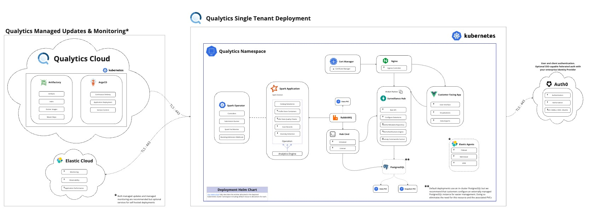

# Dataplane Deployment Guide for Databricks

This guide will walk you through deploying the Qualytics dataplane in your Databricks environment.


<figure markdown>
  [](../assets/deployments/qualytics-with-databricks-architectural-diagram.jpg)
  <figcaption>Deployment Architecture with Databricks</figcaption>
</figure>


## Prerequisites

Before starting the deployment, ensure you have:
- Databricks CLI installed and configured
- Access to your Databricks workspace with job creation permissions

## Step 1: Create Secrets Scope

First, create a secrets scope to securely store sensitive information:

```bash
databricks secrets create-scope qualytics
```

## Step 2: Add Required Secrets

Add the following secrets to your Databricks secrets scope:

### RabbitMQ Password
```bash
databricks secrets put-secret qualytics rabbitmq-password
```
When prompted, enter the RabbitMQ password: `[RABBIT_PASSWORD_TO_BE_PROVIDED]`

### Docker Hub Token
```bash
databricks secrets put-secret qualytics docker-token
```
When prompted, enter the Docker Hub token: `[DOCKER_TOKEN_TO_BE_PROVIDED]`

## Step 3: Deploy the Job

Create a file named `databricks.yml` with the following configuration:

```yaml
resources:
  jobs:
    QualyticsDataplane:
      name: QualyticsDataplane
      continuous:
        pause_status: PAUSED
      tasks:
        - task_key: QualyticsDataplane
          spark_jar_task:
            jar_uri: ""
            main_class_name: io.qualytics.dataplane.SparkMothership
            run_as_repl: true
          job_cluster_key: QualyticsJobCluster
          libraries:
            - jar: file:///opt/qualytics/qualytics-dataplane.jar
      job_clusters:
        - job_cluster_key: QualyticsJobCluster
          new_cluster:
            spark_version: 17.1.x-scala2.13
            spark_conf:
              spark.driver.extraJavaOptions: -Dconfig.resource=prod.conf
                -Djava.library.path=/databricks/libs
                --add-opens=java.base/java.lang=ALL-UNNAMED
                --add-opens=java.base/java.util=ALL-UNNAMED
                --add-opens=java.base/java.lang.invoke=ALL-UNNAMED
                --add-opens=java.base/java.nio=ALL-UNNAMED
                --add-opens=java.base/sun.nio.ch=ALL-UNNAMED
                --add-opens=java.management/sun.management=ALL-UNNAMED
                --add-exports=java.management/sun.management=ALL-UNNAMED
                -Djava.security.manager=allow
              spark.executor.extraJavaOptions: -Djava.library.path=/databricks/libs
                --add-opens=java.base/java.lang=ALL-UNNAMED
                --add-opens=java.base/java.util=ALL-UNNAMED
                --add-opens=java.base/java.lang.invoke=ALL-UNNAMED
                --add-opens=java.base/java.nio=ALL-UNNAMED
                --add-opens=java.base/sun.nio.ch=ALL-UNNAMED
                --add-opens=java.management/sun.management=ALL-UNNAMED
                --add-exports=java.management/sun.management=ALL-UNNAMED
                -Djava.security.manager=allow
              spark.databricks.r.command: /bin/false
              spark.executorEnv.PYSPARK_PYTHON: /bin/false
              spark.executorEnv.PYSPARK_DRIVER_PYTHON: /bin/false
              spark.databricks.driverNfs.clusterWidePythonLibsEnabled: "false"
              spark.databricks.driverNfs.enabled: "false"
              spark.databricks.sql.externalUDF.env.enabled: "false"
            aws_attributes:
              first_on_demand: 1
              availability: SPOT_WITH_FALLBACK
              zone_id: auto
              spot_bid_price_percent: 100
            node_type_id: r6id.2xlarge
            spark_env_vars:
              MOTHERSHIP_NUM_CORES_PER_EXECUTOR: "8"
              MOTHERSHIP_MAX_MEMORY_PER_EXECUTOR: "50000"
              MOTHERSHIP_MAX_EXECUTORS: "20"
              MOTHERSHIP_RABBIT_HOST: rabbitmq.us-east-1.elb.amazonaws.com
              JNAME: zulu21-ca-amd64
              MOTHERSHIP_RABBIT_USER: user
              MOTHERSHIP_RABBIT_PASS: "{{ '{{secrets/qualytics/rabbitmq-password}}' }}"
            enable_elastic_disk: false
            docker_image:
              url: qualyticsai/dataplane-databricks:latest
              basic_auth:
                username: qualyticsai
                password: "{{ '{{secrets/qualytics/docker-token}}' }}"
            data_security_mode: DATA_SECURITY_MODE_DEDICATED
            runtime_engine: PHOTON
            kind: CLASSIC_PREVIEW
            is_single_node: false
            autoscale:
              min_workers: 1
              max_workers: 20
      queue:
        enabled: true
```

## Step 4: Deploy the Configuration

Deploy the job using the Databricks CLI:

```bash
databricks bundle deploy
```

## Step 5: Start the Job

Once deployed, you can start the job from the Databricks UI or using the CLI:

```bash
databricks jobs start --job-id <job-id>
```

## Configuration Notes

- **RabbitMQ Connection**: The dataplane connects to `rabbitmq.us-east-1.elb.amazonaws.com` with user `user`
- **Cluster Configuration**: Uses `r6id.2xlarge` instances with autoscaling from 1-20 workers
- **Docker Image**: Uses `qualyticsai/dataplane-databricks:latest` with provided authentication

## Troubleshooting

If you encounter issues:

- Verify secrets are properly configured: `databricks secrets list-secrets qualytics`
- Check job logs in the Databricks UI
- Ensure the JAR file is uploaded to the correct location
- Verify network connectivity to the RabbitMQ endpoint

## Support

For additional support or questions, please contact the Qualytics team.