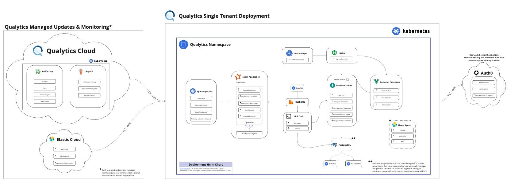

# Deployment options

## Overview
The following two operations are supported for the Qualytics platform:

-   __[Platform as a Service Deployment](#paas)__: to a single-tenant virtual private cloud (VPC) provisioned by Qualytics on infrastructure that Qualytics manages
-   __[On-Premises Deployment](#onpremise)__: to a [CNCF compliant kubernetes control plane](https://www.cncf.io/certification/software-conformance/) on Customer managed infrastructure

### __Platform as a Service (PaaS) Deployment:__

Depending on Customer’s cloud infrastructure, this option uses one of the following:

- EKS (Elastic Kubernetes Service)
- AKE (Azure Kubernetes Engine)
- GKE (Google Kubernetes Engine)
- Oracle OKE (Oracles Container Engine for Kubernetes)

The Qualytics platform is deployed to a single-tenant virtual private cloud provisioned by Qualytics and with the provider and in the region of Customer’s choosing. This VPC is not shared (single-tenant) and contains a single Customer Qualytics deployment.  This model requires that the provisioned VPC have the ability to access Customer’s datastore(s). In the case of publicly routable datastores such as Snowflake or S3, no extra configuration is required. In the case of private datastore(s) with no public IP address or route, the hosted VPC will require private routing using: PrivateLink, Transit Gateway peering, point to point VPN, or similar support to enable network access to that private datastore.

<figure markdown>
  
  <figcaption>PaaS Deployment Architecture</figcaption>
</figure>

**Considerations**
This is Qualytics’ preferred model of deployment. In this model, Qualytics is fully responsible for the provisioning and operation of the Qualytics platform. Customer is only responsible for granting the Qualytics platform necessary access.

### __On-Premises Deployment:__

This option supports deployments to any Kubernetes control plane that meets the following system requirements:

-  Kubernetes version that is officially supported for patches running any [CNCF compliant control plane](https://www.cncf.io/certification/software-conformance/)
-  A minimum 16 cores and 80 gigabytes of memory available for workload allocation
-  Assigned a Customer resolvable fully-qualified domain name for the https ingress to the Qualytics UI
- (optional) Grant Qualytics an admin-level ServiceAccount to the cluster for pushing automated updates

This option requires that the kubernetes nodes supporting Qualytics’ analytics engine have the ability to access Customer’s datastore(s). Because Customer hosts the Qualytics deployment, Customer is solely responsible for ensuring the necessary network configuration and support.

**Considerations**
This option supports organizations that due to regulatory or other restrictions cannot permit READ access to their datastore(s) from a third-party hosted product. This model requires Customer to manage and operate the appropriate infrastructure and ensure it is granted all necessary access to the targeted datastore(s). For deployments to supported commercial kubernetes control planes (EKS, AKE, GKE, OKE) and at the Customer’s discretion, Qualytics will provision the deployment and transfer ownership of the applicable infrastructure to the Customer.  Otherwise, the Customer shall be responsible for both the provisioning of a cluster meeting the requisite system requirements and the deployment of the Qualytics platform via [Qualytics provided Helm chart](../upgrades/qualytics-single-tenant-instance.md).
