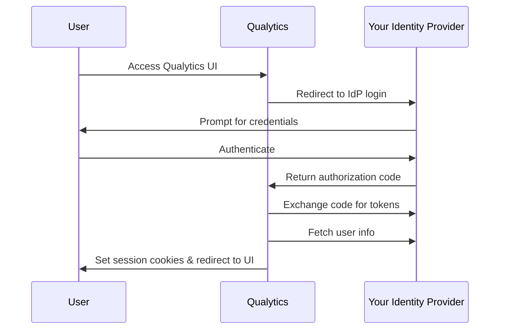

# OIDC Authentication Configuration

!!! warning "Self-Hosted Deployments Only"
    This guide is for **customer-managed (self-hosted) deployments** where you manage your own Kubernetes infrastructure. If your Qualytics instance is managed by Qualytics (PaaS/SaaS), see the [SSO Setup Guide](sso.md) instead — your account manager handles authentication configuration for you.

This guide explains how to configure OpenID Connect (OIDC) authentication for a self-hosted Qualytics deployment. OIDC is the **recommended authentication method** for customer-managed deployments, as it integrates directly with your enterprise Identity Provider (IdP) and supports fully air-gapped environments with no internet egress required.

## Overview

When configured for OIDC, Qualytics authenticates users directly against your organization's Identity Provider using the OpenID Connect protocol. This means:

- **No external dependencies** — authentication is handled entirely within your network
- **Your IdP governs access** — user login requirements, MFA, and password policies are enforced by your IdP
- **Air-gapped support** — no egress to external services is required



## Supported Identity Providers

Any OIDC-compliant Identity Provider is supported, including:

- **Microsoft Entra ID** (Azure Active Directory)
- **Okta** / Okta Workforce Identity
- **Google Workspace**
- **Keycloak**
- **OneLogin**
- **PingFederate**
- **ForgeRock**
- **Active Directory Federation Services (ADFS)**

## Step 1: Register Qualytics in Your IdP

Before configuring Qualytics, you need to register it as an application in your Identity Provider.

### Application Registration Settings

| Setting | Value |
|---------|-------|
| **Application type** | Web application |
| **Grant type** | Authorization Code |
| **Redirect URI** | `https://<your-qualytics-domain>/api/callback` |
| **Scopes** | `openid`, `email`, `profile` (at minimum `openid`) |
| **Token endpoint auth method** | Client secret (POST body) |
| **Back-channel logout URL** (optional) | `https://<your-qualytics-domain>/api/backchannel-logout` |

After registration, your IdP will provide:

- A **Client ID**
- A **Client Secret**
- A **Discovery URL** (typically `https://<your-idp-domain>/.well-known/openid-configuration`)

!!! tip "Back-Channel Logout"
    Configuring the back-channel logout URL enables automatic user deactivation in Qualytics when a user is disabled or removed in your IdP.

## Step 2: Configure Qualytics

Set `global.authType` to `OIDC` in your Helm `values.yaml` file and provide the OIDC configuration under `secrets.oidc`.

### Discovery URL (Recommended)

The simplest way to configure OIDC is to provide a **Discovery URL**. Qualytics will automatically fetch your IdP's `.well-known/openid-configuration` document and populate the authorization, token, userinfo, JWKS, and issuer endpoints for you.

With Discovery URL, you only need **4 values** — everything else has sensible defaults:

| Helm Value | Description | Example |
|------------|-------------|---------|
| `secrets.oidc.oidc_discovery_url` | IdP's OpenID Connect discovery endpoint | `https://your-org.okta.com/.well-known/openid-configuration` |
| `secrets.oidc.oidc_client_id` | OAuth2 client ID from your IdP | `0oabc123def456` |
| `secrets.oidc.oidc_client_secret` | OAuth2 client secret from your IdP | *(secret value)* |
| `secrets.auth.jwt_signing_secret` | Secret for signing JWTs (minimum 32 characters) | *(generate with `openssl rand -base64 32`)* |

Set `global.authType: "OIDC"` in your `values.yaml`. All other OIDC fields — scopes, claim mappings, and endpoints — default to sensible values and do not need to be configured for most IdPs.

#### Common Discovery URLs

| Identity Provider | Discovery URL |
|-------------------|---------------|
| **Okta** | `https://{your-domain}.okta.com/.well-known/openid-configuration` |
| **Microsoft Entra ID** | `https://login.microsoftonline.com/{tenant-id}/v2.0/.well-known/openid-configuration` |
| **Google Workspace** | `https://accounts.google.com/.well-known/openid-configuration` |
| **Keycloak** | `https://{host}/realms/{realm}/.well-known/openid-configuration` |

!!! tip "Discovery URL auto-discovers 5 endpoints"
    When `oidc_discovery_url` is set, the following fields are fetched automatically at startup and do **not** need to be configured:

    - `oidc_authorization_endpoint`
    - `oidc_token_endpoint`
    - `oidc_userinfo_endpoint`
    - JWKS URI (for back-channel logout token verification)
    - Issuer (for back-channel logout token validation)

    These fields default to empty strings (`""`) and are not injected into the deployment when left empty. If you set both a discovery URL and individual endpoints, the individually configured values take precedence as fallbacks.

### Manual Endpoint Configuration (Fallback)

If your IdP does not support a standard discovery URL, or if the discovery endpoint is not reachable from your cluster, you can configure endpoints individually instead:

| Helm Value | Description | Example |
|------------|-------------|---------|
| `global.authType` | Authentication mode — must be `OIDC` | `OIDC` |
| `secrets.oidc.oidc_client_id` | OAuth2 client ID from your IdP | `0oabc123def456` |
| `secrets.oidc.oidc_client_secret` | OAuth2 client secret from your IdP | *(secret value)* |
| `secrets.oidc.oidc_authorization_endpoint` | IdP's authorization URL | `https://login.example.com/oauth2/authorize` |
| `secrets.oidc.oidc_token_endpoint` | IdP's token exchange URL | `https://login.example.com/oauth2/token` |
| `secrets.oidc.oidc_userinfo_endpoint` | IdP's user info URL | `https://login.example.com/oauth2/userinfo` |
| `secrets.auth.jwt_signing_secret` | Secret for signing JWTs (minimum 32 characters) | *(generate with `openssl rand -base64 32`)* |

!!! warning "JWT Signing Secret"
    The `jwt_signing_secret` must be at minimum 32 characters long. Changing this value will invalidate all active user sessions.

!!! note "Redirect URL"
    The OAuth2 callback URL is automatically set to `https://<global.dnsRecord>/api/callback`. Ensure this matches the redirect URI registered in your IdP.

### Optional Settings

#### OIDC Scopes and Behavior

| Helm Value | Default | Description |
|------------|---------|-------------|
| `secrets.oidc.oidc_scopes` | `openid,email,profile` | Comma-separated OAuth2 scopes |
| `secrets.oidc.oidc_allow_insecure_transport` | `false` | Allow HTTP for IdP endpoints (development only — never use in production) |
| `secrets.oidc.oidc_signer_pem_url` | `""` | URL to a custom CA certificate PEM for IdP token validation |

#### Claims Mapping

All claim keys default to standard OIDC claim names and work out of the box with most IdPs. You only need to override these if your IdP uses non-standard claim names:

| Helm Value | Default | Qualytics Field |
|------------|---------|-----------------|
| `secrets.oidc.oidc_user_id_key` | `sub` | User ID |
| `secrets.oidc.oidc_user_email_key` | `email` | Email address |
| `secrets.oidc.oidc_user_name_key` | `name` | Display name |
| `secrets.oidc.oidc_user_fname_key` | `given_name` | First name |
| `secrets.oidc.oidc_user_lname_key` | `family_name` | Last name |
| `secrets.oidc.oidc_user_picture_key` | `picture` | Profile picture URL |
| `secrets.oidc.oidc_user_provider_key` | `iss` | Identity provider name |

### Environment Variable Reference

The Helm chart translates the `values.yaml` settings into environment variables for the controlplane. Fields left as empty strings (`""`) are **not injected** — the controlplane uses discovery or built-in defaults instead. This reference is useful for advanced troubleshooting:

| Environment Variable | Source | Notes |
|---------------------|--------|-------|
| `API_AUTH` | `global.authType` | Always set to `OIDC` |
| `OIDC_DISCOVERY_URL` | `secrets.oidc.oidc_discovery_url` | Only injected when non-empty |
| `OIDC_REDIRECT_URL` | Auto-generated | `https://<global.dnsRecord>/api/callback` |
| `OIDC_SCOPES` | `secrets.oidc.oidc_scopes` | Default: `openid,email,profile` |
| `OIDC_AUTHORIZATION_ENDPOINT` | `secrets.oidc.oidc_authorization_endpoint` | Only injected when non-empty; auto-discovered via discovery URL |
| `OIDC_TOKEN_ENDPOINT` | `secrets.oidc.oidc_token_endpoint` | Only injected when non-empty; auto-discovered via discovery URL |
| `OIDC_USERINFO_ENDPOINT` | `secrets.oidc.oidc_userinfo_endpoint` | Only injected when non-empty; auto-discovered via discovery URL |
| `OIDC_CLIENT_ID` | `secrets.oidc.oidc_client_id` | Required |
| `OIDC_CLIENT_SECRET` | `secrets.oidc.oidc_client_secret` | Required |
| `OIDC_USER_*_KEY` | `secrets.oidc.oidc_user_*_key` | Sensible OIDC-standard defaults |
| `OIDC_ALLOW_INSECURE_HTTP` | `secrets.oidc.oidc_allow_insecure_transport` | Default: `false` |
| `JWT_SIGNING_SECRET` | `secrets.auth.jwt_signing_secret` | Required |

### Example `values.yaml` — Discovery URL (Recommended)

This is all you need for most IdPs — scopes, claim mappings, and endpoints all use sensible defaults:

```yaml
global:
  dnsRecord: "qualytics.example.com"
  authType: "OIDC"

secrets:
  oidc:
    oidc_discovery_url: "https://your-org.okta.com/.well-known/openid-configuration"
    oidc_client_id: "your-client-id"
    oidc_client_secret: "your-client-secret"
  auth:
    jwt_signing_secret: "your-secure-random-string-min-32-chars"
  postgres:
    secrets_passphrase: "your-secure-passphrase"
  rabbitmq:
    rabbitmq_password: "your-secure-password"
```

### Example `values.yaml` — Manual Endpoints (Fallback)

Use this approach only if your IdP's discovery endpoint is not reachable from your cluster:

```yaml
global:
  dnsRecord: "qualytics.example.com"
  authType: "OIDC"

secrets:
  oidc:
    oidc_client_id: "your-client-id"
    oidc_client_secret: "your-client-secret"
    oidc_scopes: "openid,email,profile"
    oidc_authorization_endpoint: "https://login.example.com/oauth2/authorize"
    oidc_token_endpoint: "https://login.example.com/oauth2/token"
    oidc_userinfo_endpoint: "https://login.example.com/oauth2/userinfo"
  auth:
    jwt_signing_secret: "your-secure-random-string-min-32-chars"
  postgres:
    secrets_passphrase: "your-secure-passphrase"
  rabbitmq:
    rabbitmq_password: "your-secure-password"
```

## Step 3: Deploy or Restart

If this is a new deployment, follow the [Self-Hosted Deployment Guide](self-hosted-deployment.md) to deploy Qualytics.

If you are updating an existing deployment's authentication configuration, apply the changes:

```bash
helm upgrade qualytics qualytics/qualytics \
  --namespace qualytics \
  -f values.yaml \
  --timeout=20m
```

## Step 4: Verify Authentication

1. Navigate to your Qualytics instance in a browser (e.g., `https://qualytics.example.com`)
2. You should be redirected to your IdP's login page
3. Authenticate with your IdP credentials
4. After successful authentication, you should be redirected back to the Qualytics UI

## Security Architecture

Qualytics implements a three-tier security model for OIDC authentication:

### Tier 1: HttpOnly Cookies + CSRF Protection

- Session JWTs are stored in HttpOnly cookies (not accessible to JavaScript)
- CSRF protection uses a double-submit cookie pattern
- SameSite=Lax cookie attribute prevents cross-site request forgery

### Tier 2: Token Fingerprinting

- A random fingerprint is embedded in the JWT and stored in a separate HttpOnly cookie
- Prevents stolen JWT replay — an attacker needs both the JWT and the fingerprint cookie
- 30-minute JWT TTL with automatic session refresh

### Tier 3: DPoP (Demonstration of Proof-of-Possession)

- The browser generates a non-extractable ECDSA key pair
- The JWT is cryptographically bound to the key pair
- Each API request includes a signed proof — a stolen JWT is useless without the private key

## CLI Authentication

When using OIDC authentication, the Qualytics CLI authenticates via **manual token paste**:

1. Generate an API token in the Qualytics UI
2. Provide the token to the CLI when prompted

!!! note
    Browser-based CLI authentication (PKCE flow) is only available when using Auth0. See the [Auth0 Setup Guide](auth0-setup.md) for details.

## Troubleshooting

| Symptom | Likely Cause | Solution |
|---------|-------------|----------|
| 401 error after IdP login | Redirect URI mismatch | Ensure the redirect URI registered in your IdP exactly matches `https://<global.dnsRecord>/api/callback` |
| CORS errors in browser console | Missing frontend origin | Contact your Qualytics account manager — CORS origins are derived from your deployment configuration |
| CSRF token mismatch | Frontend not sending CSRF header | Verify the frontend reads the `csrf_token` cookie and sends it as the `X-CSRF-Token` header |
| Sessions expire too quickly | Default 30-minute TTL | The default JWT TTL is 30 minutes with automatic refresh — contact your Qualytics account manager if you need to adjust this |
| User deactivated after IdP logout | Back-channel logout working correctly | This is expected behavior — re-enable the user in Qualytics or have them log in again |
| SSL certificate errors | Self-signed or private CA certificates | Set `secrets.oidc.oidc_signer_pem_url` to your CA certificate URL in your `values.yaml` |

!!! info "Need Help?"
    Contact your [Qualytics account manager](mailto:hello@qualytics.ai) for assistance with OIDC configuration.
