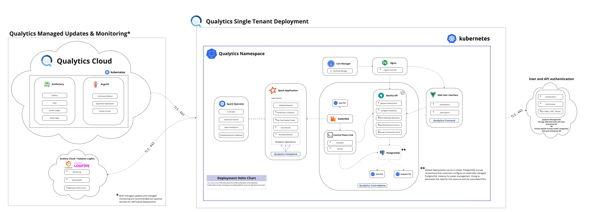
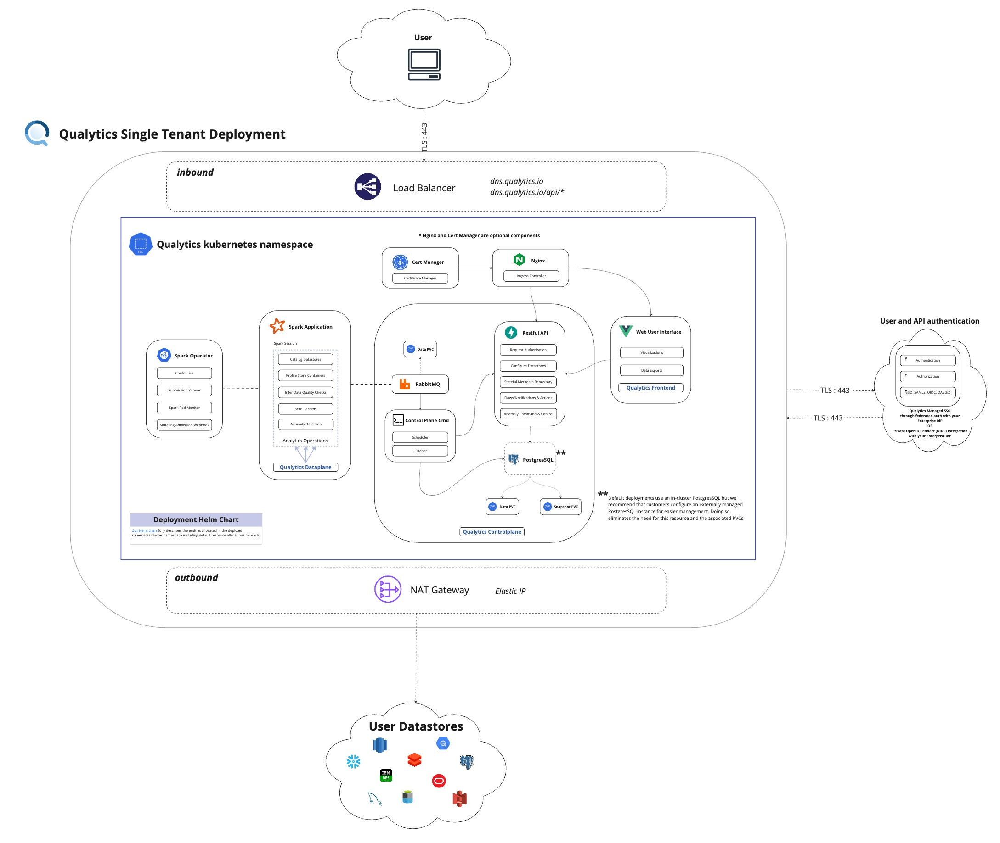

# Deployment Options

## Introduction
This document serves as a primer for organizations looking to decide which deployment model of Qualytics is right for them. It provides an overview of the two primary deployment models and considerations when making this decision.

## Overview
The following two deployment models are supported for the Qualytics platform:

- __[Model 1: Platform as a Service Deployment](#paas)__: to a single-tenant virtual private cloud (VPC) provisioned by Qualytics on infrastructure that Qualytics manages
- __[Model 2: Customer-Managed Deployment](#customer-managed)__: to a [CNCF compliant Kubernetes control plane](https://www.cncf.io/certification/software-conformance/) on Customer managed infrastructure (including on-premises options)

### Across both models, the following is true:
- Raw customer data is not stored at-rest but derivative data and select values may be held in the dedicated VPC
- READ access is required to connect a datastore to the Qualytics Platform
- WRITE access to Customer chosen datastore is required for enrichment data

### Databricks Deployment

For organizations using Databricks as their data processing platform, Qualytics provides a specialized dataplane deployment option. This allows the Qualytics dataplane to run directly within your Databricks environment as a continuous job.

For detailed instructions on setting up the Qualytics dataplane in Databricks, see our [Databricks Deployment Guide](databricks-deployment.md).

### <a name="paas"></a>__Model 1: Platform as a Service (PaaS) Deployment__

#### Overview
In this model, the Qualytics platform is deployed to a single-tenant virtual private cloud provisioned by Qualytics and with the provider and in the region of Customer's choosing. This VPC is not shared (single-tenant) and contains a single Customer Qualytics deployment.

<figure markdown>
  [](../assets/deployments/paas_architectural_diagram.jpg)
  <figcaption>PaaS Deployment Architecture</figcaption>
</figure>

#### Supported Cloud Providers
Depending on Customer's cloud infrastructure, this option uses one of the following:

- EKS (Elastic Kubernetes Service)
- AKS (Azure Kubernetes Service)
- GKE (Google Kubernetes Engine)
- Oracle OKE (Oracle Container Engine for Kubernetes)

#### Network Requirements
This model requires that the provisioned VPC have the ability to access Customer's datastore(s). In the case of publicly routable datastores such as Snowflake or S3, no extra configuration is required. In the case of private datastore(s) with no public IP address or route, the hosted VPC will require private routing using: PrivateLink, Transit Gateway peering, point to point VPN, or similar support to enable network access to that private datastore.

#### Considerations
This is Qualytics' preferred model of deployment. In this model, Qualytics is fully responsible for the provisioning and operation of the Qualytics platform. Customer is only responsible for granting the Qualytics platform necessary access.

### <a name="customer-managed"></a>__Model 2: Customer-Managed Deployment__

#### Overview
In this model, the Qualytics platform is deployed to a CNCF compliant Kubernetes control plane on Customer managed infrastructure, which can include on-premises deployments. This chart will deploy a single-tenant instance of the qualytics platform to a [CNCF compliant](https://www.cncf.io/certification/software-conformance/) kubernetes control plane.

<figure markdown>
  [](../assets/deployments/deployment_arch_diagram.jpg)
  <figcaption>Customer-Managed Deployment Architecture</figcaption>
</figure>

#### Prerequisites

Before deploying Qualytics, ensure you have:

- A Kubernetes cluster (recommended version 1.30+)
- `kubectl` configured to access your cluster
- `helm` CLI installed (recommended version 3.12+)
- Docker registry credentials from your Qualytics account manager
- Auth0 configuration details from your Qualytics account manager

#### Deployment Guide

Please work with your account manager at Qualytics to secure the right values for your licensed deployment. If you don't yet have an account manager, [please write us here](mailto://hello@qualytics.co) to say hello!

##### Step 1: Create a CNCF compliant cluster

Qualytics fully supports kubernetes clusters hosted in AWS, GCP, and Azure as well as any CNCF-compliant control plane.

###### Node Requirements

Node(s) with the following labels must be made available:

- `appNodes=true`
- `driverNodes=true`
- `executorNodes=true`

Nodes with the `driverNodes=true` and `executorNodes=true` labels will be used for Spark jobs, while nodes with the `appNodes=true` label will be used for all other needs. Users have the flexibility to merge the `driverNodes=true` and `executorNodes=true` labels into a single label, `sparkNodes=true`, within the same node group, as long as the provided node group can supply sufficient resources to handle both Spark driver and executors. Alternatively, users may choose not to use node selectors at all, allowing the entire cluster to be used without targeting specific node groups. However, it is highly recommended to set up autoscaling for Apache Spark operations by providing separate node groups with the `driverNodes=true` and `executorNodes=true` labels to ensure optimal performance and scalability.

|          |          Application Nodes          |               Spark Driver Nodes                |            Spark Executor Nodes            |
|----------|:-----------------------------------:|:-----------------------------------------------:|:------------------------------------------:|
| Label    | appNodes=true                       | driverNodes=true                                | executorNodes=true                         |
| Scaling  | Autoscaling (1 node on-demand)      | Autoscaling (1 node on-demand)                  | Autoscaling (1 - 12 nodes spot)            |
| EKS      | t3.2xlarge (8 vCPUs, 32 GB)         | r5.2xlarge (8 vCPUs, 64 GB)                     | r5d.2xlarge (8 vCPUs, 64 GB)               |
| GKE      | n2-standard-8 (8 vCPUs, 32 GB)      | n2-highmem-8 (8 vCPUs, 64 GB)                   | n2-highmem-8 (8 vCPUs, 64 GB)              |
| AKS      | Standard_D8_v5 (8 vCPUs, 32 GB)     | Standard_E8s_v5 (8 vCPUs, 64 GB)                | Standard_E8s_v5 (8 vCPUs, 64 GB)           |

###### Docker Registry Secrets

Execute the command below using the credentials supplied by your account manager as a replacement for "&lt;token&gt;". The secret created will provide access to Qualytics private registry on dockerhub and the required images that are available there.

```bash
kubectl create namespace qualytics
kubectl create secret docker-registry regcred -n qualytics --docker-username=qualyticsai --docker-password=<token>
```

!!! important
    The above configuration will connect your cluster directly to our private dockerhub repositories for pulling our images. If you are unable to directly connect your cluster to our image repository for technical or compliance reasons, then you can instead import our images into your preferred registry using these same credentials (`docker login -u qualyticsai -p <token>`). You'll need to update the image URLs in the values.yaml file in the next step to point to your repository instead of ours.

##### Step 2: Create your configuration file

For a quick start, copy the simplified template configuration:

```bash
cp template.values.yaml values.yaml
```

The `template.values.yaml` file contains essential configurations with sensible defaults. You'll need to update these required settings:

1. __DNS Record__ (provided by Qualytics or managed by customer):

    ```yaml
    global:
      dnsRecord: "your-company.qualytics.io"  # or your custom domain
    ```

2. __Auth0 Settings__ (provided by your Qualytics account manager):

    ```yaml
    secrets:
      auth0:
        auth0_audience: your-api-audience
        auth0_organization: org_your-org-id
        auth0_spa_client_id: your-spa-client-id
    ```

3. __Security Secrets__ (generate secure random values):

    ```yaml
    secrets:
      auth:
        jwt_signing_secret: your-secure-jwt-secret
      postgres:
        secrets_passphrase: your-secure-passphrase
      rabbitmq:
        rabbitmq_password: your-secure-password
    ```

__Optional configurations:__

- Enable `nginx` if you need an ingress controller
- Enable `certmanager` for automatic SSL certificates
- Configure `controlplane.smtp` settings for email notifications
- Node selectors are now enabled by default for dedicated node groups

For advanced configuration, refer to the full `charts/qualytics/values.yaml` file which contains all available options.

!!! info 
    Contact your [Qualytics account manager](mailto://hello@qualytics.co) for assistance.

##### Step 3: Deploy Qualytics to your cluster

Add the Qualytics Helm repository and deploy the platform:

```bash
# Add the Qualytics Helm repository
helm repo add qualytics https://qualytics.github.io/qualytics-helm-public
helm repo update

# Deploy Qualytics
helm upgrade --install qualytics qualytics/qualytics \
  --namespace qualytics \
  --create-namespace \
  -f values.yaml \
  --timeout=20m
```

__Monitor the deployment:__

```bash
# Check deployment status
kubectl get pods -n qualytics
```

__Get the ingress IP address:__

```bash
# If using nginx ingress
kubectl get svc -n qualytics qualytics-nginx-controller

# Or check ingress resources
kubectl get ingress -n qualytics
```

!!! note
    Note this IP address as it's needed for the next step!

##### Step 4: Configure DNS for your deployment

You have two options for DNS configuration:

###### Option A: Qualytics-managed DNS (Recommended)

Send your [account manager](mailto://hello@qualytics.co) the IP address from step 3. Qualytics will assign a DNS record under `*.qualytics.io` (e.g., `https://acme.qualytics.io`) and handle SSL certificate management.

###### Option B: Custom Domain

If using your own domain:

1. Create an A record pointing your domain to the ingress IP address
2. Ensure your `global.dnsRecord` in values.yaml matches your custom domain
3. Configure SSL certificates (enable `certmanager` or provide your own)
4. Update any firewall rules to allow traffic to your domain


!!! info
    Contact your [account manager](mailto://hello@qualytics.co) for assistance with either option.

#### Can I run a fully "air-gapped" deployment?

Yes. The only egress requirement for a standard self-hosted Qualytics deployment is to <https://auth.qualytics.io> which provides Auth0-powered federated authentication. This is recommended for ease of installation and support, but not a strict requirement. 

If you require a fully private deployment with no access to the public internet, you can instead configure an OpenID Connect (OIDC) integration with your enterprise identity provider (IdP). Simply contact your Qualytics account manager for more details.

#### Troubleshooting

##### Common Issues

__Pods stuck in Pending state:__

- Check node resources: `kubectl describe nodes`
- Verify node selectors match your cluster labels
- Ensure storage classes are available

__Image pull errors:__

- Verify Docker registry secret: `kubectl get secret regcred -n qualytics -o yaml`
- Check if images are accessible from your cluster

__Ingress not working:__

- Ensure an ingress controller is installed and running
- Check ingress resources: `kubectl describe ingress -n qualytics`

##### Useful Commands

```bash
# Check all resources
kubectl get all -n qualytics

# Restart a deployment
kubectl rollout restart deployment/qualytics-api -n qualytics
kubectl rollout restart deployment/qualytics-cmd -n qualytics

# View detailed pod information
kubectl describe pod <pod-name> -n qualytics

# Get spark application logs
kubectl logs -f pod qualytics-spark-driver -n qualytics
```
