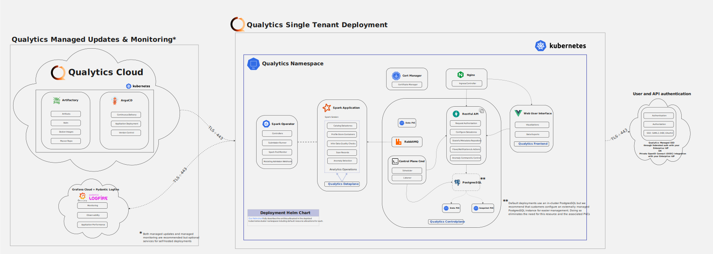

# Deployment Options

## Introduction
This document serves as a primer for organizations looking to decide which deployment model of Qualytics is right for them. It provides an overview of the two primary deployment models and considerations when making this decision.

## Overview
The following two deployment models are supported for the Qualytics platform:

- __[Model 1: Platform as a Service Deployment](#paas)__: to a single-tenant virtual private cloud (VPC) provisioned by Qualytics on infrastructure that Qualytics manages
- __[Model 2: Customer-Managed Deployment](#customer-managed)__: to a [CNCF compliant Kubernetes control plane](https://www.cncf.io/certification/software-conformance/) on Customer managed infrastructure (including on-premises options)

### Across both models, the following is true:
- Raw customer data is not stored at-rest but derivative data and select values may be held in the dedicated VPC
- READ access is required to connect a datastore to the Qualytics Platform
- WRITE access to Customer chosen datastore is required for enrichment data

### Databricks Deployment

For organizations using Databricks as their data processing platform, Qualytics provides a specialized dataplane deployment option. This allows the Qualytics dataplane to run directly within your Databricks environment as a continuous job.

For detailed instructions on setting up the Qualytics dataplane in Databricks, see our [Databricks Deployment Guide](databricks-deployment.md).

### __Model 1: Platform as a Service (PaaS) Deployment__

#### Overview
In this model, the Qualytics platform is deployed to a single-tenant virtual private cloud provisioned by Qualytics and with the provider and in the region of Customer's choosing. This VPC is not shared (single-tenant) and contains a single Customer Qualytics deployment.

<figure markdown>
  
  <figcaption>PaaS Deployment Architecture</figcaption>
</figure>

#### Supported Cloud Providers
Depending on Customer's cloud infrastructure, this option uses one of the following:

- EKS (Elastic Kubernetes Service)
- AKS (Azure Kubernetes Service)
- GKE (Google Kubernetes Engine)
- Oracle OKE (Oracle Container Engine for Kubernetes)

#### Network Requirements
This model requires that the provisioned VPC have the ability to access Customer's datastore(s). In the case of publicly routable datastores such as Snowflake or S3, no extra configuration is required. In the case of private datastore(s) with no public IP address or route, the hosted VPC will require private routing using: PrivateLink, Transit Gateway peering, point to point VPN, or similar support to enable network access to that private datastore.

#### Considerations
This is Qualytics' preferred model of deployment. In this model, Qualytics is fully responsible for the provisioning and operation of the Qualytics platform. Customer is only responsible for granting the Qualytics platform necessary access.

### __Model 2: Customer-Managed Deployment__

#### Overview
In this model, the Qualytics platform is deployed to a CNCF compliant Kubernetes control plane on Customer managed infrastructure, which can include on-premises deployments. This chart will deploy a single-tenant instance of the qualytics platform to a [CNCF compliant](https://www.cncf.io/certification/software-conformance/) kubernetes control plane.

<figure markdown>
  
  <figcaption>Customer-Managed Deployment Architecture</figcaption>
</figure>

#### System Requirements
This option supports deployments to any Kubernetes control plane that meets the following system requirements:

- Any Kubernetes version that is officially supported for patches running any [CNCF compliant control plane](https://www.cncf.io/certification/software-conformance/)
- A minimum 16 cores and 80 gigabytes of memory available for workload allocation
- Assigned a Customer resolvable fully-qualified domain name for the https ingress to the Qualytics UI
- (optional) Grant Qualytics an admin-level ServiceAccount to the cluster for pushing automated upgrades

#### Network Requirements
This model requires that the Kubernetes nodes supporting Qualytics' analytics engine have the ability to access Customer's datastore(s). Because Customer hosts the Qualytics deployment, Customer is solely responsible for ensuring the necessary network configuration and support.

#### Considerations
This model supports organizations that due to regulatory or other restrictions cannot permit READ access to their datastore(s) from a third-party hosted product. This model requires Customer to manage and operate the appropriate infrastructure and ensure it is granted all necessary access to the targeted datastore(s).

For deployments to supported commercial Kubernetes control planes (EKS, AKS, GKE, OKE) and at the Customer's discretion, Qualytics will provision the deployment and transfer ownership of the applicable infrastructure to the Customer. Otherwise, the Customer shall be responsible for both the provisioning of a cluster meeting the requisite system requirements and the deployment of the Qualytics platform via [Qualytics provided Helm chart](../upgrades/qualytics-single-tenant-instance.md).

> **Terraform Templates Available**: To simplify infrastructure provisioning, we provide ready-to-use Terraform templates for [AWS](https://github.com/Qualytics/qualytics-self-hosted/tree/main/terraform/aws), [GCP](https://github.com/Qualytics/qualytics-self-hosted/tree/main/terraform/gcp), and [Azure](https://github.com/Qualytics/qualytics-self-hosted/tree/main/terraform/azure). These templates create Kubernetes clusters with the correct node pools, labels, storage classes, and networking configuration required for Qualytics deployments.
