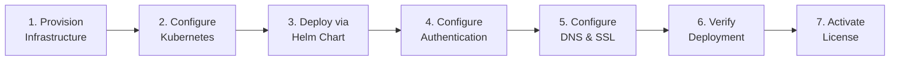

# Self-Hosted Deployment Guide

This guide walks you through deploying the Qualytics platform on your own infrastructure using a customer-managed Kubernetes cluster.

!!! info "Deployment Model"
    This guide covers **Model 2: Customer-Managed Deployment** — where Qualytics runs on your own Kubernetes infrastructure (including on-premises). If you are a Qualytics SaaS (PaaS) customer, your deployment is fully managed by Qualytics and you do not need this guide.

## Deployment Overview

A self-hosted Qualytics deployment consists of the following steps:



## Prerequisites

Before you begin, ensure you have the following:

| Requirement | Details |
|-------------|---------|
| **Kubernetes cluster** | Version 1.30+ on any [CNCF-compliant](https://www.cncf.io/certification/software-conformance/) control plane |
| **Minimum resources** | 16 cores and 80 GB memory available for workload allocation |
| **CLI tools** | `kubectl` (configured to access your cluster) and `helm` (version 3.12+) |
| **Registry credentials** | Docker registry credentials from your [Qualytics account manager](mailto:hello@qualytics.ai) |
| **Domain name** | A fully-qualified domain name resolvable by your users |
| **Authentication config** | Either [OIDC credentials](oidc-configuration.md) from your IdP or [Auth0 credentials](auth0-setup.md) from Qualytics |

## Step 1: Provision Infrastructure

Qualytics supports Kubernetes clusters hosted on **AWS (EKS)**, **GCP (GKE)**, **Azure (AKS)**, and any CNCF-compliant control plane including on-premises distributions.

!!! tip "Terraform Templates"
    We provide ready-to-use Terraform templates that create the required node pools, storage classes, and networking configuration:

    - [AWS (EKS)](https://github.com/Qualytics/qualytics-self-hosted/tree/main/terraform/aws)
    - [GCP (GKE)](https://github.com/Qualytics/qualytics-self-hosted/tree/main/terraform/gcp)
    - [Azure (AKS)](https://github.com/Qualytics/qualytics-self-hosted/tree/main/terraform/azure)

### Node Requirements

Your cluster must have nodes with the following labels:

| Label | Purpose | Scaling | EKS | GKE | AKS |
|-------|---------|---------|-----|-----|-----|
| `appNodes=true` | Application workloads | Autoscaling (1 node on-demand) | m8g.2xlarge (8 vCPUs, 32 GB) | n4-standard-8 (8 vCPUs, 32 GB) | Standard_D8s_v6 (8 vCPUs, 32 GB) |
| `driverNodes=true` | Spark driver jobs | Autoscaling (1 node on-demand) | r8g.2xlarge (8 vCPUs, 64 GB) | n4-highmem-8 (8 vCPUs, 64 GB) | Standard_E8s_v6 (8 vCPUs, 64 GB) |
| `executorNodes=true` | Spark executor jobs | Autoscaling (1–12 nodes spot) | r8gd.2xlarge (8 vCPUs, 64 GB, 474 GB SSD) | n2-highmem-8 + Local SSD (8 vCPUs, 64 GB) | Standard_E8ds_v5 (8 vCPUs, 64 GB, 300 GB SSD) |

!!! note "Flexible Node Configuration"
    - You may merge `driverNodes=true` and `executorNodes=true` into a single `sparkNodes=true` label if your node group has sufficient resources.
    - You may also skip node selectors entirely and allow the full cluster to be used, though dedicated node groups with autoscaling are recommended for optimal performance.

!!! note "Local SSD Storage"
    Local SSD storage on executor nodes is recommended for optimal Spark performance but not mandatory. Spark will use remote storage for shuffle and scratch data when local SSD is unavailable.

## Step 2: Configure Kubernetes

### Create Namespace and Registry Secret

Use the credentials provided by your Qualytics account manager to create the Docker registry secret:

```bash
kubectl create namespace qualytics
kubectl create secret docker-registry regcred -n qualytics \
  --docker-username=qualyticsai \
  --docker-password=<token>
```

!!! important "Private Registry Option"
    If your cluster cannot connect directly to Docker Hub, you can import the Qualytics images into your own registry:

    ```bash
    docker login -u qualyticsai -p <token>
    ```

    Then update the image URLs in your `values.yaml` to point to your registry.

## Step 3: Deploy via Helm Chart

### Add the Qualytics Helm Repository

```bash
helm repo add qualytics https://qualytics.github.io/qualytics-self-hosted
helm repo update
```

### Create Your Configuration File

```bash
cp template.values.yaml values.yaml
```

Edit `values.yaml` to configure your deployment. The following settings are required:

**DNS Record:**

```yaml
global:
  dnsRecord: "your-company.qualytics.io"  # or your custom domain
```

**Authentication** — choose one of the following:

=== "OIDC (Recommended)"

    Only 4 values needed — scopes, claim mappings, and endpoints all use sensible defaults. See the [OIDC Configuration Guide](oidc-configuration.md) for advanced options.

    ```yaml
    global:
      authType: "OIDC"

    secrets:
      oidc:
        oidc_discovery_url: "https://your-idp.example.com/.well-known/openid-configuration"
        oidc_client_id: "your-oidc-client-id"
        oidc_client_secret: "your-oidc-client-secret"
      auth:
        jwt_signing_secret: "your-secure-jwt-secret"  # min 32 chars
    ```

=== "Auth0"

    See the [Auth0 Setup Guide](auth0-setup.md) for how to request these values from Qualytics.

    ```yaml
    global:
      authType: "AUTH0"

    secrets:
      auth0:
        auth0_audience: "your-api-audience"
        auth0_organization: "org_your-org-id"
        auth0_spa_client_id: "your-spa-client-id"
      auth:
        jwt_signing_secret: "your-secure-jwt-secret"  # min 32 chars
    ```

**Security Secrets** (generate secure random values):

```yaml
secrets:
  auth:
    jwt_signing_secret: "your-secure-jwt-secret"       # min 32 chars
  postgres:
    secrets_passphrase: "your-secure-passphrase"
  rabbitmq:
    rabbitmq_password: "your-secure-password"
```

!!! tip "Generating Secure Secrets"
    Use `openssl rand -base64 32` to generate secure random values for each secret.

**Optional configurations:**

- Enable `nginx` if you need an ingress controller
- Enable `certmanager` for automatic SSL certificates
- Configure `controlplane.smtp` settings for email notifications

For the full list of available options, refer to `charts/qualytics/values.yaml` in the Helm chart.

### Deploy

```bash
helm upgrade --install qualytics qualytics/qualytics \
  --namespace qualytics \
  --create-namespace \
  -f values.yaml \
  --timeout=20m
```

### Monitor Deployment

```bash
kubectl get pods -n qualytics
```

Wait until all pods show a `Running` status before proceeding.

## Step 4: Configure Authentication

Qualytics supports two authentication modes for self-hosted deployments:

| Mode | Recommended For | Details |
|------|----------------|---------|
| **OIDC** (Recommended) | Air-gapped or standard self-hosted deployments | Integrates directly with your enterprise IdP — no external dependencies |
| **Auth0** | Deployments with internet access | Managed by Qualytics — simpler setup but requires egress to `auth.qualytics.io` |

- **[OIDC Configuration Guide](oidc-configuration.md)** — Step-by-step instructions for configuring OIDC with your Identity Provider
- **[Auth0 Setup Guide](auth0-setup.md)** — How to request and configure Auth0 for your self-hosted deployment

## Step 5: Configure DNS & SSL

Get the ingress IP address from your deployment:

```bash
# If using nginx ingress
kubectl get svc -n qualytics qualytics-nginx-controller

# Or check ingress resources
kubectl get ingress -n qualytics
```

### Option A: Qualytics-Managed DNS (Recommended)

Send your [account manager](mailto:hello@qualytics.ai) the IP address from above. Qualytics will:

1. Assign a DNS record under `*.qualytics.io` (e.g., `https://acme.qualytics.io`)
2. Handle SSL certificate management

### Option B: Custom Domain

If using your own domain:

1. Create an A record pointing your domain to the ingress IP address
2. Ensure `global.dnsRecord` in `values.yaml` matches your custom domain
3. Configure SSL certificates (enable `certmanager` in your Helm values or provide your own)
4. Update any firewall rules to allow traffic to your domain

## Step 6: Verify Deployment

1. **Access the UI** — Navigate to your configured domain (e.g., `https://acme.qualytics.io`) in a browser
2. **Test authentication** — Log in using your configured authentication method (OIDC or Auth0)
3. **Check pod health** — Verify all pods are running:

    ```bash
    kubectl get pods -n qualytics
    ```

4. **Check API health** — Verify the API is responding:

    ```bash
    curl -s https://your-domain.qualytics.io/api/health
    ```

## Step 7: Activate Your License

Self-hosted deployments require a valid license. A **31-day grace period** starts automatically when you create your first datastore connection — during this time, the platform is fully functional without a license. A warning banner on the **Settings > Status** page counts down the remaining days.

!!! warning "Activate before the grace period ends"
    If the grace period expires without a valid license, **dataplane operations** (scanning, profiling, enrichment) are blocked. The UI remains accessible so admins can apply a license.

### Requesting a License

1. Navigate to **Settings > Status** (requires **Admin** or **Manager** role)
2. Click **Generate License Request** — this creates an encoded fingerprint of your deployment
3. Copy the request string and send it to your [Qualytics account manager](mailto:hello@qualytics.ai) via a secure channel (e.g., [Bitwarden Send](https://bitwarden.com/products/send/) — never plain email)
4. Qualytics signs the request and returns a license key

### Applying a License

1. In **Settings > Status**, click **Update License**
2. Paste the signed license key and submit
3. The license is now active — the expiration date displays on the Status page

### Renewal

The renewal process is identical to initial activation — generate a new request, send it to Qualytics, and apply the signed key.

- A warning appears when the license expires **within 30 days** (the date turns red with a warning icon)
- **Renew before expiration** to avoid service interruption — if a license expires, dataplane operations stop until a new license is applied

!!! note
    No Helm configuration is needed for licensing — it is handled entirely through the UI.

## Air-Gapped Deployments

Qualytics fully supports air-gapped deployments with no internet egress required. To deploy in an air-gapped environment:

1. **Import container images** into your private registry using the credentials from your account manager
2. **Update image URLs** in `values.yaml` to point to your private registry
3. **Use OIDC authentication** — configure direct integration with your enterprise IdP (see the [OIDC Configuration Guide](oidc-configuration.md))

!!! info
    The only egress requirement for a standard self-hosted deployment is to `https://auth.qualytics.io` for Auth0 authentication. By using OIDC instead, you eliminate this requirement entirely.

## Upgrading

!!! info "Do you have the Qualytics Helm chart repository locally?"
    Make sure you have the Qualytics Helm chart repository in your local Helm repositories:
    ```bash
    helm repo add qualytics https://qualytics.github.io/qualytics-self-hosted
    ```

### Update the Helm Repository

```bash
helm repo update
```

To see all available Helm chart versions:

```bash
helm search repo qualytics
```

!!! warning "Target Helm chart version?"
    The target Helm chart version must be higher than the current Helm chart version.

### Run the Upgrade

```bash
helm upgrade --install qualytics qualytics/qualytics \
  --namespace qualytics \
  --create-namespace \
  -f values.yaml \
  --timeout=20m
```

### Monitor Upgrade Progress

```bash
kubectl get pods --namespace qualytics --watch
```

Watch the status of the pods in real-time. Ensure that the pods are successfully updated without any issues.

### Verify the Upgrade

Once the upgrade is complete, verify the deployment by checking pod status:

```bash
kubectl get pods --namespace qualytics
```

Ensure that all pods are running, indicating a successful upgrade.

## Troubleshooting

### Common Issues

**Pods stuck in Pending state:**

- Check node resources: `kubectl describe nodes`
- Verify node selectors match your cluster labels
- Ensure storage classes are available

**Image pull errors:**

- Verify Docker registry secret: `kubectl get secret regcred -n qualytics -o yaml`
- Check if images are accessible from your cluster

**Ingress not working:**

- Ensure an ingress controller is installed and running
- Check ingress resources: `kubectl describe ingress -n qualytics`

**Authentication errors:**

- For OIDC issues, see the [OIDC troubleshooting section](oidc-configuration.md#troubleshooting)
- For Auth0 issues, verify your Auth0 credentials with your [Qualytics account manager](mailto:hello@qualytics.ai)

### Useful Commands

```bash
# Check all resources
kubectl get all -n qualytics

# View logs for a specific pod
kubectl logs -f <pod-name> -n qualytics

# Restart a deployment
kubectl rollout restart deployment/qualytics-api -n qualytics
kubectl rollout restart deployment/qualytics-cmd -n qualytics

# View detailed pod information
kubectl describe pod <pod-name> -n qualytics

# Get Spark application logs
kubectl logs -f pod qualytics-spark-driver -n qualytics
```

!!! info "Need Help?"
    Contact your [Qualytics account manager](mailto:hello@qualytics.ai) for assistance with any deployment issues.
