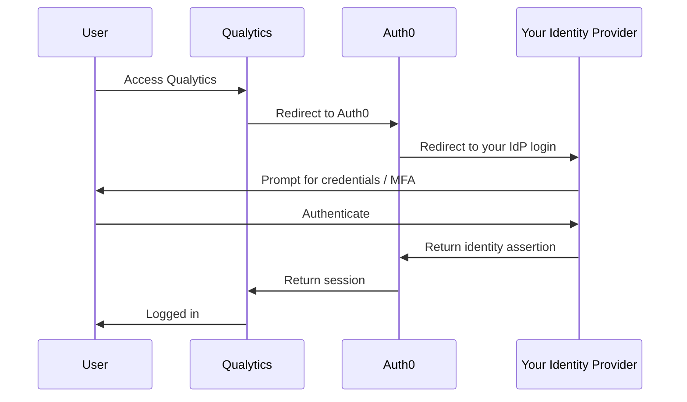

# Single Sign-On (SSO) Setup

This guide explains how to enable Single Sign-On (SSO) for your Qualytics deployment. With SSO, your team authenticates using your organization's existing Identity Provider (IdP) — such as Microsoft Entra ID, Okta, or Google Workspace — so there are no extra passwords to manage.

!!! info "Who is this guide for?"
    This guide is for **Qualytics-managed (PaaS/SaaS) customers** whose deployment is hosted and operated by Qualytics. If you manage your own Kubernetes infrastructure (self-hosted), see the [OIDC Configuration Guide](oidc-configuration.md) or [Auth0 Setup Guide](auth0-setup.md) instead.

## How SSO Works

Qualytics uses [Auth0](https://auth0.com/) as its authentication platform. When SSO is enabled, Auth0 federates authentication to your Identity Provider — your users see your organization's familiar login page and never interact with Auth0 directly.

## How to Request SSO

Setting up SSO is a collaborative process between your IT team and Qualytics:

| Step | Who | What |
|------|-----|------|
| **1. Create an application** | Your IT team | Register Qualytics as an application in your IdP (see instructions below) |
| **2. Share credentials** | Your IT team | Securely send the credentials to your Qualytics account manager |
| **3. Configure SSO** | Qualytics | Configure the SSO connection in Auth0 on your behalf |
| **4. Validate** | Your IT team | Test login with SSO and confirm it works |
| **5. Go live** | Qualytics | Disable username/password login once SSO is confirmed working |

!!! warning "Share credentials securely"
    Never send client secrets or credentials over email. Use a secure sharing method such as [Bitwarden Send](https://bitwarden.com/products/send/), a password manager share link, or another encrypted channel approved by your organization.

## Identity Provider Setup

Choose your Identity Provider below for step-by-step instructions on creating the application registration that Qualytics needs.

### Microsoft Entra ID (Azure AD)

1. Sign in to the [Microsoft Entra admin center](https://entra.microsoft.com)
2. Navigate to **Identity** > **Applications** > **App registrations** > **New registration**
3. Configure the registration:

    | Setting | Value |
    |---------|-------|
    | **Name** | `Qualytics` (or your preferred name) |
    | **Supported account types** | Accounts in this organizational directory only (Single tenant) |
    | **Redirect URI (Web)** | `https://auth.qualytics.io/login/callback` |

4. After registration, note the **Application (client) ID** and **Directory (tenant) ID** from the Overview page
5. Navigate to **Certificates & secrets** > **New client secret**
    - Set a description (e.g., `Qualytics SSO`) and choose an expiration period
    - Copy the **secret value** immediately — it will not be shown again

6. Navigate to **Token configuration** > **Add optional claim**
    - Select **ID** token type
    - Add the `email` claim

**Send the following to your Qualytics account manager:**

| Value | Where to find it |
|-------|-----------------|
| **Application (client) ID** | App registration > Overview |
| **Directory (tenant) ID** | App registration > Overview |
| **Client secret value** | Certificates & secrets (copied at creation) |
| **Your Entra domain** | e.g., `yourcompany.onmicrosoft.com` or your custom domain |

### Okta

1. Sign in to your [Okta admin console](https://your-org-admin.okta.com)
2. Navigate to **Applications** > **Applications** > **Create App Integration**
3. Select **OIDC - OpenID Connect** and **Web Application**, then click **Next**
4. Configure the application:

    | Setting | Value |
    |---------|-------|
    | **App integration name** | `Qualytics` |
    | **Grant type** | Authorization Code |
    | **Sign-in redirect URIs** | `https://auth.qualytics.io/login/callback` |
    | **Sign-out redirect URIs** | `https://auth.qualytics.io/logout` |
    | **Assignments** | Limit access to selected groups, or allow everyone in your org |

5. After creation, note the **Client ID** and **Client Secret** from the application's General tab

**Send the following to your Qualytics account manager:**

| Value | Where to find it |
|-------|-----------------|
| **Client ID** | Application > General > Client Credentials |
| **Client secret** | Application > General > Client Credentials |
| **Okta domain** | e.g., `yourcompany.okta.com` |

### Google Workspace

1. Sign in to the [Google Cloud Console](https://console.cloud.google.com)
2. Create a new project or select an existing one
3. Navigate to **APIs & Services** > **OAuth consent screen**
    - Select **Internal** (restricts login to your Google Workspace organization)
    - Fill in the required fields and click **Save**
4. Navigate to **APIs & Services** > **Credentials** > **Create Credentials** > **OAuth client ID**
5. Configure the client:

    | Setting | Value |
    |---------|-------|
    | **Application type** | Web application |
    | **Name** | `Qualytics` |
    | **Authorized redirect URIs** | `https://auth.qualytics.io/login/callback` |

6. After creation, note the **Client ID** and **Client Secret**

**Send the following to your Qualytics account manager:**

| Value | Where to find it |
|-------|-----------------|
| **Client ID** | APIs & Services > Credentials |
| **Client secret** | APIs & Services > Credentials |
| **Google Workspace domain** | e.g., `yourcompany.com` |

### Other OIDC or SAML Providers

Qualytics supports SSO with any Identity Provider that speaks **OpenID Connect (OIDC)** or **SAML 2.0**, including:

- PingFederate / PingOne
- OneLogin
- Keycloak
- Active Directory Federation Services (ADFS)
- ForgeRock
- Any SAML 2.0 compliant provider

**For OIDC providers, send:**

| Value | Description |
|-------|-------------|
| **Client ID** | The OAuth2 client ID |
| **Client secret** | The OAuth2 client secret |
| **Discovery URL** | Your IdP's `.well-known/openid-configuration` URL |
| **Redirect URI used** | `https://auth.qualytics.io/login/callback` |

**For SAML providers, send:**

| Value | Description |
|-------|-------------|
| **IdP metadata URL or XML** | Your SAML IdP metadata |
| **Entity ID** | Your IdP's entity identifier |
| **Sign-in URL** | Your IdP's SAML SSO endpoint |
| **Signing certificate** | Your IdP's X.509 signing certificate (PEM or Base64) |

Contact your [Qualytics account manager](mailto:hello@qualytics.ai) for guidance on configuring your specific provider.

## After SSO Is Enabled

Once Qualytics confirms that SSO is working:

- **Username/password login is disabled** — all users must authenticate through your IdP
- **Your IdP governs access** — MFA, password policies, and conditional access rules from your IdP are enforced
- **User provisioning** — new users are automatically created in Qualytics on first login. For automated provisioning and deprovisioning, see the [Directory Sync guide](../settings/security/directory-sync.md)

## Frequently Asked Questions

**Can I test SSO before disabling password login?**
:   Yes. Qualytics enables SSO alongside existing login during the validation step. Password login is only disabled after you confirm SSO is working.

**What happens if my IdP is down?**
:   If your IdP is unavailable, users will not be able to log in until it is restored. Qualytics does not maintain a separate set of credentials when SSO is enabled.

**Can I use multiple Identity Providers?**
:   Contact your [Qualytics account manager](mailto:hello@qualytics.ai) to discuss multi-IdP configurations.

**How do I rotate the client secret?**
:   Generate a new secret in your IdP, then share the updated value with your Qualytics account manager. Qualytics will update the configuration with zero downtime.

**How do I revoke access for a user?**
:   Disable or remove the user in your Identity Provider. They will be unable to log in on their next session. For immediate deprovisioning, configure [Directory Sync](../settings/security/directory-sync.md).

!!! info "Need Help?"
    Contact your [Qualytics account manager](mailto:hello@qualytics.ai) for assistance with SSO setup.
