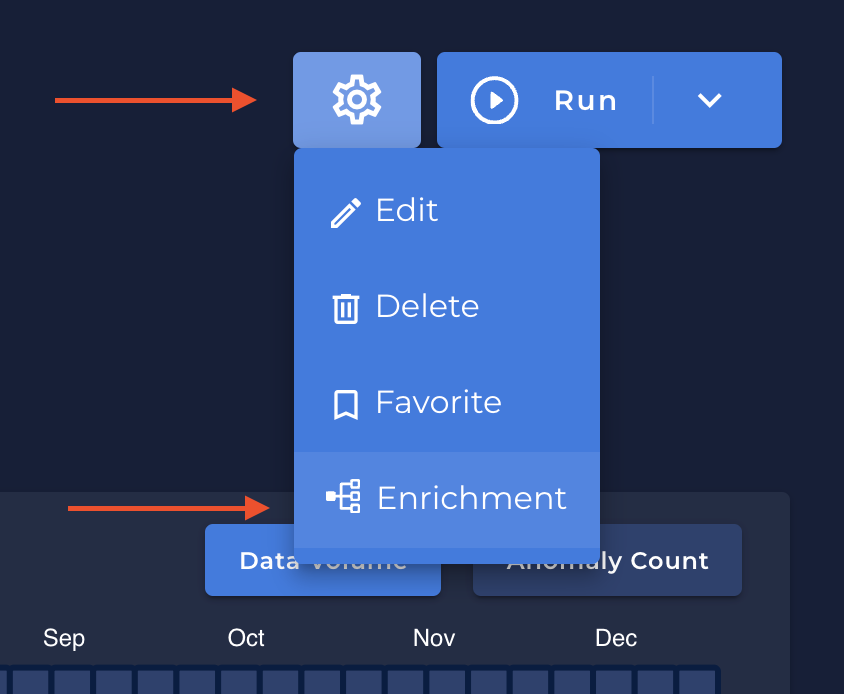
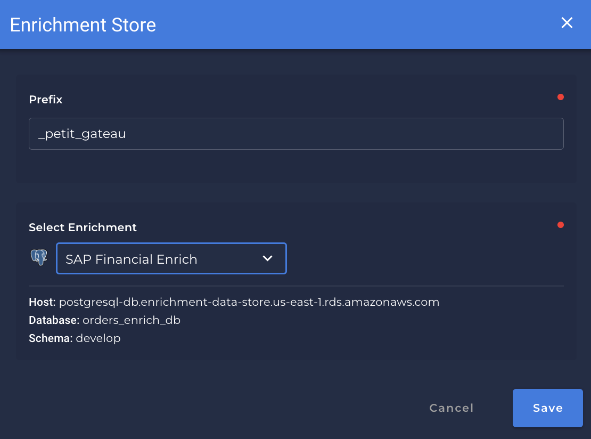
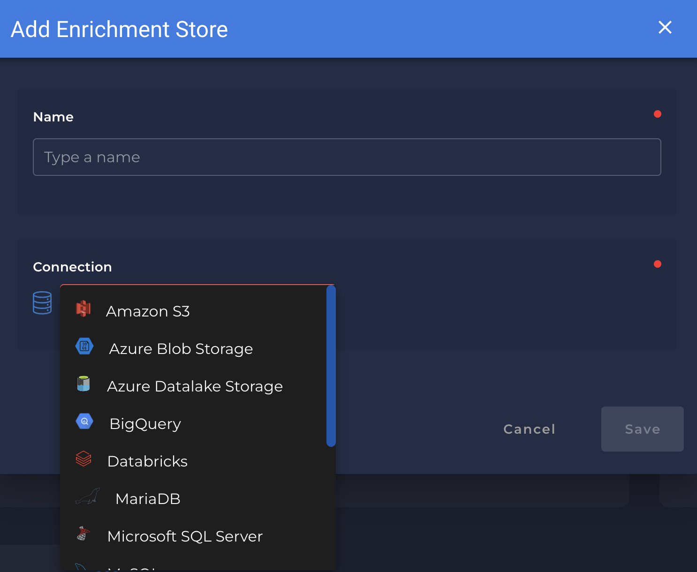
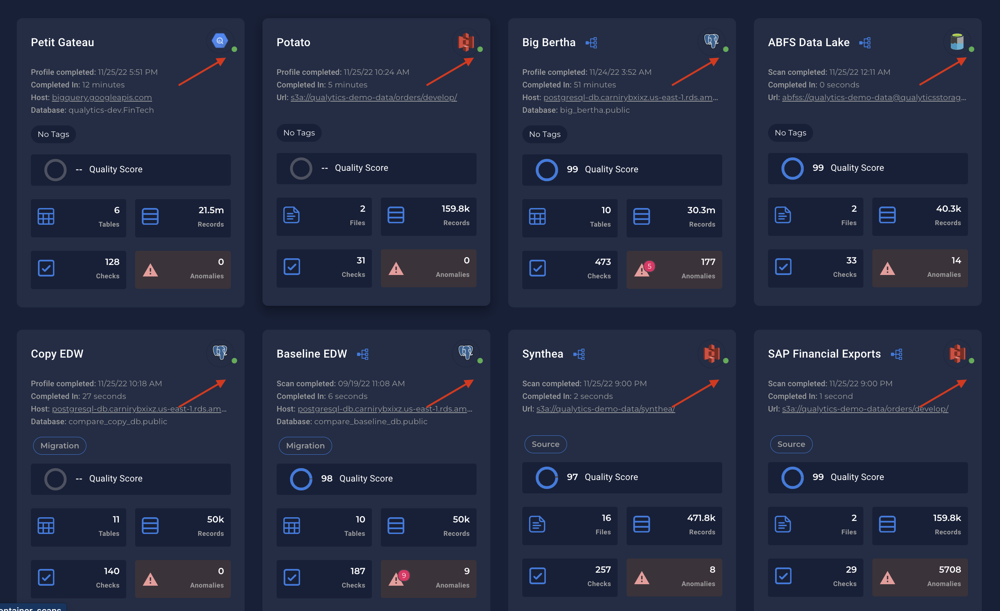

# Attaching an Enrichment Store

1. Once you have selected your `Data Store`, you can click in the engine icon and select `Enrichment`
    - {: style="height:350px"}

2. If you already have created an `Enrichment Store` in `Enrichment Stores` section, a list of the available `Enrichment Store` will be shown to you:

    - {: style="height:350px"}

    - {: style="height:350px"}
    
* When an `Enrichment Store` is attached, you can see a `green` light showing that the connection between the `Data Store` and the `Enrichment Store` are stable or `red` if it's unstable:

    
