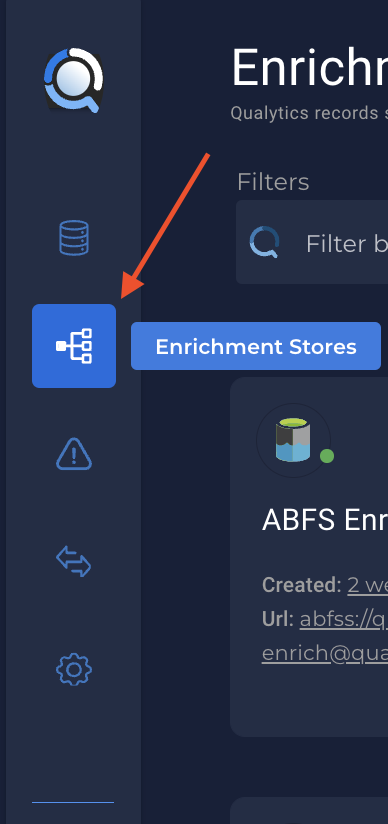
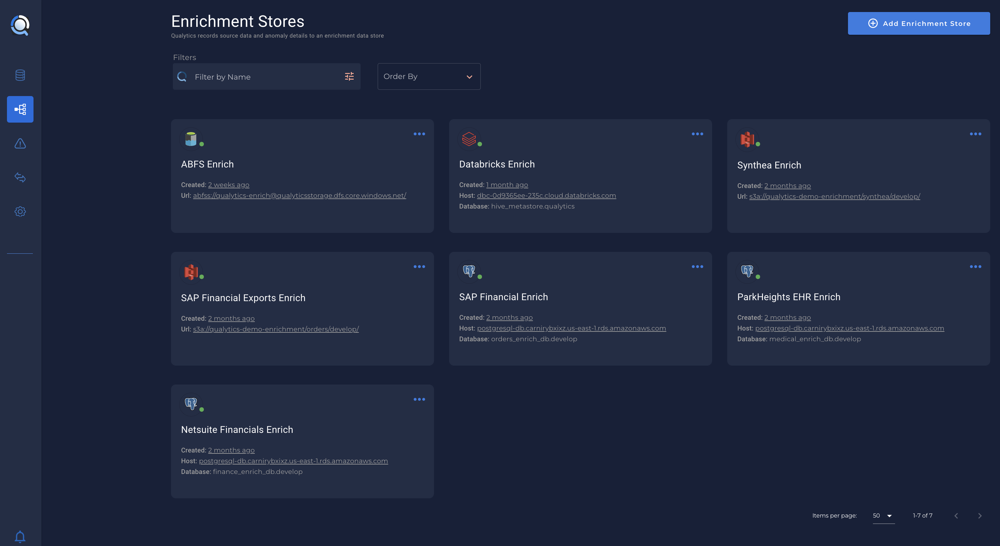

# Create a new Enrichment Store

* You can create a new `Enrichment Store` on `Enrichment Stores` 
 tab 

    - {: style="height:350px"}

# List of supported Enrichment Stores

*On the following links you can see how to setup each one of them.*

* [Amazon S3](/datastores/amazon-s3).
* [Azure Blob Storage](/datastores/azure-blob-storage).
* [Azure Datalake Storage](/datastores/azure-datalake-storage).
* [BigQuery](/datastores/bigquery).
* [Databricks](/datastores/databricks).
* [MariaDB](/datastores/maria-db).
* [Microsoft SQL Server](/datastores/microsoft-sql-server).
* [MySQL](/datastores/mysql).
* [Oracle](/datastores/oracle).
* [PostgreSQL](/datastores/postgresql).
* [QFS](/datastores/qfs).
* [Redshift](/datastores/redshift).
* [Snowflake](/datastores/snowflake).
* [Synapse](/datastores/synapse).

---

# Configuration

* When the Datastore connection details are submitted, a synchronous `Connection Verification` operation will be initiated to verify that the indicated Datastore can be accessed appropriately from Firewall. 

* The result of that operation will either return an error message to you on the new Datastore form view on failure, or mark the new Datastore as “connected” and initiate an asynchronous Catalog operation on success.  

* If any future Operation is unable to establish a connection to the Datastore - the connected property of the Datastore should be set false.  The app should warn/prompt users to address any such Datastore connectivity issues.

* When an `Enrichment Store` is added, it’ll be populated in the home screen along with other data stores:

 

* Clicking into an `Enrichment Store` will guide you to the credentials page