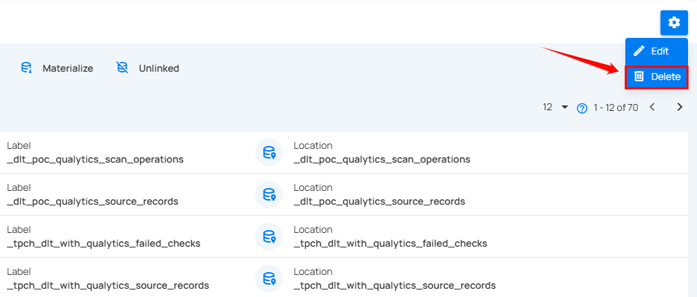
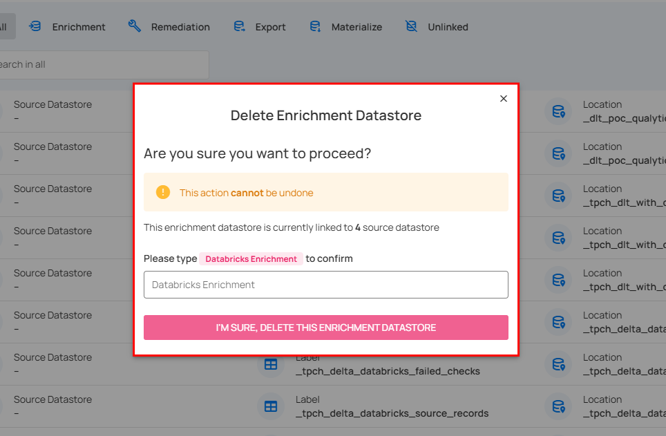
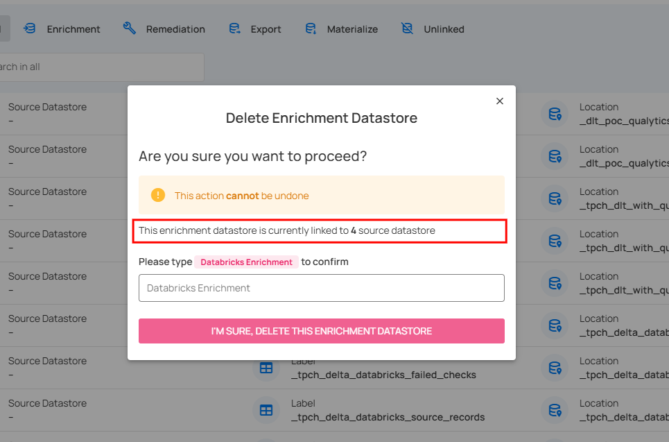
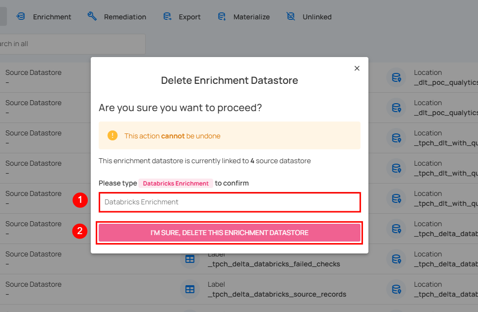

# Delete Enrichment

**Step 1**: Click on the **Delete** icon.

A modal window **Delete Enrichment Datastore** will appear.

When deleting an enrichment datastore, the confirmation dialog displays the number of linked source datastores. 

**Step 2**: Enter the name of the enrichment datastore in the given field (confirmation check) and then click on the **I’M SURE, DELETE THIS ENRICHMENT DATASTORE** button to delete the enrichment datastore.

After clicking the **I’M SURE, DELETE THIS ENRICHMENT DATASTORE** button, a success notification appears confirming the deletion.