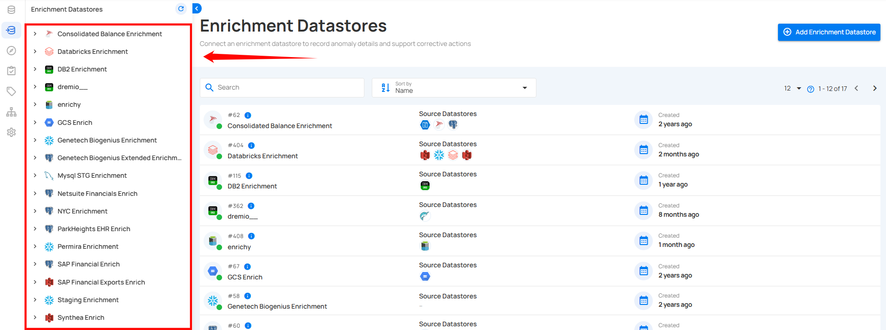
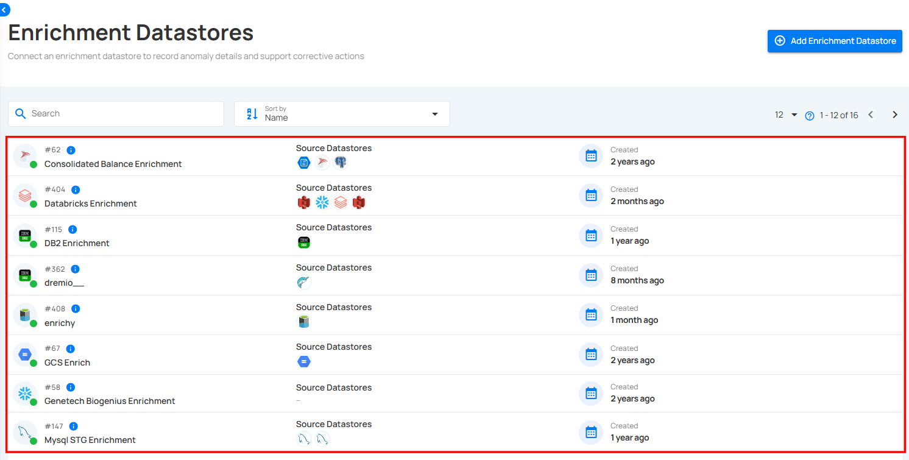
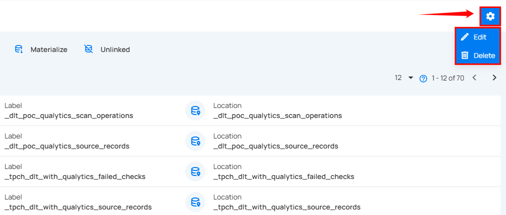

# Enrichment Actions  

Enrichment Actions in Qualytics help you manage enrichment datastores efficiently—whether you're adding a new source, updating existing settings, or removing. These actions keep your enrichment workflows accurate, current, and easy to maintain.

Let’s get started 🚀

## Navigation

Log in to your Qualytics account and click the **Enrichment Datastores** button on the left side panel of the interface.

### Add Enrichment

Use this action to create a new enrichment datastore by entering details such as name, connector type, and authentication credentials.

For more information, refer to the [Add Enrichment Documentation](enrichment-datastore-creation.md).

### Edit & Delete Enrichment

Use Edit to update existing configuration details, and Delete to permanently remove a datastore and its linked components when no longer needed.

**Step 1:** Select the specific enrichment datastore you want to edit or delete.

**Step 2:** Click the Settings icon located at the top right corner of the interface, then choose Edit or Delete depending on the action you want to perform.

#### Edit

Use this action to modify an existing enrichment datastore—update its connection details or reconfigure any required fields.

For more information, refer to the [Edit Enrichment Documentation](edit-enrichment.md).

#### Delete Enrichment

Use this action to permanently delete an enrichment datastore that is no longer required.

For more information, refer to the [Delete Enrichment Documentation](delete-enrichment.md).

