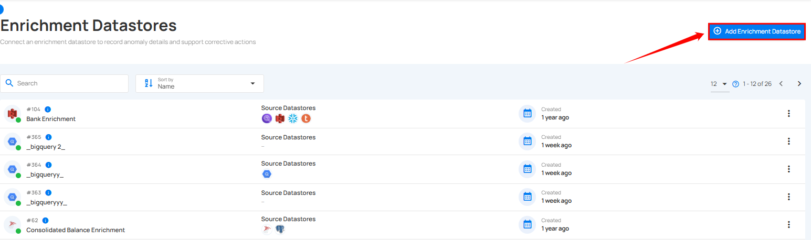
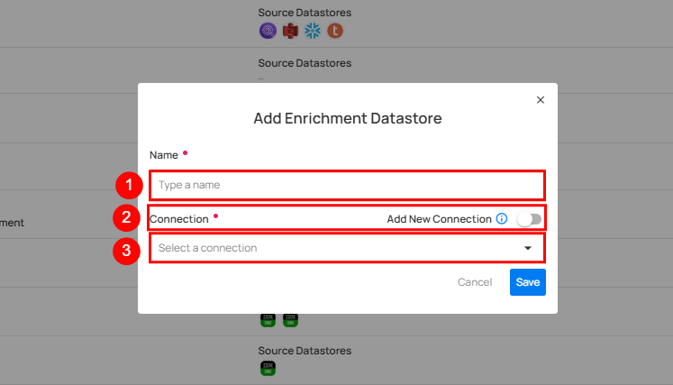
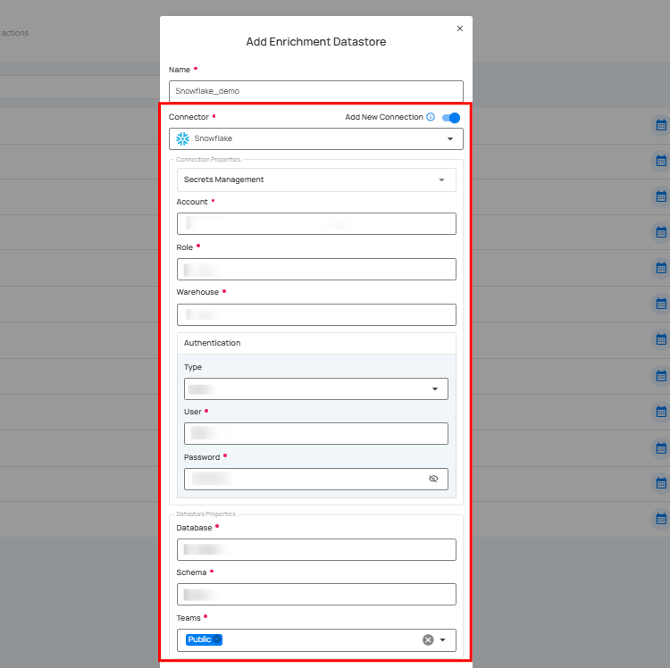
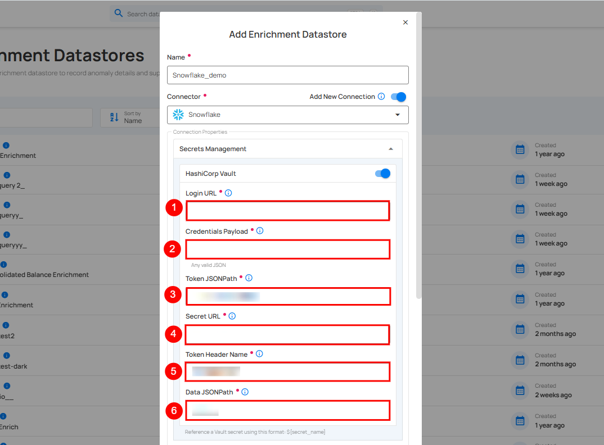
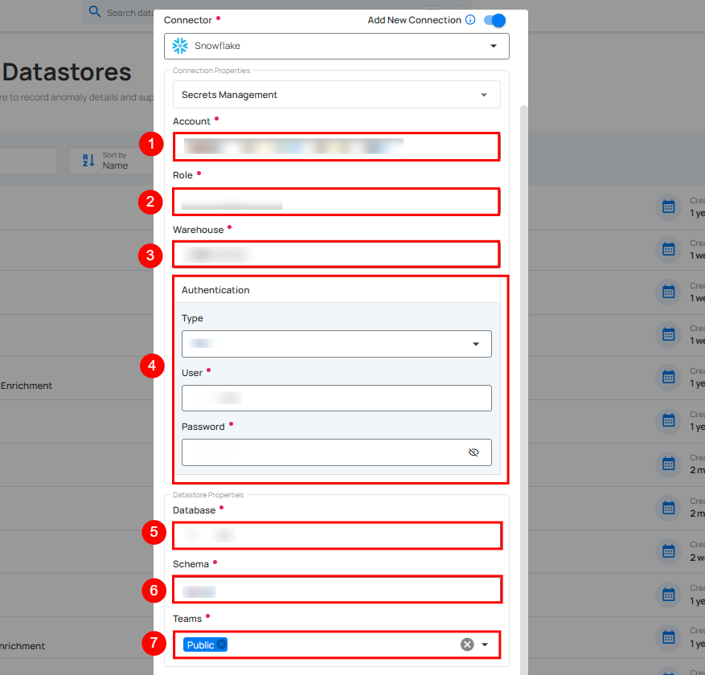
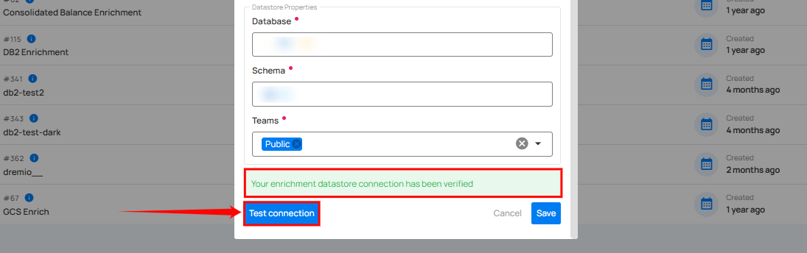
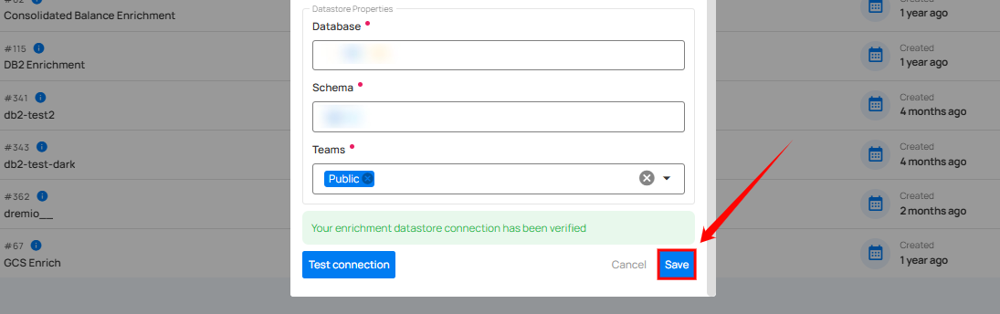
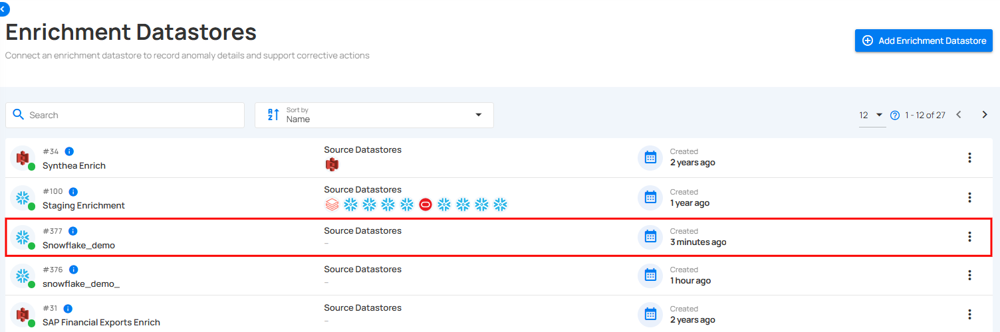
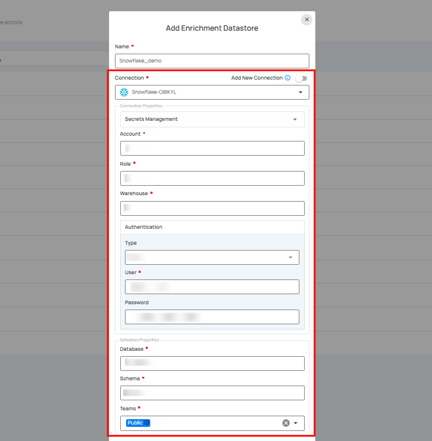

# Add Enrichment Datastore

**Step 1:** Click on the **Add Enrichment Datastore** button located at the top-right corner of the interface.

**Step 2**: A modal window- **Add Enrichment Datastore** will appear, providing you with the options to add enrichment datastore.

| REF. | FIELDS |                     ACTIONS |
| :---- | :---- | :---- |
| 1. | Name | Specify the name of the enrichment datastore |
| 2. | Toggle Button | Toggle **ON** to create a new enrichment datastore from scratch, or toggle **OFF** to reuse credentials from an existing connection |
| 3. | Connector | Select connector from the dropdown list. |

### Option I: Add Enrichment Datastore with a new Connection

If the toggle for **Add New connection** is turned on, then this will prompt you to add and configure the enrichment datastore from scratch without using existing connection details.

**Step 1:** Select the connector from the dropdown list and add connection details such as Secrets Management, temp dataset ID, service account key, project ID, and dataset ID.

For demonstration purposes we have selected the **Snowflake** connector.

**Secrets Management**: This is an optional connection property that allows you to securely store and manage credentials by integrating with HashiCorp Vault and other secret management systems. Toggle it **ON** to enable Vault integration for managing secrets.

!!! note 
    After configuring HashiCorp Vault integration, you can use ${key} in any Connection property to reference a key from the configured Vault secret. Each time the Connection is initiated, the corresponding secret value will be retrieved dynamically.  

| REF | FIELDS | ACTIONS |
| :---- | :---- | :---- |
| 1. | Login URL | Enter the URL used to authenticate with HashiCorp Vault. |
| 2. | Credentials Payload | Input a valid JSON containing credentials for Vault authentication. |
| 3. | Token JSONPath | Specify the JSONPath to retrieve the client authentication token from the response (e.g., $.auth.client_token). |
| 4. | Secret URL | Enter the URL where the secret is stored in Vault. |
| 5. | Token Header Name | Set the header name used for the authentication token (e.g., X-Vault-Token). |
| 6. | Data JSONPath | Specify the JSONPath to retrieve the secret data (e.g., $.data). |

**Step 2:** The configuration form, requesting credential details before add the enrichment datastore.

!!! note 
    Different connectors have different sets of fields and options appearing when selected. 

| REF | FIELDS | ACTIONS |
| :---- | :---- | :---- |
| 1. | Account (Required) | Define the account identifier to be used for accessing the Snowflake. |
| 2. | Role (Required) | Specify the user role that grants appropriate access and permissions. |
| 3. | Warehouse (Required) | Provide the warehouse name that will be used for computing resources. |
| 4. | Authentication (Required) |You can choose between Basic authentication or Keypair authentication for validating and securing the connection to your Snowflake instance.     **Basic Authentication:** This method uses a username and password combination for authentication. It is a straightforward method where the user's credentials are directly used to access Snowflake. <ul><li>**Type:** Select the authentication type from the dropdown menu.</li><li>**User:** Enter the username that Qualytics will use to connect to Snowflake.</li><li>**Password:** Enter the password associated with the specified user account.</li></ul> **Keypair Authentication:** This method uses a combination of a private key and a corresponding public key for authentication. This is a more secure method compared to basic authentication, as it involves asymmetric cryptography <ul> <li>**Type:** Select "Keypair" from the dropdown menu.</li><li>**User:** Enter the username that Qualytics will use to connect to Snowflake.</li> <li>**Private Key:** Upload the private key file that will be used for authentication. This key is part of a public-private key pair used to securely authenticate the user.</li> <li>**Private Key Password (Optional):** Enter the password associated with the private key, if any </li> </ul>  |
| 5. | Database | Specify the database name to be accessed. |
| 6. | Schema | Define the schema within the database that should be used. |
| 7. | Teams | Select one or more teams from the dropdown to associate with this source datastore. |

**Step 3:** After adding the details, click on the **Test Connection** button to check and verify its connection.

If the credentials and provided details are verified, a success message will be displayed indicating that the connection has been verified.

**Step 4:** Click on the **Save** button.

A modal window appears and shows a success message that the enrichment was updated successfully.

**Step 5:** Close the success dialog. Here, you can view a list of all the enrichment datastores you have added to the system. For demonstration purposes, we have created an enrichment datastore named **Snowflake_demo**, which is visible in the list.

### Option II: Use an Existing Enrichment Datastore

If the toggle for **Add New connection** is turned off, then this will prompt you to add and configure the enrichment datastore using existing connection details.

**Step 1**: Select a **connection** to reuse existing credentials.

!!! note 
    If you are using existing credentials, you can only edit the details such as Database, Schema, and Teams.  

**Step 2:** After adding the details, click on the **Test Connection** button to check and verify its connection.

If the credentials and provided details are verified, a success message will be displayed indicating that the connection has been verified.

**Step 3:**  Click on the **Save** button.

A modal window appears and shows a success message that the enrichment was updated successfully.

**Step 4:** Close the success dialog. Here, you can view a list of all the enrichment datastores you have added to the system. For demonstration purposes, we have created an enrichment datastore named **Snowflake_demo**, which is visible in the list.

