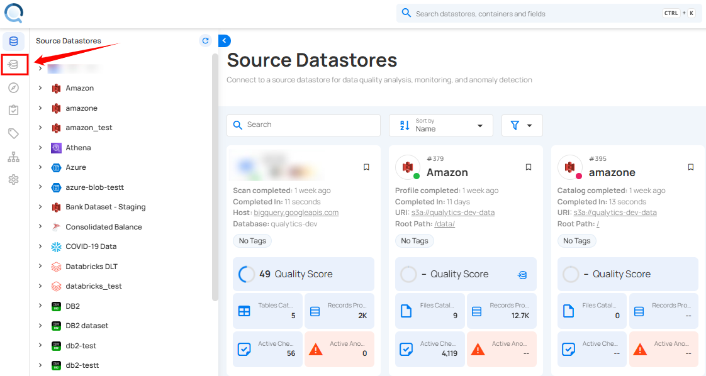

# Enrichment Datastore Overview

An Enrichment Datastore is a user-managed storage location where the Qualytics platform records and accesses metadata through a set of system-defined tables. It is purpose-built to capture metadata generated by the platform's profiling and scanning operations.

Let’s get started 🚀

## Key Points

* **Metadata Storage**: The Enrichment Datastore acts as a dedicated mechanism for writing and retaining metadata that the platform generates. This includes information about anomalies, quality checks, field profiling, and additional details that enrich the source data.

* **Feature Enablement**: By using the Enrichment Datastore, the platform unlocks certain features such as the previewing of source records. For instance, when an anomaly is detected, the platform typically previews a limited set of affected records. For a comprehensive view and persistent access, the Enrichment Datastore captures and maintains a complete snapshot of the source records associated with the anomalies.

* **User-Managed Location**: While the Qualytics platform handles the generation and processing of metadata, the actual storage is user-managed. This means that the user maintains control over the Enrichment Datastore, deciding where and how this data is stored, adhering to their governance and compliance requirements.

* **Insight and Reporting**: Beyond storing metadata, the Enrichment Datastore allows users to derive actionable insights and develop custom reports for a variety of use cases, from compliance tracking to data quality improvement initiatives.

## Navigation

Log in to your Qualytics account and click the Enrichment Datastores button on the left side panel of the interface.



## Table Types

The Enrichment Datastore contains several types of tables, each serving a specific purpose in the data enrichment and remediation process. 

!!! note 
    For more information, please refer to the [table types documentation](../enrichment/table-types.md).

## Diagram

The diagram below provides a visual representation of the associations between various tables in the Enrichment Datastore. It illustrates how tables can be joined to track and analyze data across different processes.


## Handling JSON and string splitting

=== "Snowflake"
    ```sql
	SELECT
		PARSE_JSON(ADDITIONAL_METADATA):metadata_1::string AS Metadata1_Key1,
		PARSE_JSON(ADDITIONAL_METADATA):metadata_2::string AS Metadata2_Key1,
		PARSE_JSON(ADDITIONAL_METADATA):metadata_3::string AS Metadata3_Key1,
		-- Add more lines as needed up to MetadataN
		CONTAINER_ID,
		COVERAGE,
		CREATED,
		DATASTORE_ID,
		DELETED_AT,
		DESCRIPTION,
		SPLIT_PART(FIELDS, ',', 1) AS Field1,
		SPLIT_PART(FIELDS, ',', 2) AS Field2,
		-- Add more lines as needed up to FieldN
		FILTER,
		GENERATED_AT,
		SPLIT_PART(GLOBAL_TAGS, ',', 1) AS Tag1,
		SPLIT_PART(GLOBAL_TAGS, ',', 2) AS Tag2,
		-- Add more lines as needed up to TagN
		HAS_PASSED,
		ID,
		INFERRED,
		IS_NEW,
		IS_TEMPLATE,
		LAST_ASSERTED,
		LAST_EDITOR,
		LAST_UPDATED,
		NUM_CONTAINER_SCANS,
		PARSE_JSON(PROPERTIES):allow_other_fields::string AS Property_AllowOtherFields,
		PARSE_JSON(PROPERTIES):assertion::string AS Property_Assertion,
		PARSE_JSON(PROPERTIES):comparison::string AS Property_Comparison,
		PARSE_JSON(PROPERTIES):datetime_::string AS Property_Datetime,
		-- Add more lines as needed up to Property
		RULE_TYPE,
		SOURCE_CONTAINER,
		SOURCE_DATASTORE,
		TEMPLATE_ID,
		WEIGHT
	FROM "_EXPORT_CHECKS";
    ```
=== "PostgreSQL"
    ```sql
    SELECT
		(ADDITIONAL_METADATA::json ->> 'metadata_1') AS Metadata1_Key1,
		(ADDITIONAL_METADATA::json ->> 'metadata_2') AS Metadata2_Key1,
		(ADDITIONAL_METADATA::json ->> 'metadata_3') AS Metadata3_Key1,
		-- Add more lines as needed up to MetadataN
		CONTAINER_ID,
		COVERAGE,
		CREATED,
		DATASTORE_ID,
		DELETED_AT,
		DESCRIPTION,
		(string_to_array(FIELDS, ','))[1] AS Field1,
		(string_to_array(FIELDS, ','))[2] AS Field2,
		-- Add more lines as needed up to FieldN
		FILTER,
		GENERATED_AT,
		(string_to_array(GLOBAL_TAGS, ','))[1] AS Tag1,
		(string_to_array(GLOBAL_TAGS, ','))[2] AS Tag2,
		-- Add more lines as needed up to TagN
		HAS_PASSED,
		ID,
		INFERRED,
		IS_NEW,
		IS_TEMPLATE,
		LAST_ASSERTED,
		LAST_EDITOR,
		LAST_UPDATED,
		NUM_CONTAINER_SCANS,
		(PROPERTIES::json ->> 'allow_other_fields') AS Property_AllowOtherFields,
		(PROPERTIES::json ->> 'assertion') AS Property_Assertion,
		(PROPERTIES::json ->> 'comparison') AS Property_Comparison,
		(PROPERTIES::json ->> 'datetime_') AS Property_Datetime,
		-- Add more lines as needed up to PropertyN
		RULE_TYPE,
		SOURCE_CONTAINER,
		SOURCE_DATASTORE,
		TEMPLATE_ID,
		WEIGHT
	FROM "_EXPORT_CHECKS";
    ```
=== "MySQL"
    ```sql
    SELECT
		(ADDITIONAL_METADATA->>'$.metadata_1') AS Metadata1_Key1,
		(ADDITIONAL_METADATA->>'$.metadata_2') AS Metadata2_Key1,
		(ADDITIONAL_METADATA->>'$.metadata_3') AS Metadata3_Key1,
		-- Add more lines as needed up to MetadataN
		CONTAINER_ID,
		COVERAGE,
		CREATED,
		DATASTORE_ID,
		DELETED_AT,
		DESCRIPTION,
		SUBSTRING_INDEX(FIELDS, ',', 1) AS Field1,
		-- Add more lines as needed up to FieldN
		SUBSTRING_INDEX(GLOBAL_TAGS, ',', 1) AS Tag1,
		-- Add more lines as needed up to TagN
		HAS_PASSED,
		ID,
		INFERRED,
		IS_NEW,
		IS_TEMPLATE,
		LAST_ASSERTED,
		LAST_EDITOR,
		LAST_UPDATED,
		NUM_CONTAINER_SCANS,
		(PROPERTIES->>'$.allow_other_fields') AS Property_AllowOtherFields,
		(PROPERTIES->>'$.assertion') AS Property_Assertion,
		(PROPERTIES->>'$.comparison') AS Property_Comparison,
		(PROPERTIES->>'$.datetime_') AS Property_Datetime,
		-- Add more lines as needed up to PropertyN
		RULE_TYPE,
		SOURCE_CONTAINER,
		SOURCE_DATASTORE,
		TEMPLATE_ID,
		WEIGHT
	FROM "_EXPORT_CHECKS";
    ```

## Usage Notes

- Both **metadata tables** and **remediation tables**, are designed to be **ephemeral** and thus are recommended to be used as temporary datasets. Users are advised to move this data to a more permanent dataset for long-term storage and reporting.
- The anomaly UUID in the **remediation tables** acts as a link to the detailed data in the **_anomaly enrichment table**. This connection not only shows the number of failed checks but also provides insight into each one, such as the nature of the issue, the type of rule violated, and associated check tags. Additionally, when available, suggested remediation actions, including suggested field modifications and values, are presented alongside a score indicating the suggested action's potential effectiveness. This information helps users to better understand the specifics of each anomaly related to the remediation tables.
- The Qualytics platform is configured to capture and write a maximum of 10 rows of data per anomaly by default for both the **_source_records enrichment table** and the **remediation tables**. To adjust this limit, users can utilize the `enrichment_source_record_limit` parameter within the Scan Operation settings. This parameter accepts a minimum value of 10 but allows the specification of a higher limit, up to an unrestricted number of rows per anomaly. It is important to note that if an anomaly is associated with fewer than 10 records, the platform will only write the actual number of records where the anomaly was detected.

## API Payload Examples

!!! note
    For more information, please refer to the [API Payload Example documentation](../enrichment/api-payload-examples.md).
