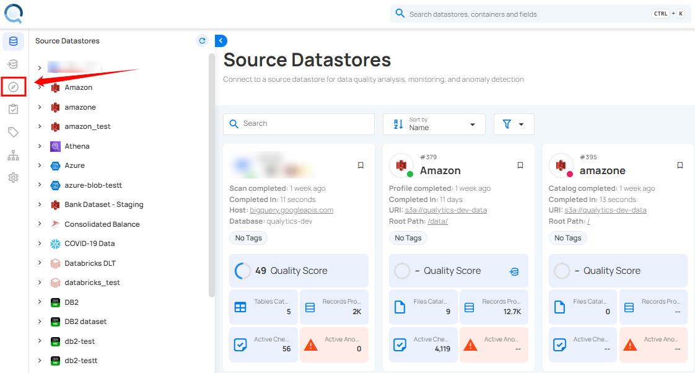
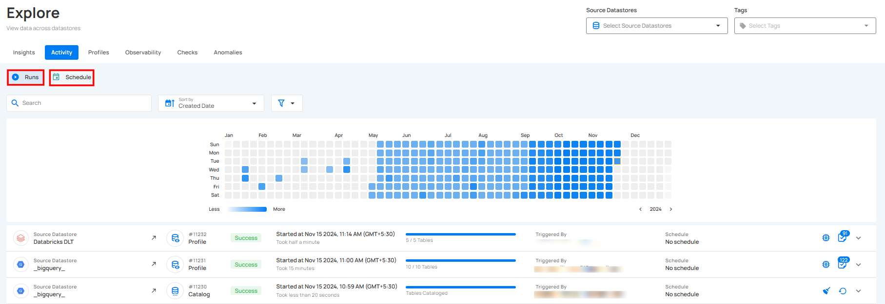
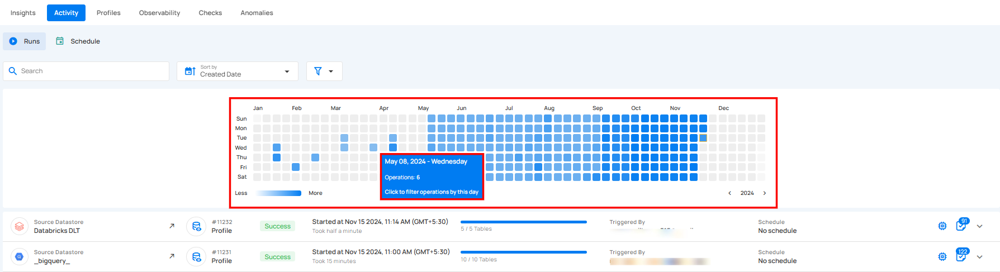
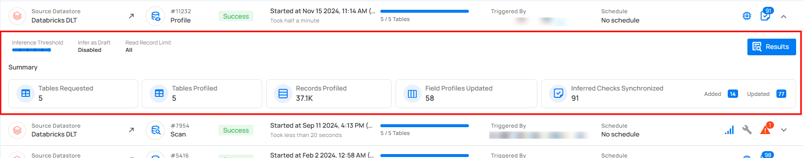
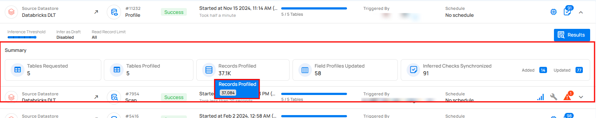
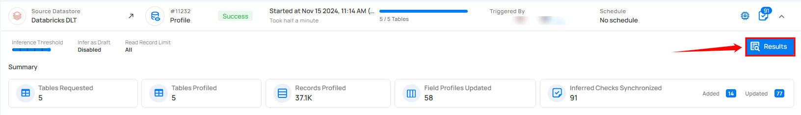
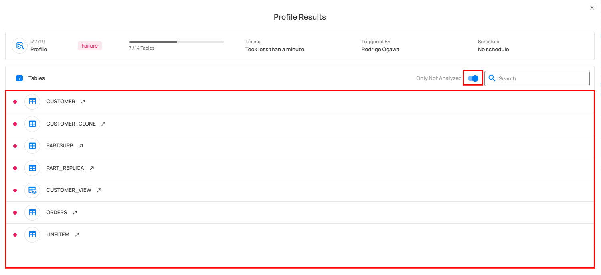

# Activity

**Activity** in Qualytics provides a comprehensive view of all operations, helping users monitor and analyze the performance and workflows across various source datastores. Activities are categorized into **Runs** and **Schedule** operations, offering distinct insights into executed and scheduled activities.

The Rerun and Resume options depend on the type of operation. [Profile](../source-datastore/profile.md) and [Scan](../source-datastore/scan.md) support both because the system can remember where it stopped and continue from there. [Catalog](../source-datastore/catalog.md), [Export](../container/export-operation.md), and [Materialize](../container/materialize-operation.md) only support Rerun, since the system can't pick up from where it left off and must start over. External Scan doesn't support either option, as they don't apply to it.

Let’s get started 🚀

## Navigation

**Step 1:** Log in to your Qualytics account and click the **Explore** button in the left side panel of the interface.

**Step 2:** Click on **"Activity"** from the Navigation Tab.

You will be navigated to the **Activity** tab and here you'll see a list of operations [catalog](../source-datastore/catalog.md), [profile](../source-datastore/profile.md), [scan](../source-datastore/scan.md), and [external scan](../source-datastore/external-scan.md) across different source datastores.

## Activity Categories

Activities are divided into two categories: Runs and Schedule Operations. Runs provide insights into operations that have been performed, while Schedule Operations provide insights into scheduled operations.

### Runs

Runs provide a complete record of all executed operations across various source datastores. This section enables users to monitor and review activities such as [catalog](../source-datastore/catalog.md), [profile](../source-datastore/profile.md), [scan](../source-datastore/scan.md), and [external scan](../source-datastore/external-scan.md). Each run displays key details like the operation type, status, execution time, duration, and triggering method, offering a clear overview of system performance and data processing workflows.

| No. | Field | Description |
| :---- | :---- | :---- |
| 1. | Select Source Datastore | Select specific source datastores to focus on their operations. |
| 2. | Search | This feature helps users quickly find specific identifiers. |
| 3. | Sort By | **Sort By** option helps users organize the list of performed operations by criteria like Duration and Created Date for quick access. |
| 4. | Filter | The filter lets users easily refine the list of performed operations by choosing a specific Type [Scan](../source-datastore/scan.md), [Catalog](../source-datastore/catalog.md), [Profile](../source-datastore/profile.md), and [External Scan](../source-datastore/external-scan.md), etc along with Status (Success, Failure, Running, and Aborted) or **Has Logs** to view operations that completed with logs. |
| 5. | Activity Heatmap | The **Activity Heatmap** shows daily activity levels, with color intensity indicating operation counts. Hovering over a square reveals details for that day. |
| 6. | Operation List | Shows a list of operations [**catalog**](../source-datastore/catalog.md), [**profile**](../source-datastore/profile.md), [**scan**](../source-datastore/scan.md), and [**external scan**](../source-datastore/external-scan.md), etc performed across various source datastores. |

### Activity Heatmap

The Activity Heatmap represents activity levels over a period, with each square indicating a day and the color intensity representing the number of operations or activities on that day. It is useful for tracking the number of operations performed on each day within a specific timeframe.

!!! note 
    You can click on any of the squares from the Activity Heatmap to filter operations.  

By hovering over each square, you can view additional details for that specific day, such as the exact **date** and the total number of **operations** executed.

### Operation Details

**Step 1:** Click on any successfully performed operation from the list to view its details.

For demonstration purposes, we have selected the profile operation.

**Step 2:** After clicking, a drop-down will appear, displaying the details of the selected operation.

**Step 3:** Users can hover over abbreviated metrics to see the full value for better clarity. For demonstration purposes, we are hovering over the **Records Profiled** field to display the full value.

Users can also view both profiled and non-profiled File Patterns:

**Step 4:** Click on the Result Button.

The **Profile Results** modal displays a list of both profiled and non-profiled containers. You can filter the view to show only non-profiled containers by toggling on the button, which will display the complete list of unprofiled containers.

### Schedule

The Schedule section provides a complete record of all scheduled operations across various source datastores. This section enables users to monitor and review scheduled operations such as [catalog](../source-datastore/catalog.md), [profile](../source-datastore/profile.md), and [scan](../source-datastore/scan.md). Each scheduled operation includes key details like operation type, scheduled time, and triggering method, giving users a clear overview of system performance and data workflows.

| No. | Field | Description |
| :---- | :---- | :---- |
| 1. | Selected Source Datastores | Select specific source datastores to focus on their operations. |
| 2. | Search | This feature helps users quickly find specific identifiers. |
| 3. | Sort By | **Sort By** option helps users organize the list of scheduled operations by criteria like Created Date and Operations for quick access. |
| 4. | Filter | The filter lets users easily refine the list of scheduled operations by choosing a specific operation type: [Scan](../source-datastore/scan.md), [Catalog](../source-datastore/catalog.md), and [Profile](../source-datastore/profile.md), etc to view. |
| 5. | Operation List | Shows the list of scheduled operations such as [catalog](../source-datastore/catalog.md), [profile](../source-datastore/profile.md), and [scan](../source-datastore/scan.md), etc across various source datastores. |

#### Deactivate Schedule Operation

Users can deactivate a scheduled operation from the Activity tab. This stops the operation from running further until it is activated again.

**Step 1:** Click on the **Redirect (↗)** button to open the datastore.

**Step 2:** Click on the **Activity** tab and select **Schedule** to view the scheduled operations.

**Step 3:** Click on the vertical ellipsis **(⋮)** and select **Deactivate** to stop the scheduled operation.

