# Insights

**Insights** in Qualytics provides a quick and clear overview of your data's health and performance. It shows key details like Quality Scores, active checks, profiles, scans, and anomalies in a simple and effective way. This makes it easy to monitor and track data quality, respond to issues, and take action quickly. Additionally, users can monitor specific source datastores and check for a particular report date and time frame.

Let’s get started 🚀

## Navigation

**Step 1:** Log in to your Qualytics account and click the **Explore** button on the left side panel of the interface.

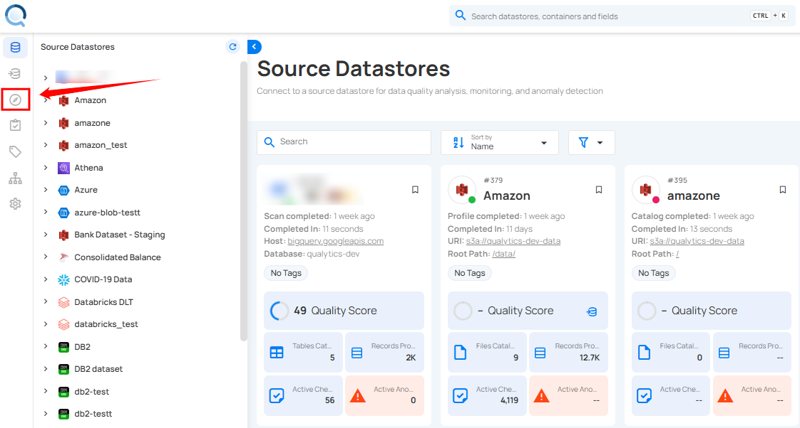

You will be navigated to the **Insights** tab to view a presentation of your data, pulled from the connected source datastore.

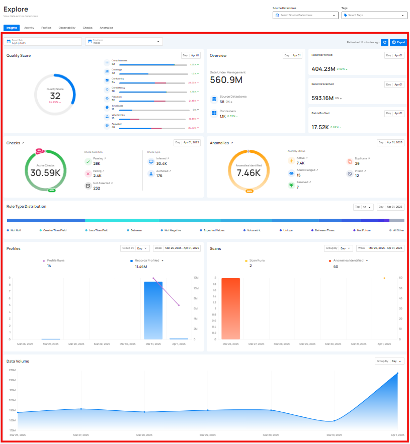

## Filtering Controls

Filtering Controls allow you to refine the data displayed on the **Insights** page. You can customize the data view based on **Source Datastores**, **Tags**, **Report Date**, and **Timeframe**, ensuring you focus on the specific information that matters to you.

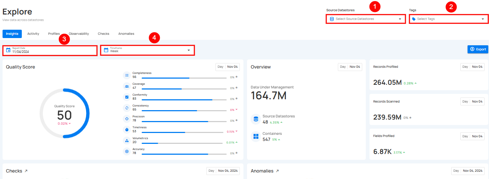

| No | Filter | Description |
| :---- | :---- | :---- |
| 1. | Select Source Datastores | Select specific source datastores to focus on their data. |
| 2. | Tags | Filter data by specific tags to categorize and refine results. |
| 3. | Report Date  | Set the report date to view data from a particular day. |
| 4. | Timeframe | Choose a timeframe to view data for a specific period (week, month, quarter, or year) |



## **Understanding Timeframes and Timeslices**

When analyzing data on the Insights, two key concepts help you uncover trends: **timeframes** and **timeslices**. These work together to give you both a broad view and a detailed breakdown of your data.

## **Timeframes**

**Timeframe** is the total range of time you select to view your data. For example, you can choose to see data:

* **Weekly**: Summarize data for an entire week.

* **Monthly**: Group data by months.

* **Quarterly**: Cover three months at a time.

* **Yearly**: Show data for the entire year.

### **How Metrics Behave Over a Timeframe** 

* **Quality Score** and other similar metrics display an **average** for the selected timeframe.

**Example:** If you select **weekly**, the Quality Score shown will be the **average score for the entire week**.

* **Historical Graphs** (like **Profiles** or **Scans**) show **cumulative totals** over time.

**Example:**If you view a graph for a **monthly timeframe**, the graph shows how data grows or changes month by month.

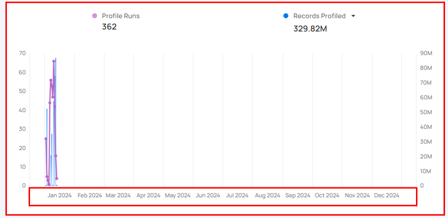

## **Timeslices**

**Timeslice** breaks your selected timeframe into smaller parts. It helps you see more detailed trends within the overall timeframe.

For example:

* A **weekly timeframe** shows each day of the week.

* A **monthly timeframe** breaks into weekly segments.

* A **quarterly timeframe** highlights months within that quarter.

* A **yearly timeframe** divides into quarters and months.

### **How Timeslices Work**

* When you choose a timeframe, the graph automatically breaks it into timeslices.

* Each bar or point on the graph represents one **timeslice**.
    
**Example:**

* If you choose a **Weekly timeframe**, each bar in the graph will represent one **day** of the week.

* If you choose a **Monthly timeframe**, each bar will represent one **week** in that month.

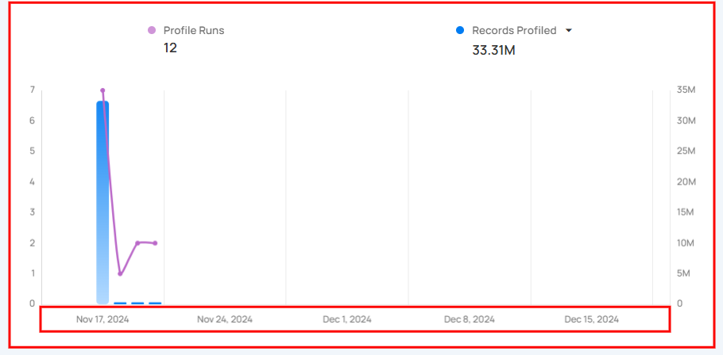

### **Metrics Within a Timeslice** 

Metrics like Quality Score, Profiles, or Scans are displayed for each timeslice, allowing you to identify trends and patterns over smaller intervals.

## Quality Score

**Quality Score** gives a clear view of your data's overall quality. It shows important measures like [**Completeness**](../glossary.md#completeness), [**Conformity**](../glossary.md#conformity), [**Consistency**](../glossary.md#consistency), [**Precision**](../glossary.md#precision), [**Timeliness**](../glossary.md#timeliness), [**Volumetrics**](../glossary.md#volumetrics), and [**Accuracy**](../glossary.md#accuracy), each represented by a percentage. This helps you quickly understand the health of your data, making it easier to identify areas that need improvement.  

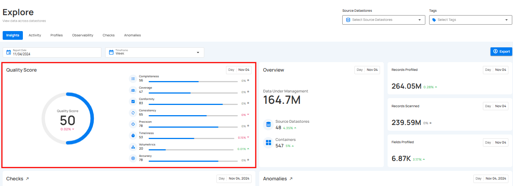

### Score Summary

This section shows your overall Quality Score along with a breakdown of each dimension. You’ll also see how much each score has improved or decreased.

You can **hover over any quality dimension** (such as Completeness, Precision, or Timeliness) to see additional details about that score.

### Score Progression

The new Score Progression chart helps you track how your Quality Score changes over time. Users can:

- Switch between **Day**, **Week**, or **Month** views.
- Click individual dimensions on the right to see the trend for that specific metric.
- Compare how each dimension is performing over time.
- This makes it easier to understand your data’s health, spot improvements, and identify areas that need attention.

## Data Overview

The **Data Overview** gives you a high-level snapshot of your data for the selected period. It shows:

- **Data Under Management** — the total number of rows managed in Qualytics  
- **Source Datastores** — how many active datastores are connected  
- **Containers** — the number of containers within those datastores  

This helps you quickly understand the scale of your data and how it’s growing over time.

## Data Volume

The **Data Volume** chart helps you track how your stored data is increasing or decreasing over time. This makes it easier to:

- Spot unexpected growth or drops in data size  
- Monitor ingestion patterns  
- Plan storage, scaling, and resource allocation
- Detect irregularities that may affect overall system performance  

You can change the **Group By** option (Day, Week, Month) to view the trend with the level of detail you need.

## Checks & Profiling

The Checks & Profiling section provides a consolidated view of your active checks, their status, and profiling activity.

**1. Passing Check:** Displays the real-time number of passed checks that were successfully completed during the [**scan**](../source-datastore/scan.md) or [**profile operation**](../source-datastore/profile.md), indicating that the data met the set quality criteria.

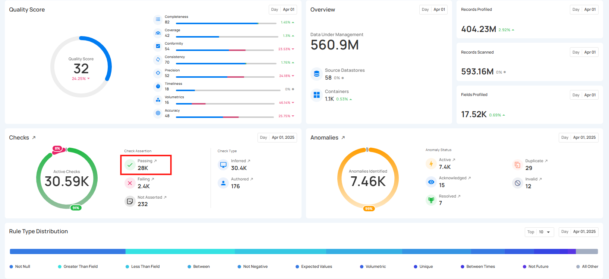

**2. Failing Checks:** This shows the real-time number of checks that did not pass during the [**scan**](../source-datastore/scan.md) or [**profile operation**](../source-datastore/profile.md), indicating data that did not meet the quality criteria.

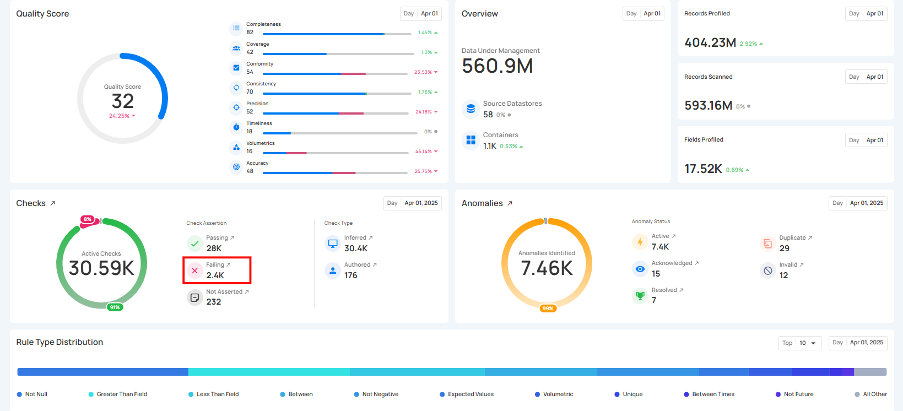

**3. Not Asserted Checks:** This shows the real-time number of checks that haven't been processed or validated yet, meaning their status is still pending and they have not been confirmed as either passed or failed.

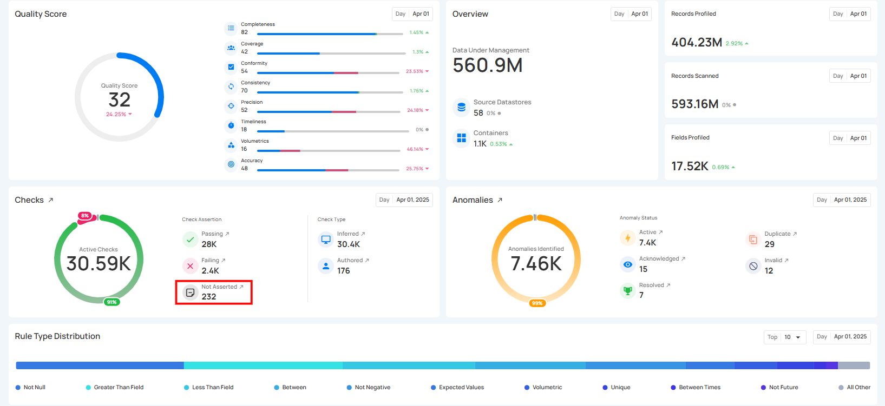

**4. Inferred Checks:** This shows the real-time number of system-generated [**Inferred Checks**](../checks/inferred-check.md).These checks are automatically created during a Profile operation using statistical analysis and machine learning methods.

**5. Authored Check:** This shows the [**Authored Checks**](../checks/authored-check.md) that are manually created by users within the Qualytics platform or API. These checks can range from simple templates for common validations to complex rules using Spark SQL and User-Defined Functions (UDF) in Scala. 

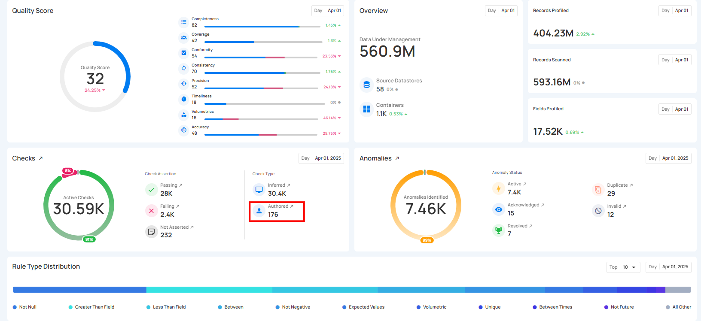

The count for each category can be viewed by hovering over the relevant check, providing real-time ratios of checks. Users can also click on these checks to navigate directly to the corresponding checks’ dedicated page in the Explore section. 

**6. Records Profiled**: This represents the total number of records that were included in the profiling process.

**7. Fields Profiled**: This shows how many field profiles were updated as a result of the profiling operation.

## Anomalies & Scanning

The **Anomalies & Scanning** section provides a high-level summary of all detected anomalies, along with the scanning activity that helps generate those results. This view helps you understand the number of issues identified and how they are distributed across different statuses, while also showing how much data was scanned during the selected period.

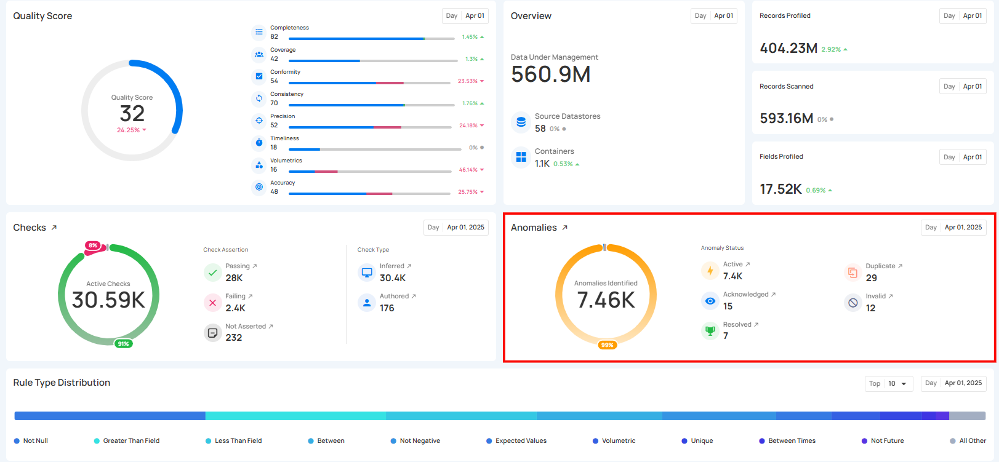

**1. Active Anomalies:** Shows the number of unresolved anomalies that require immediate attention. These anomalies are still present and have not been acknowledged, archived, or resolved in the system.

**2. Acknowledged Anomalies:**  These are anomalies that have been reviewed and recognized by users but are not yet resolved. Acknowledging anomalies helps keep track of issues that have been addressed, even if further actions are still needed. 

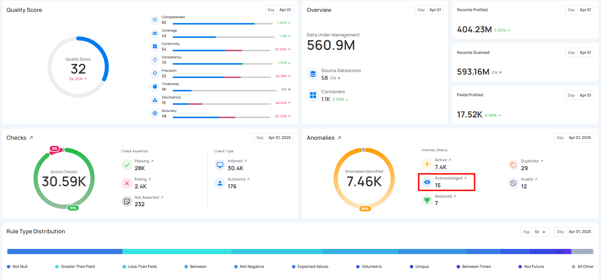

**3. Resolved Anomalies:** Represent anomalies that were valid data quality issues and have been successfully addressed. These anomalies have been resolved, indicating the data now meets the required quality standards.

**4. Duplicate Anomalies:** These anomalies have been identified as duplicates of existing anomalies. This status helps prevent redundant issue tracking and ensures that duplicate records are consolidated into a single entry.

**5. Invalid Anomalies:** These anomalies have been reviewed and determined to be false positives or not relevant. Marking an anomaly as invalid removes it from active consideration, preventing unnecessary investigations.

**6. Discarded Anomalies:** Shows the number of anomalies that were intentionally removed from the workflow because they are not useful, not valid, or no longer need attention.

!!! info
    Users can see the checks using the redirect link (the redirect only show the current check statuses).

The count for each category can be viewed by hovering over the relevant anomalies, providing real-time ratios of anomalies. Users can also click on these anomalies to navigate directly to the corresponding anomalies’ dedicated page in the Explore section. 

**7. Container Scanned:** Shows the total number of containers that were scanned during the selected period.

**8. Records Scanned:** This refers to the number of records that were checked during a scan operation. The scan performs data quality checks on collections like tables, views, and files.

## Check Distribution

The **Check Distribution** section shows a breakdown of checks by rule type, helping you quickly understand which types of rules are most commonly applied across your datastore. Each rule type is represented by a different color for easy visual comparison.

By clicking the caret down 🔽 button, users can choose either the top 5 or top 10 rule types to view in the insights, based on their analysis needs.

## Failed Check Distribution

The **Failed Check Distribution** shows a breakdown of all failed checks by rule type. This helps you quickly understand which rule types are failing most often and may require attention.

By clicking the caret down 🔽 button, users can choose either the top 5 or top 10 rule types to view in the insights, based on their analysis needs.

## Profiles

[**Profiles**](../source-datastore/profile.md) section provides a clear view of data profiling activities over time, showing how often profiling is performed and the amount of data (records) analyzed.

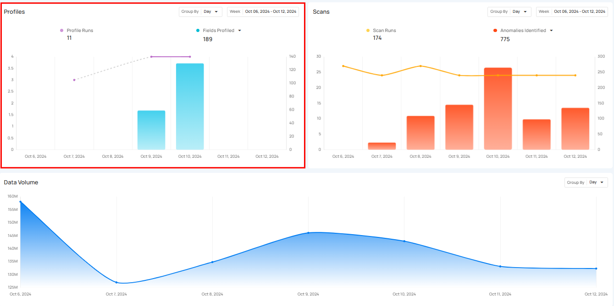

**Profile Runs** shows how many times data profiling has been done over a certain period. Each run processes a specific source datastore or table, helping users see how often profiling happens. The graph gives a clear view of the changes in profile runs over time, making it easier to track  profiling activity.

Click on the caret down 🔽 button to choose between viewing **Records Profiled** or **Fields Profiled**, depending on your preference.

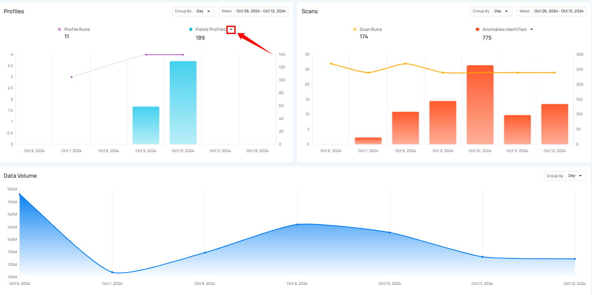

###  Record Profile 

Record Profiled shows the total number of records processed during the profile runs. It provides insight into the amount of data that has been analyzed during those runs. The bars in the graph show the comparison of the number of records profiled over the selected days.

###  Field Profiled 

Field Profiled shows the number of fields processed during the profile runs. It shows how many individual fields within datasets have been analyzed during those runs. The bars in the graph provide a comparison of the fields profiled over the selected days.

## Scans

[**Scans**](../source-datastore/scan.md) section provides a clear overview of all scanning activities within a selected period. It helps users keep track of how many scans were performed and how many anomalies were detected during those scans. This section makes it easier to understand the scanning process and manage data by offering insight into how often scans occur. 

**Scan Runs** show how often data scans are performed over a certain period. These scans check the quality of data across tables, views, and files, helping users monitor their data regularly and identify any issues. The process can be customized to scan tables or limit the number of records checked, ensuring that data stays accurate and up to standard.

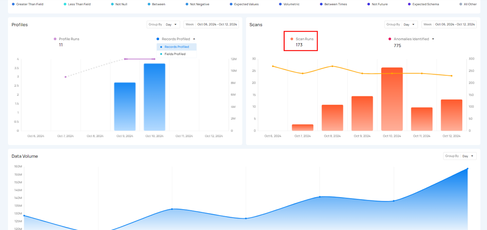

Click on the caret down **🔽** button to choose between viewing **Anomalies Identified** or **Records Scanned**, depending on your preference.

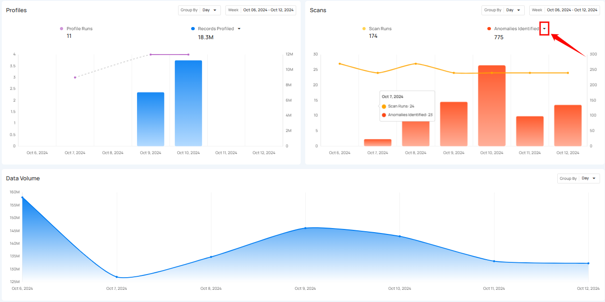

### Anomalies Identified

Anomalies Identified shows the total number of anomalies detected during the scan runs. The bars in the graph allow users to compare the number of anomalies found across different days, helping them spot trends or irregularities in the data.

### Records Scanned 

Records Scanned shows the total number of records that were scanned during the scan runs. It gives users insight into how much data has been processed and allows them to compare the scanned records over the selected period.

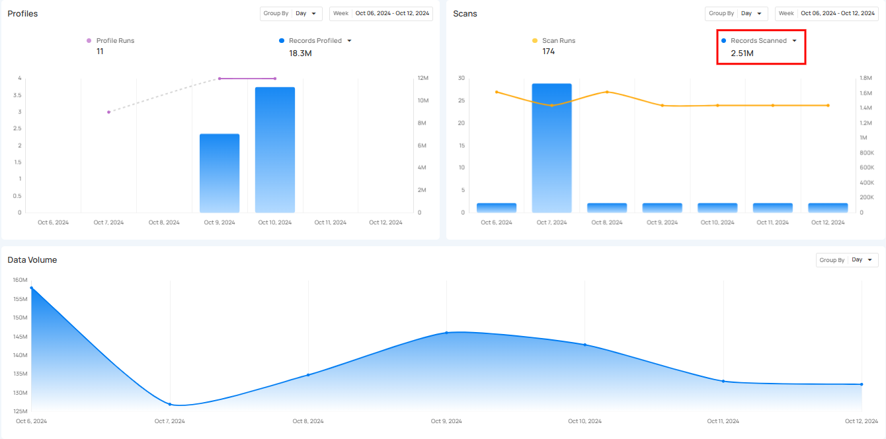

## Export

**Export** button allows you to quickly download the data from the **Insights** page. You can export data according to the selected **Source Datastores**, **Tags**, **Report Date**, and **Timeframe**. This makes it easy to save the data for offline use or share it with others.

After exporting, the data appears in a structured format, making it easy to save for offline use or to share with others.

## Refresh

**Refresh** button allows users to quickly update the Insights data. When clicked, it fetches the latest information, ensuring that users always have the most up-to-date insights.

A label indicates when the page was last refreshed, helping users track data updates. This feature ensures accuracy and keeps the insights current without requiring a full page reload.

