# Profiles

**Profiles** in Qualytics helps you explore and manage your containers and fields. With features like filtering, sorting, tagging, and detailed profiling, it provides a clear understanding of data quality and structure. This simplifies navigation and enhances data management for quick, informed decisions.

Let’s get started 🚀

## Navigation

**Step 1:** Log in to your Qualytics account and click the **Explore** button on the left side panel of the interface.

**Step 2:** Click on the **"Profiles"** from the Navigation Tab.

You will be navigated to the **Profiles** section. Here, you will see the data organized into two sections: **Containers** and **Fields**, allowing you to explore and analyze the datasets efficiently.

## Containers

By selecting the **Containers section**, you can explore structured datasets that are organized as either JDBC or DFS containers. JDBC containers represent tables or views within relational databases, while DFS containers include files such as CSV, JSON, or Parquet, typically stored in distributed systems like Hadoop or cloud storage.

### Container Details

**Containers** section provides key details about each container, including the **last profiled** and **last scanned** dates. Hovering over the **info icon** for a specific container reveals these details instantly.

**Step 1:** Locate the container you want to review, then hover over the info icon to view the container Details. 

**Step 2:** A pop-up will appear with additional details about the container, such as the last **profiled** and last **scanned** dates.

### Explore Tables and Fields

By clicking on a specific container, users can view its associated fields, including detailed profiling information. Additionally, clicking the arrow icon on the right side of a specific container allows users to navigate directly to its corresponding table for a more in-depth exploration.

#### Explore Fields

To explore the data within a container, you can view all its fields. This allows you to gain insights into the structure and quality of the data stored in the container.

**Step 1:** Click on the specific container whose fields you want to preview.

For demonstration purposes, we have selected the Netsuite Financials container.

**Step 2:** You will be directed to the fields of the selected container, where all the fields of the container will be displayed.

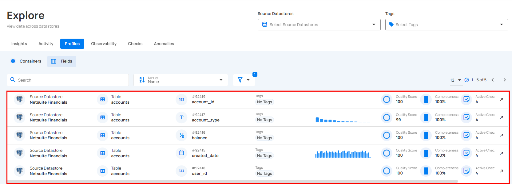

#### Explore Tables

To explore the data in more detail, you can view the corresponding table of a selected container. This provides a comprehensive look at the data stored within, allowing for deeper analysis and exploration.

**Step 1:** Click on the arrow icon on the right side of the container you want to preview.

**Step 2:** You will be directed to the corresponding table, providing a comprehensive view of the data stored in the container.

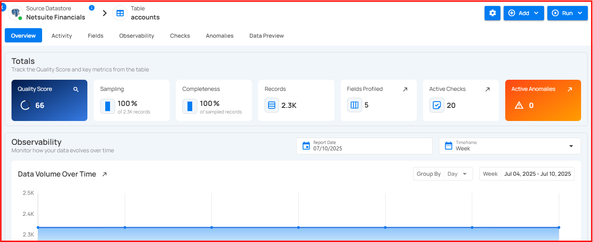

### Filter and Sort

Filter and Sort options allow you to organize your containers by various criteria, such as Name, Last Profiled, Last Scanned, Quality Score, Records, and Type. You can also apply filters to refine your list of containers based on Type.

#### Sort

You can sort your containers by various criteria, such as Name, Last Profiled, Last Scanned, Quality Score, Records, and Type to easily organize and prioritize them according to your needs.

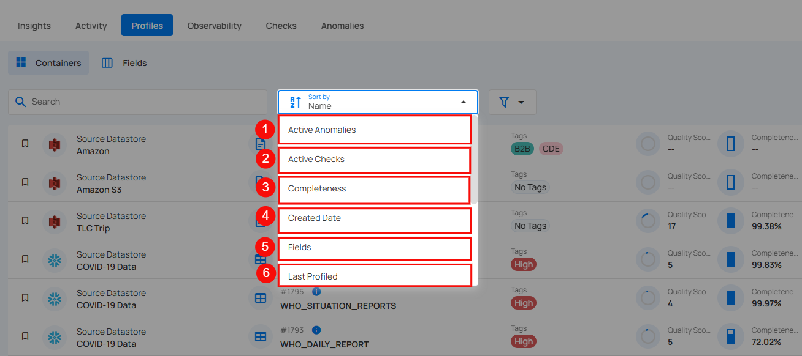

| No | Sort By | Description |
| :---- | :---- | :---- |
| 1. | Active Anomalies | Sorts containers based on the number of currently active anomalies detected. |
| 2. | Active Checks | Sorts containers by the number of active validation checks applied. |
| 3. | Completeness | Sorts containers based on their data completeness percentage. |
| 4. | Created Date | Sorts containers by the date they were created, showing the newest or oldest fields first. |
| 5. | Fields | Sorts containers by the number of fields profiled. |
| 6. | Last Profiled | Sorts by the most recent profiling container. |
| 7. | Last Scanned | Sorts by the most recent scanned container. |
| 8. | Name | Sorts containers alphabetically by their names. |
| 9. | Quality Score | Sorts containers based on their quality score, indicating the reliability of the data in the field. |
| 10. | Records | Sorts containers by the number of records profiled. |
| 11. | Type | Sorts containers based on their data type (e.g., string, boolean, etc.). |

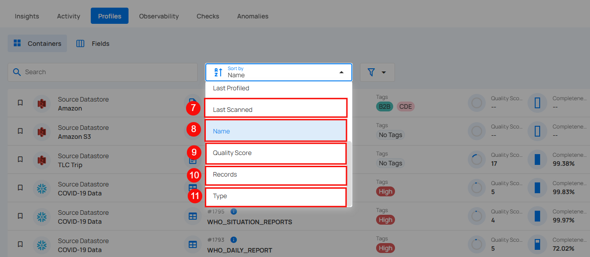

Whatever sorting option is selected, you can arrange the data either in ascending or descending order by clicking the caret button next to the selected sorting criteria.

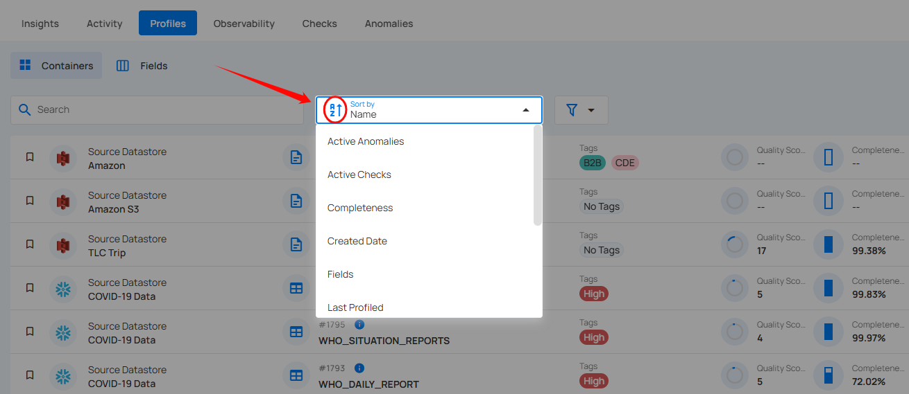

#### Filter

You can filter your containers based on values like Type (Table, View, File, Computed Table and Computed File) to easily organize and prioritize them according to your needs.

% include-markdown "components/general-props/typos.md" 
    start='<!-- TYPOS-CHECK --start -->' 
    end='<!-- TYPOS-CHECK --end -->' 
%
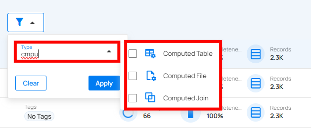

### Mark as Favorite

Marking a container as a favorite allows you to quickly access and prioritize the containers that are most important to your work, ensuring faster navigation and improved efficiency.

**Step 1:** Locate the container which you want to mark as a favorite and click on the bookmark icon located on the left side of the container.

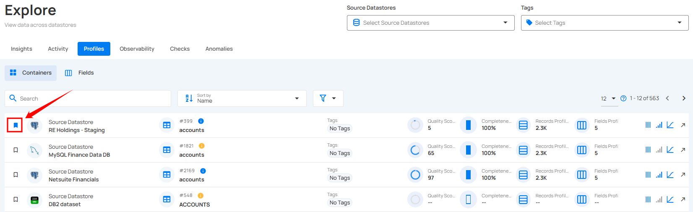

After clicking on the bookmark icon your container is successfully marked as a favorite and a success flash message will appear stating **"The Table has been favorited"**

To unmark, simply click on the bookmark icon of the marked container. This will remove it from your favorites.

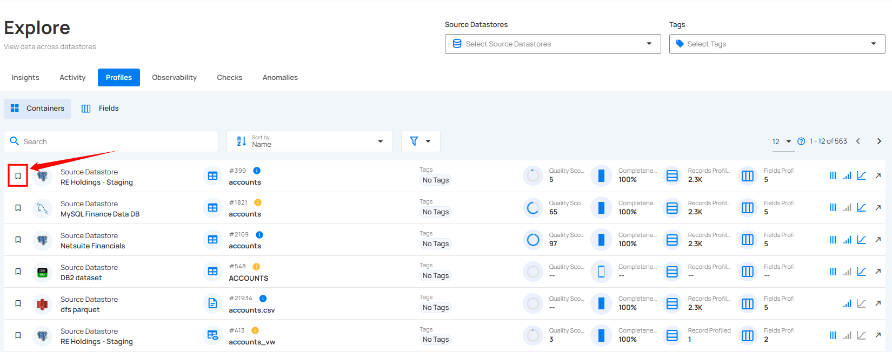

## Fields

By selecting the Fields section in the Qualytics platform, you can view all the fields across your data sources, including their quality scores, completeness, and metadata, for streamlined data management.

### Field Details

Field Details view in the Qualytics platform provides in-depth insights into a selected field. It displays key information, including the field’s declared type, number of distinct values, minimum and maximum length of observed values, entropy, and unique/distinct ratio. This detailed profiling allows you to understand the field's data structure, quality, and variability, enabling better data governance and decision-making.

**Step 1:** Click on the specific field whose field details you want to preview.

A modal window will appear, providing detailed information about the selected field, such as its declared type, distinct values, length range, the Last Profile timestamp to indicate when the field was last profiled, and more.

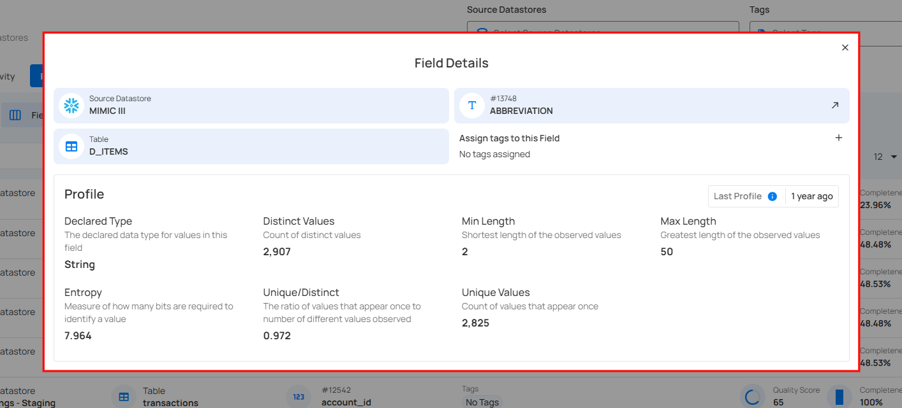

### Manage Tags in Field Details

Tags can now be directly managed in the field profile within the Explore section. Simply access the Field Details panel to create, add, or remove tags, enabling more efficient and organized data management.

**Step 1**: Click on the specific field that you want to manage tags.

A Field Details modal window will appear. Click on the + button to assign tags to the selected field.

**Step 2:** You can also create the new tag by clicking on the ➕ button.

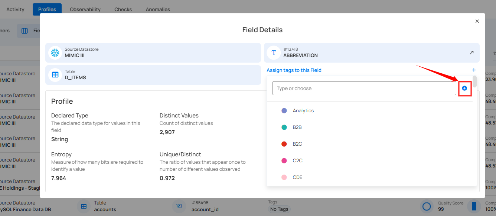

A modal window will appear, providing the options to create the tag. Enter the required values to get started.

For more information on creating tags, refer to the [Add Tag section](../tags/overview-of-tag.md/#add-tag).

### Filter and Sort

Filter and Sort options allow you to organize your fields by various criteria, such as Active Anomalies, Active Checks, Completeness, Created Date, Name, Quality Score, and Type. You can also apply filters to refine your list of fields based on Profile and Type. 

#### Sort

You can sort your containers by various criteria, such as Active Anomalies, Active Checks, Completeness, Created Date, Name, Quality Score, and Type to easily organize and prioritize them according to your needs.

| No | Sort By | Description |
| :---- | :---- | :---- |
| 1. | Active Anomalies | Sorts fields based on the number of currently active anomalies detected. |
| 2. | Active Checks | Sorts fields by the number of active validation checks applied. |
| 3. | Completeness | Sorts fields based on their data completeness percentage. |
| 4. | Created Date | Sorts fields by the date they were created, showing the newest or oldest fields first. |
| 5. | Name | Sorts fields alphabetically by their names. |
| 6. | Quality Score | Sorts fields based on their quality score, indicating the reliability of the data in the field. |
| 7. | Type | Sorts fields based on their data type (e.g., string, boolean, etc.). |

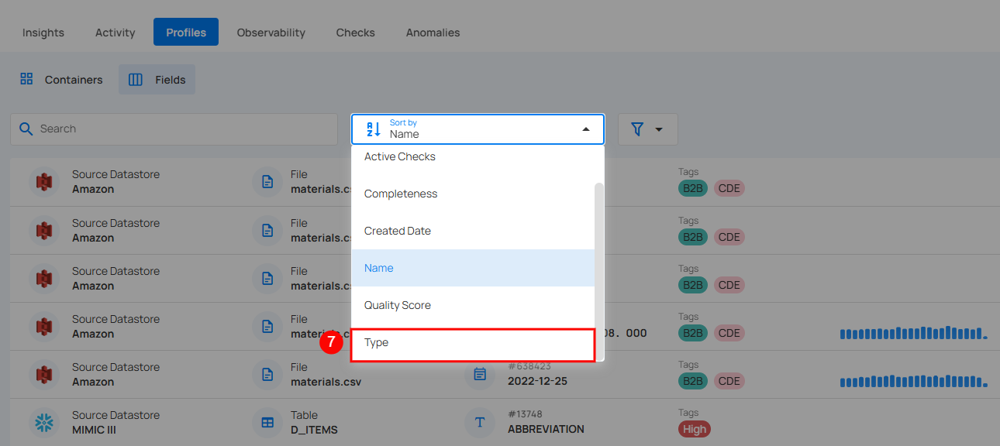

Whatever sorting option is selected, you can arrange the data either in ascending or descending order by clicking the caret button next to the selected sorting criteria.

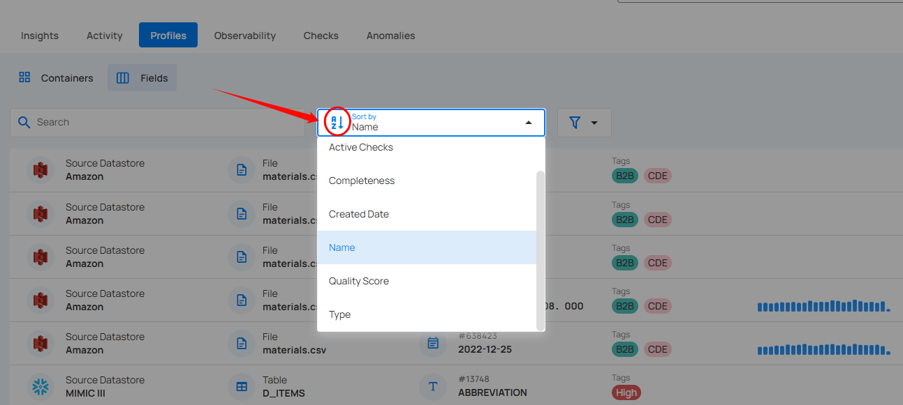

#### Filter

You can filter your fields based on Profiles and Type to easily organize and prioritize them according to your needs.

| No. | Filter | Description |
| :---- | :---- | :---- |
| 1. | Profile | Filters fields based on the Profiles (e.g., accounts, accounts.csv,  etc.). |
| 2. | Type | Filters fields based on the data type (e.g., string, boolean, date, etc.). |

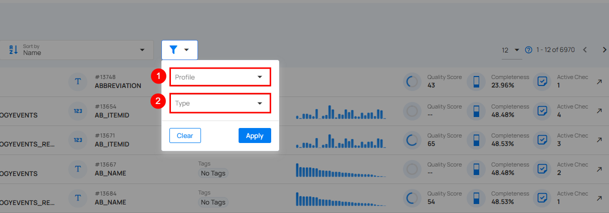