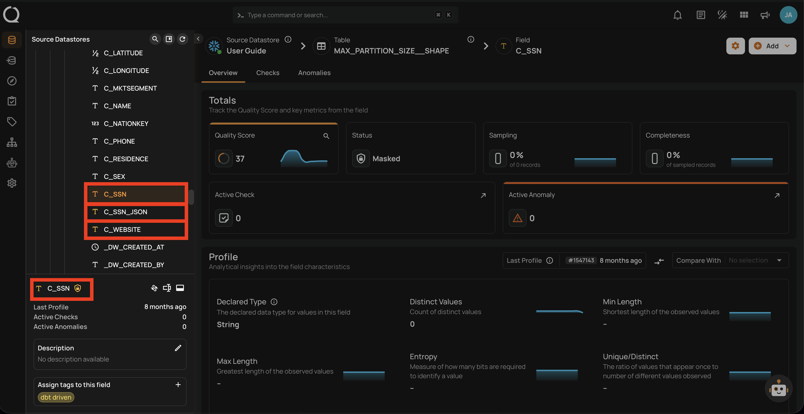
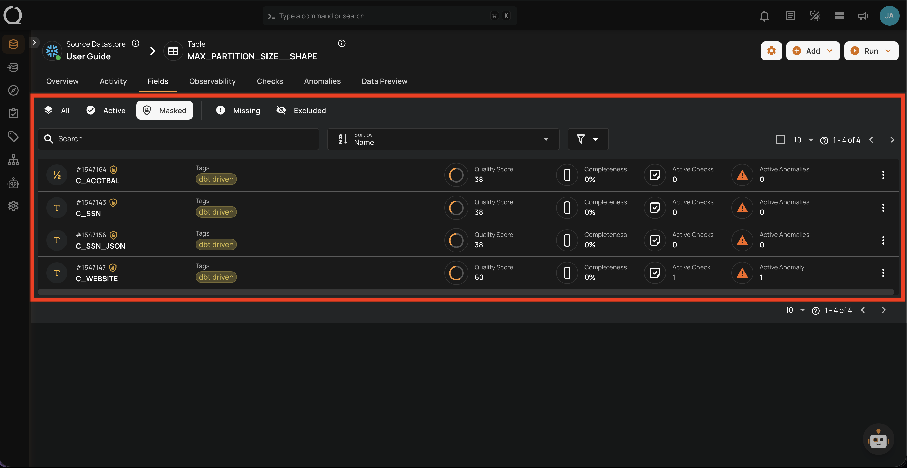
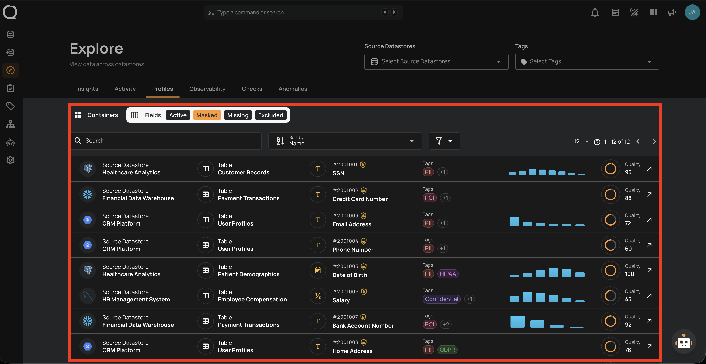
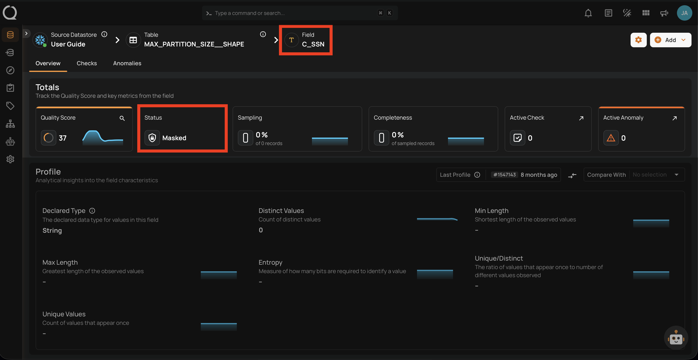
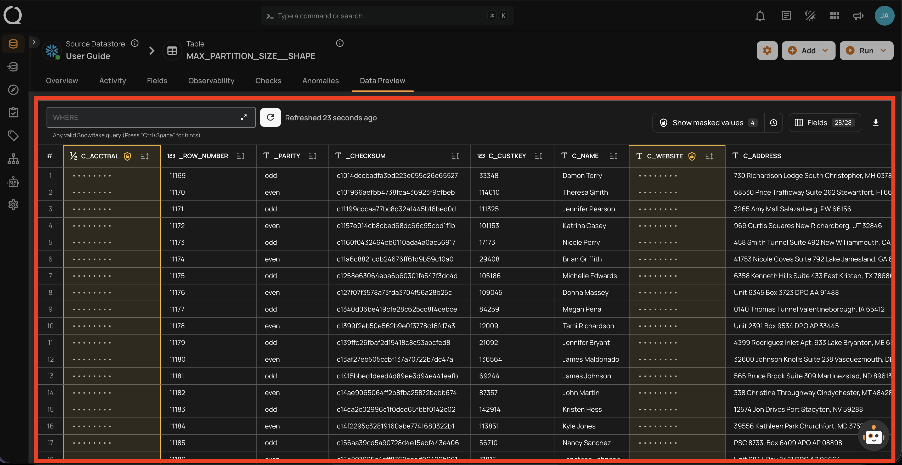
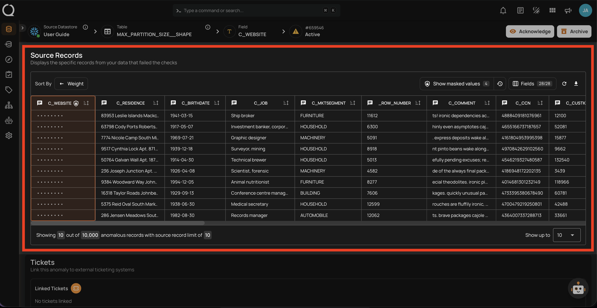
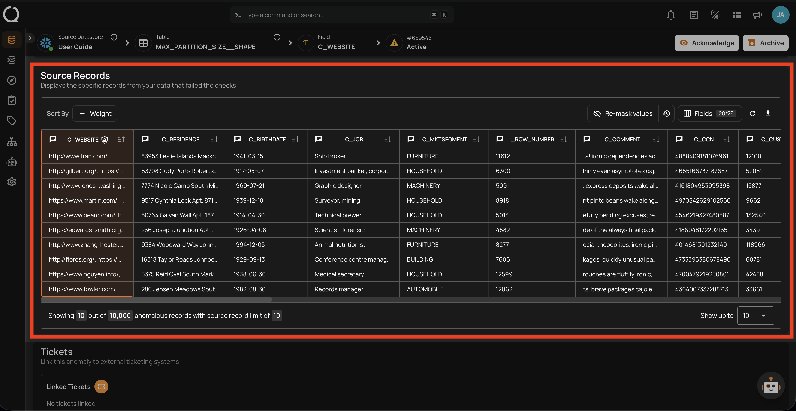

# Field Masking

Field masking is a data protection mechanism that hides the actual values of sensitive fields across the platform while keeping those fields fully operational for quality monitoring. When a field is masked, its values are replaced with the `***MASKED***` placeholder in all surfaces where data is displayed or exported.

This is useful for fields that contain sensitive data (e.g., PII, financial data, health records) that should be protected but still monitored for quality.

## Identifying Masked Fields

Masked fields are visually identified across the platform so you can quickly tell which fields are protected.

### In the Tree View

The left-side tree view shows the hierarchy of datastores, containers, and fields. Masked fields display an amber :material-shield-lock-outline: icon next to their name in the tree view, making it easy to spot protected fields while navigating the data hierarchy.

### In the Container Field Listing

When viewing a container's fields, masked fields are identified by the amber :material-shield-lock-outline: icon next to the field name. Switching to the **Masked** tab filters the listing to show only masked fields in that container.

### In the Explore View

In the Explore view, you can filter fields across all containers by status. Selecting the **Masked** filter shows all masked fields across the platform, helping you get a global view of which fields are protected.

### In the Field Detail Page

When you open a masked field's detail page, the field status is displayed as **Masked** with the amber :material-shield-lock-outline: indicator at the top of the page.

## How Masking Works

Masking only affects **value visibility** — it does not change how the platform processes data. A masked field continues to be profiled, scanned, and evaluated by quality checks exactly like an active field. The only difference is that actual values are hidden by default across the platform.

When you mask a field:

- **Quality Checks**: Continue to run normally — masking does not affect quality monitoring
- **Profiling and Scanning**: Continue to run normally — all metrics are computed using actual source data
- **Values**: Replaced with `***MASKED***` across all surfaces listed below

## Where Masking Is Applied

Masked values are obfuscated at every point where field values are surfaced or written:

| Surface | Operation that produces it | Reveal available? |
| :--- | :--- | :--- |
| Data Preview | Container read (live query) | Yes — "Show masked values" button |
| Anomaly Source Records | Scan / Dry Run | Yes — per-anomaly reveal toggle (all records revealed together) |
| Quality Check Dry Runs | Dry Run | No — unconditionally masked |
| Field Profile Histograms (UI) | Profile | Yes — via `include_masked` API parameter |
| Anomaly Assertion Context | Scan / Dry Run | No — unconditionally masked |
| Field Profiles Export | Export Operation | Yes — via `include_masked` API parameter (not available in the UI) |
| Materialized Snapshots | Materialize Operation | Yes — via `include_masked` API parameter (not available in the UI) |

## Revealing Masked Values

Users with **Editor** permission or above can temporarily reveal masked values in the surfaces that support inline reveal.

### Data Preview

In the container's data preview, masked fields display their values as hidden. A **Show masked values** button allows you to reveal the values for the current view.

### Anomaly Source Records

In anomaly source records, masked field values are replaced with the `***MASKED***` placeholder. You can toggle the visibility of masked values using the reveal control — toggling it reveals all source records attached to that anomaly at once.

When revealed, the actual values are displayed in place of the placeholder for all source records of that anomaly.

!!! tip
    To permanently restore a field's actual values without needing to reveal them each time, see [Unmask a Field](../managing-field-status/unmask-a-field.md){:target="_blank"}.

### Anomaly Assertion Context

Masked field values that appear in anomaly check details and assertion context are **unconditionally masked**. There is no inline reveal for this surface — this is by design to ensure that sensitive values are never inadvertently exposed when reviewing anomaly descriptions or sharing anomaly details.

### Export and Materialize Outputs

Histogram bucket values in exported field profile files and source record values in materialized container snapshots are written with masking applied by default. To obtain revealed data in these outputs, pass `include_masked=true` when triggering the operation via the API. This parameter is not available in the UI.

## Masking Audit Log

Every time masked values are revealed, the action is recorded in the masking audit log for security and compliance purposes. The audit log captures the user identity, timestamp, IP address, fields accessed, and the resource where the reveal occurred.

For step-by-step instructions on accessing and using the audit log, see [Masking Audit Log](../managing-field-status/masking-audit-log.md){:target="_blank"}.

## Unmasking a Field

Unmasking a field restores its actual values across the platform, making them visible without requiring explicit reveal actions.

### What Happens When a Field is Unmasked?

When you unmask a field, its status changes from **Masked** back to **Active**. The `***MASKED***` placeholder is removed and actual values become visible across every surface where they were previously hidden.

#### Platform Behavior After Unmasking

| Surface | Behavior after unmasking |
| :--- | :--- |
| **Data Preview** | Values are shown directly — no reveal action required |
| **Anomaly Source Records** | Values are visible by default — no reveal toggle needed |
| **Quality Check Dry Runs** | Values are visible in dry run source records |
| **Field Profile Histograms** | Chart values are shown normally in the UI |
| **Anomaly Assertion Context** | Values are visible in anomaly check details and descriptions |
| **Export and Materialize outputs** | Future runs write actual values — previously written files are **not** retroactively updated |

!!! warning
    Unmasking is immediate and affects all users with access to the container. There is no per-user unmasking — once a field is unmasked, its values are visible to everyone.

#### Audit Log Considerations

When a field is unmasked, no further reveal actions are recorded in the [masking audit log](../managing-field-status/masking-audit-log.md){:target="_blank"} because there is nothing to reveal — the values are always visible. If your compliance requirements depend on tracking who accesses sensitive values, unmasking removes that layer of visibility.

### When to Unmask a Field

Unmasking is appropriate when the protection provided by masking is no longer necessary or is actively hindering your workflow. Consider unmasking when:

#### The data is no longer sensitive

- The field was reclassified and no longer contains PII, financial data, or protected health information.
- The data has been anonymized or aggregated at the source, so the values in the platform are no longer identifiable.
- A retention policy has expired and the data is now in the public domain or approved for open access.

#### Masking is blocking a legitimate workflow

- Your team needs to review actual values during an incident investigation or root cause analysis and the inline reveal is too cumbersome for the volume of data involved.
- You need to share anomaly details (including assertion context) with stakeholders who require the actual values — assertion context is unconditionally masked and has no inline reveal.
- Export or materialize operations must include actual values and you prefer not to rely on the `include_masked` API parameter for every run.

#### The field was masked by mistake

- The wrong field was masked during a bulk masking operation.
- A field was masked during initial setup but later determined to not contain sensitive data.

### When Not to Unmask a Field

Keep a field masked when the protection it provides is still valuable. Avoid unmasking when:

#### The data is still sensitive

- The field contains PII (names, emails, phone numbers, national IDs), financial data (account numbers, balances), or protected health information that is subject to regulatory requirements (GDPR, HIPAA, LGPD, etc.).
- Your organization's data governance policy classifies the field as restricted or confidential.

#### Compliance requires access tracking

- Your compliance framework requires an audit trail of who accessed sensitive values and when. Masking with reveal logging provides this — unmasking does not.
- You are in a regulated industry where demonstrating controlled access to sensitive data is part of your audit obligations.

#### Broad access to the container exists

- Many users have access to the container, and not all of them should see the actual values. Masking ensures that only users who explicitly reveal values (and have Editor permission or above) can see them.
- The container is used in shared dashboards, reports, or integrations where masked values prevent accidental exposure.

#### Temporary access is sufficient

- If you only need to see actual values occasionally (e.g., during anomaly investigation), use the **inline reveal** in Data Preview or Anomaly Source Records instead of unmasking. This keeps the audit trail intact and the field protected for all other users.
- For export or materialize operations, use the `include_masked` API parameter to include actual values on a per-run basis rather than permanently unmasking.

### Unmasking Best Practices

1. **Prefer reveal over unmask** — Use the inline reveal controls in Data Preview and Anomaly Source Records for temporary access. This keeps the audit trail and protects the field for other users.

2. **Check with your data governance team** — Before unmasking, confirm that the field's sensitivity classification has changed or that unmasking is approved under your organization's data policy.

3. **Re-mask after temporary needs** — If you unmask a field for a specific task (e.g., an investigation), re-mask it as soon as the task is complete. This minimizes the window of exposure.

4. **Review container access** — Before unmasking, check who has access to the container. Unmasking exposes values to all users with container access, not just the person performing the unmask.

5. **Document the decision** — Record why a field was unmasked, who approved it, and when. This is especially important in regulated environments where you may need to justify the decision during an audit.

6. **Consider export implications** — Remember that previously written export and materialize files are not retroactively updated. If you unmask a field, only future runs will include actual values.

To learn how to unmask a field step by step, see [Unmask a Field](../managing-field-status/unmask-a-field.md){:target="_blank"}.

## Fields That Cannot Be Masked

The following fields cannot be masked:

| Field Type | Reason |
| :--- | :--- |
| **Excluded** fields | Only active fields can be masked. Restore the field to active status first. |
| **Missing** fields | System-managed status — cannot be changed directly. |
| **Already masked** fields | The field is already masked. |
| **Incremental identifier** fields | Used to track scan boundaries for incremental processing. Masking would make incremental scans indistinguishable. |
| **Partition** fields | Used for data partitioning and segmentation. Masking would hide partition boundaries. |
| **Group-by** fields | Used for segment grouping. Masking would make segment identifiers indistinguishable. |

!!! info
    If you need to mask a field that is currently configured as a container identifier (incremental, partition, or group-by), you must first remove the identifier assignment from the container settings, and then mask the field.
