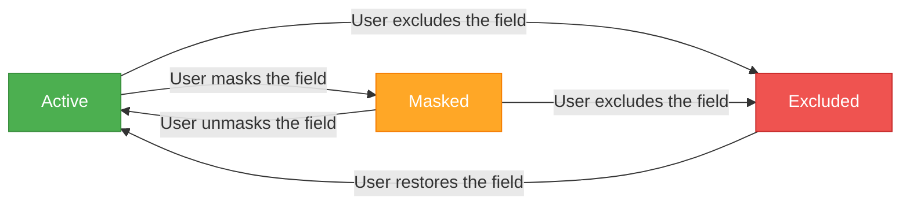

# Field Status Lifecycle

Every field in Qualytics follows a lifecycle defined by its status transitions. Understanding these transitions helps you predict how the platform will behave as your data evolves.

## User-Driven Transitions

These transitions are triggered by manual user actions — masking, unmasking, excluding, and restoring fields.

## Automatic Transitions

These transitions happen automatically based on profile operations and field discovery.

```mermaid
flowchart LR
    Start(( )) -- Field discovered during first profile --> Active

    Active -- Field not found in profile results --> Missing
    Masked -- Field not found in profile results --> Missing
    Missing -- Field reappears in profile results --> Active

    Missing -- Permanently delete --> End(( ))

    style Active fill:#4CAF50,color:#fff,stroke:#388E3C
    style Masked fill:#FFA726,color:#fff,stroke:#F57C00
    style Missing fill:#FFEE58,color:#000,stroke:#F9A825
    style Start fill:#333,stroke:#333
    style End fill:#333,stroke:#333
```

## Transition Details

| Transition | Trigger | Automatic? | Side Effects |
| :--- | :--- | :--- | :--- |
| **New → Active** | Field discovered during initial profile | Yes | None — this is the default state |
| **Active → Masked** | User masks the field | No | Values hidden across the platform; no impact on quality checks |
| **Active → Missing** | Field not found in subsequent profile | Yes | Dependent computed fields also marked as Missing; container identifiers referencing this field are cleared |
| **Masked → Missing** | Field not found in subsequent profile | Yes | Same as Active → Missing |
| **Active → Excluded** | User manually excludes the field | No | Quality checks archived (except Expected Schema); dependent computed fields excluded recursively |
| **Masked → Active** | User unmasks the field | No | Values become visible again across the platform |
| **Masked → Excluded** | User manually excludes the field | No | Same as Active → Excluded |
| **Missing → Active** | Field reappears in profile results | Yes | Field resumes normal operations |
| **Excluded → Active** | User restores the field | No | Field becomes available for profiling and scanning; archived checks are **not** auto-restored |
| **Missing → Deleted** | User permanently deletes the field | No | Field permanently removed (only if no checks have ever referenced it) |

!!! note
    Only **missing** fields and **computed fields** can be permanently deleted. Active, masked, and excluded fields cannot be removed this way.

!!! note
    A **Missing** field cannot be manually restored by a user. It can only return to **Active** automatically when it reappears in the source data during a subsequent profile operation.
