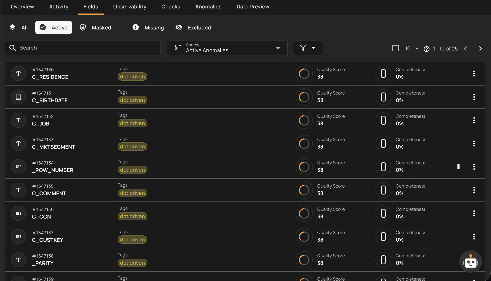
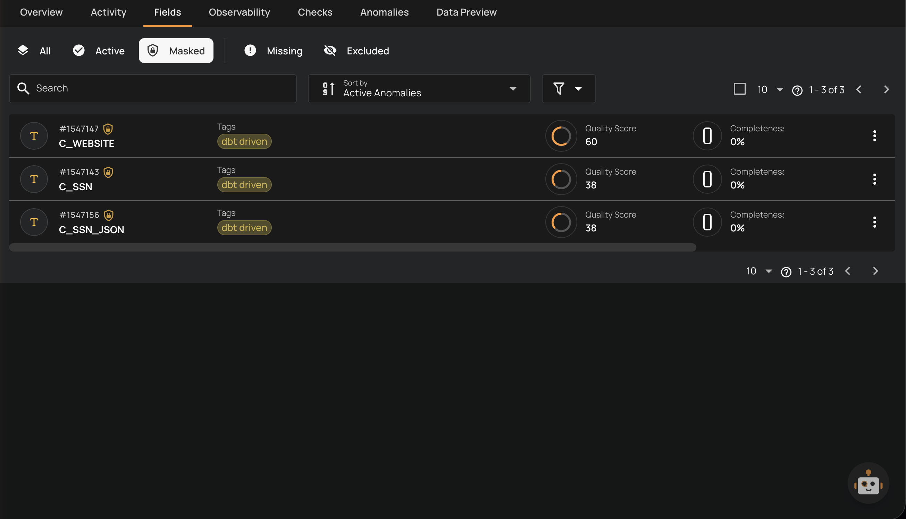
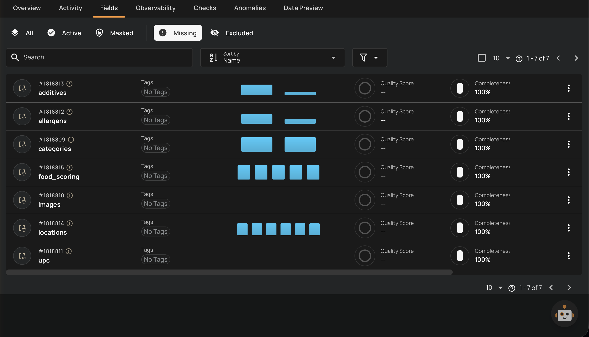
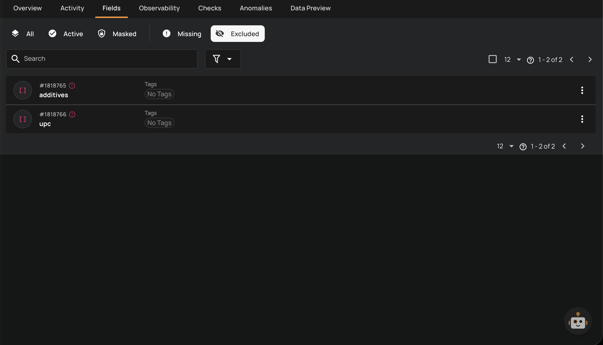
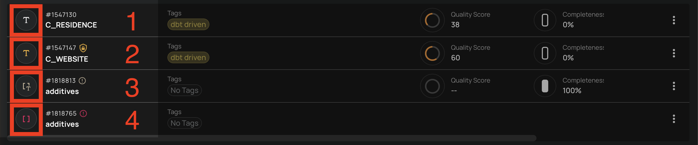

# Field Status Types

Qualytics assigns one of four statuses to each field:

| Status | Assignment | Description |
| :--- | :--- | :--- |
| **Active** | Automatic | The field is fully operational. It will be included in profiling (collecting metadata and statistics), scan operations (detecting anomalies), and quality checks will run against it. This is the default status assigned by the system when a field is first discovered during a profile operation. |
| **Masked** | Manual | The field is fully operational (profiled, scanned, quality-checked) but its actual values are hidden by default. Users with Editor permission can request to view the real values, and every reveal action is audit-logged. |
| **Missing** | Automatic | The field was previously active but was not found in the most recent profile results. This typically means the field has been removed or renamed in the source data. The system assigns this status automatically during profiling. If the field reappears in a subsequent profile, it is automatically restored to **Active**. |
| **Excluded** | Manual | The field has been manually excluded by a user. The platform will not analyze or interact with this field. Associated quality checks (except Expected Schema) are archived when a field is excluded. |

!!! info
    **Active** and **Masked** are both considered **operational** statuses. Everything you can do with an active field, you can also do with a masked field — the only difference is that masked field values are hidden by default.

## How Statuses Are Assigned

### Active (Automatic)

When a container is first profiled, all discovered fields are assigned the **Active** status. Active fields are fully operational and will be:

- Included in profiling operations
- Scanned for anomalies
- Evaluated by quality checks
- Visible in field listings by default

### Masked (Manual)

Users can manually mask a field to hide its raw values from API responses while keeping the field fully operational. This is useful for fields that contain sensitive data (e.g., PII, financial data) that should be protected but still monitored for quality.

Key behaviors for masked fields:

- **Fully operational**: Profiling, scanning, and quality checks continue to run normally
- **Values hidden**: Actual values are replaced with `***MASKED***` across the platform by default
- **Reveal on demand**: Users with Editor permission can explicitly request to view unmasked values
- **Audit-logged**: Every access to unmasked values is recorded in the masking audit log
- **Protected at multiple stages**: Values are automatically hidden across all stages of data processing

### Missing (Automatic)

During a profile operation, Qualytics compares the fields found in the source data with the previously known fields. If a field that was **Active** is no longer present in the source, its status is automatically changed to **Missing**.

Key behaviors for missing fields:

- **Automatic restoration**: If the field reappears in a subsequent profile, it is automatically restored to **Active**
- **No check archival**: Quality checks are not archived for missing fields (unlike excluded fields), since the status is expected to be transient
- **Cascading**: When a profile marks a source field as Missing, any computed fields that depend on it are also marked as **Missing** within that same run

### Excluded (Manual)

Users can manually exclude a field to prevent the platform from analyzing it. This is useful when a field contains irrelevant data or should not be part of quality monitoring.

When a field is excluded:

- Associated quality checks (except Expected Schema checks) are **archived**
- Expected Schema checks are updated to remove the excluded field
- Dependent computed fields are also **excluded** recursively
- The field is hidden from default field listings

## Status Indicators

Fields display visual status indicators to help you quickly identify their state:

| Ref. | Status | Color | Icon |
| :--- | :--- | :--- | :--- |
| 1 | **Active** | Default (neutral) | Check circle icon (`mdi-check-circle`) |
| 2 | **Masked** | Amber/Warning | Shield lock icon (`mdi-shield-lock-outline`) |
| 3 | **Missing** | Warning (yellow/orange) | Alert circle icon (`mdi-alert-circle`) with "Missing field" tooltip |
| 4 | **Excluded** | Negative (red) | Eye-off icon (`mdi-eye-off`) with "Excluded field" tooltip |

