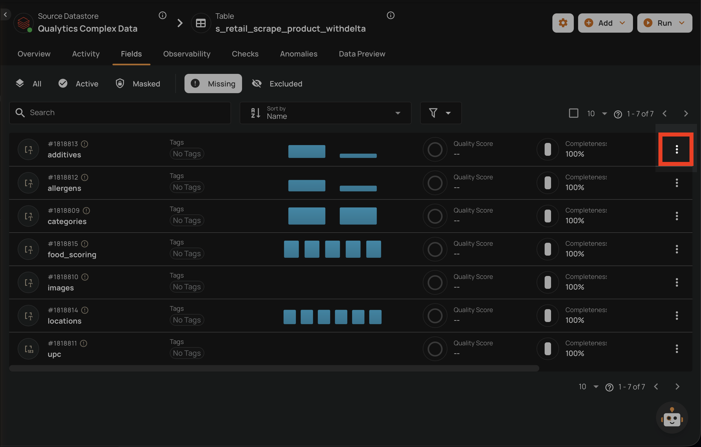
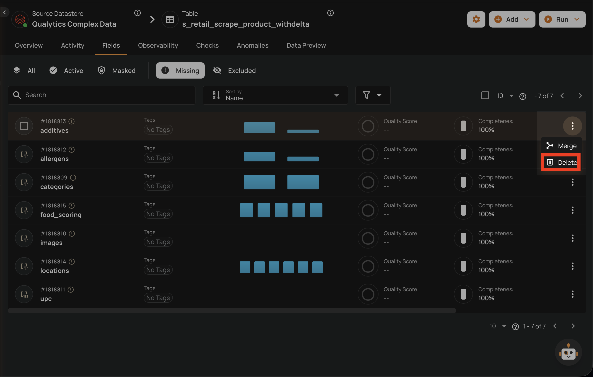
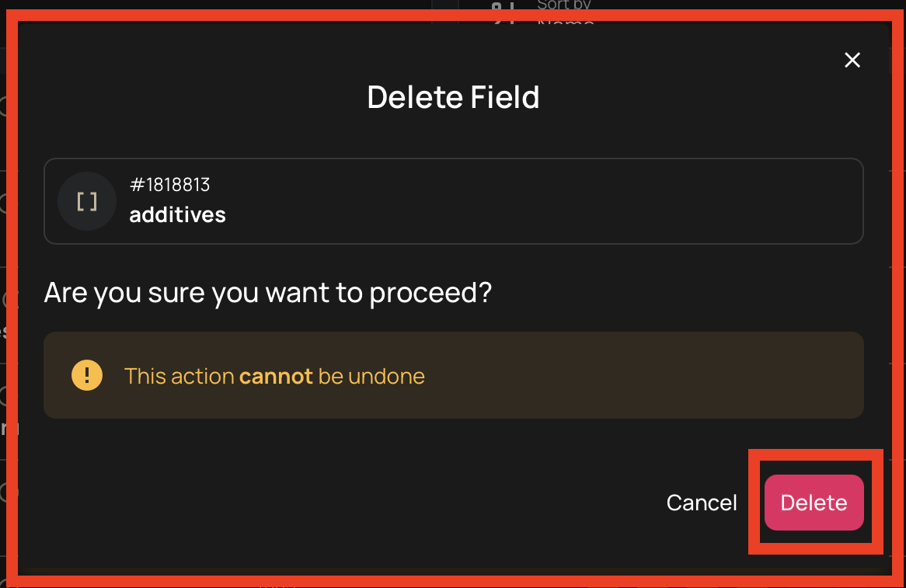
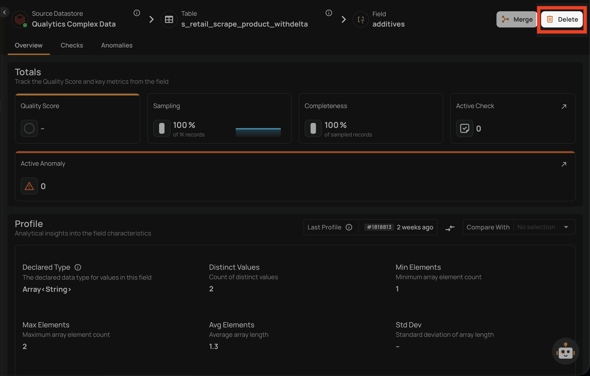
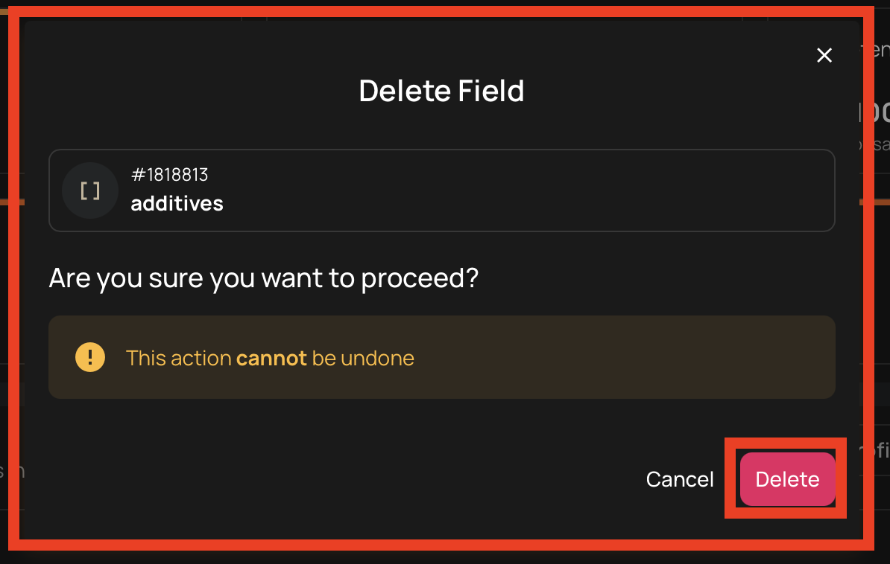
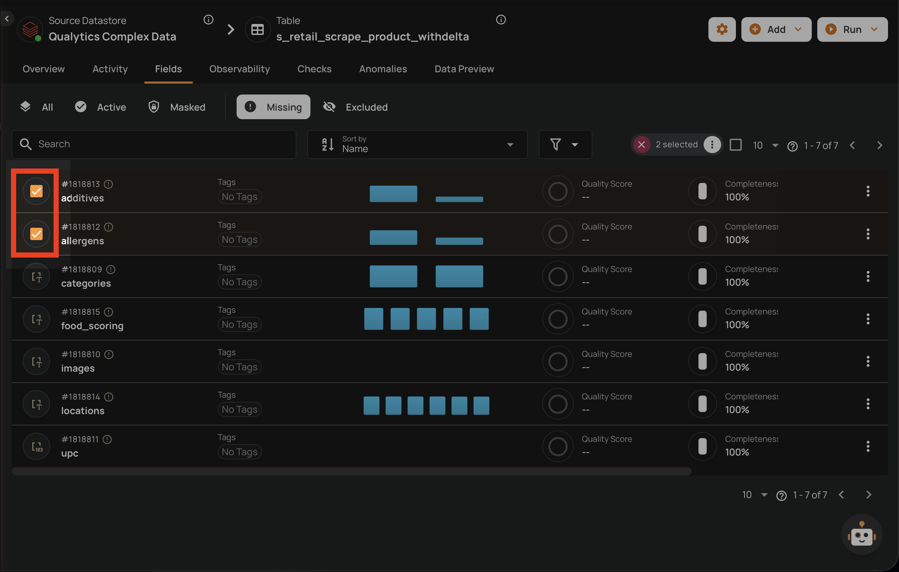
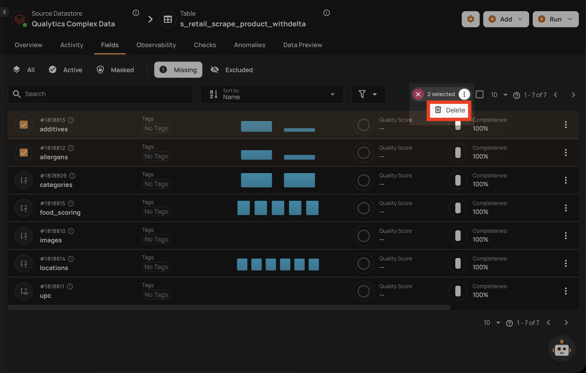
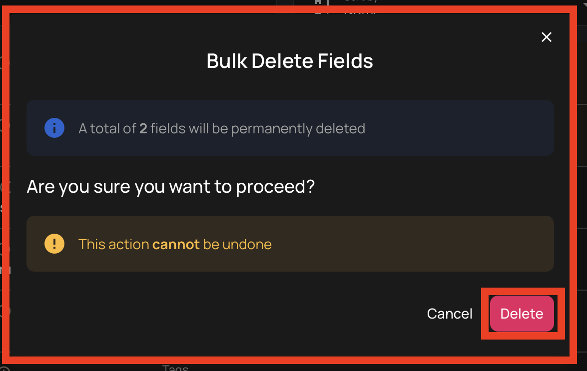

# Delete a Field

Permanently deleting a field removes it from the platform entirely. This action is **irreversible**.

Only **missing** fields and **computed fields** can be permanently deleted. Active, masked, and excluded fields cannot be removed this way.

## Constraints

| Field Type | Can Be Permanently Deleted? | Condition |
| :--- | :--- | :--- |
| **Missing** field | Yes | Must have never been referenced by any quality check (current or past) |
| **Computed** field | Yes | Always deletable — removes both the definition and the output field |
| **Active** field | No | Use [Exclude](exclude-a-field.md) to remove from monitoring instead |
| **Masked** field | No | Use [Exclude](exclude-a-field.md) to remove from monitoring instead |
| **Excluded** field | No | Use [Restore](restore-a-field.md) to bring it back to active first |

## Delete from the Field Listing

### Delete a Missing Field

1. Navigate to the container's field listing.
2. Click the **Missing** tab to view missing fields.
3. Locate the field you want to delete.
4. Click the vertical ellipsis menu (**&vellip;**) on the field row.

    

5. Click the **Delete** option from the menu.

    

6. Confirm the deletion in the dialog.

    

!!! warning
    Permanent deletion is only allowed if the field has never been referenced by any quality checks, including past references. If the field has any current, archived, or previously associated checks, the delete operation will be rejected.

### Delete a Computed Field

Deleting a [computed field](/fields/computed-fields/overview/){target="_blank"} permanently removes both the **transformation definition** and its **output field**. This is the only way to remove a computed field — computed fields cannot be excluded.

When a computed field is deleted:

- The **transformation definition** is permanently removed
- The **output field** is permanently removed
- Any **quality checks** associated with the output field are deleted
- **Source fields** are not affected — they retain their status and configuration

!!! info
    For step-by-step instructions on how to delete a computed field, see [Delete a Computed Field](/fields/computed-fields/computed-fields-details/#delete-a-computed-field){target="_blank"}.

## Delete from the Field View

You can also delete a field directly from its detail page.

1. Navigate to the field's detail page by clicking on the field name in the container's field listing.
2. Click the **Delete** button in the top-right corner of the field page.

    

3. Confirm the deletion in the dialog.

    

## Bulk Delete

You can delete multiple fields at once from the container's field listing.

1. Navigate to the container's field listing.
2. Click the **Missing** tab to view missing fields (or select computed fields from any tab).
3. Select the fields you want to delete by clicking the checkbox on each field row.

    

4. Click the **Delete** action in the selection toolbar that appears at the top.

    

5. Confirm the bulk deletion in the dialog.

    

### Bulk Delete Constraints

- The bulk operation is **all-or-nothing** — if any field in the batch fails validation, the entire operation is aborted and no fields are deleted.
- Missing fields and computed fields can be included in the same bulk delete request. They are processed separately: missing fields go through standard deletion validation, while computed fields use a dedicated deletion process.
- Each missing field must individually satisfy the constraint of having no quality check references.

!!! warning
    Bulk delete follows the same restrictions as single delete: permanent deletion is only allowed for missing fields that have never been referenced by any quality checks. Computed fields can always be deleted.
