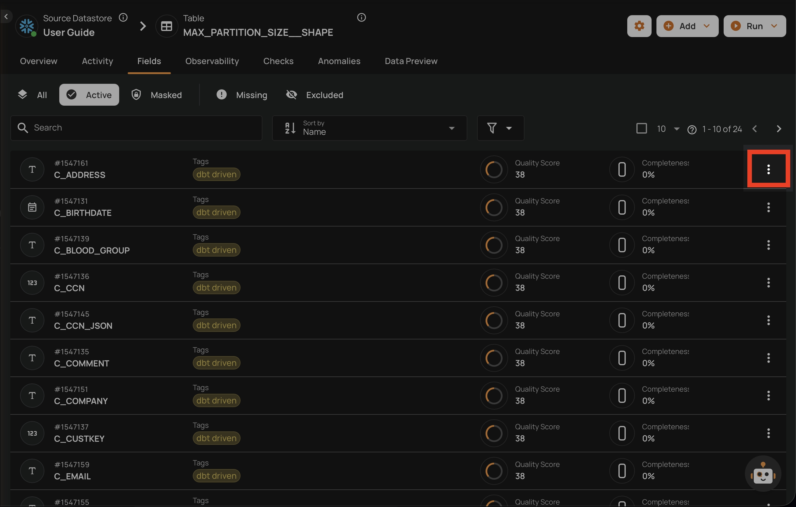
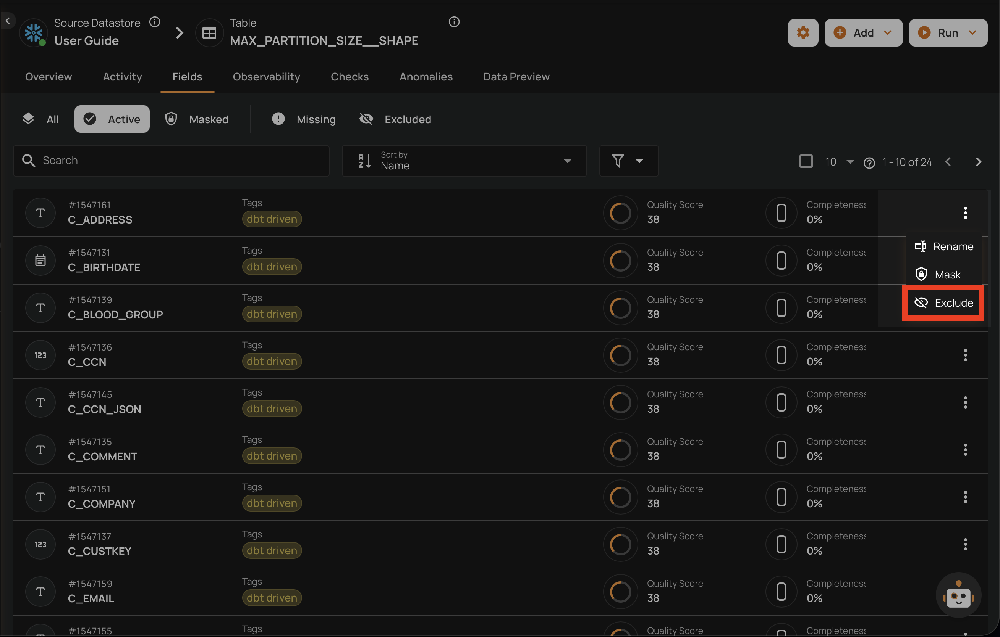
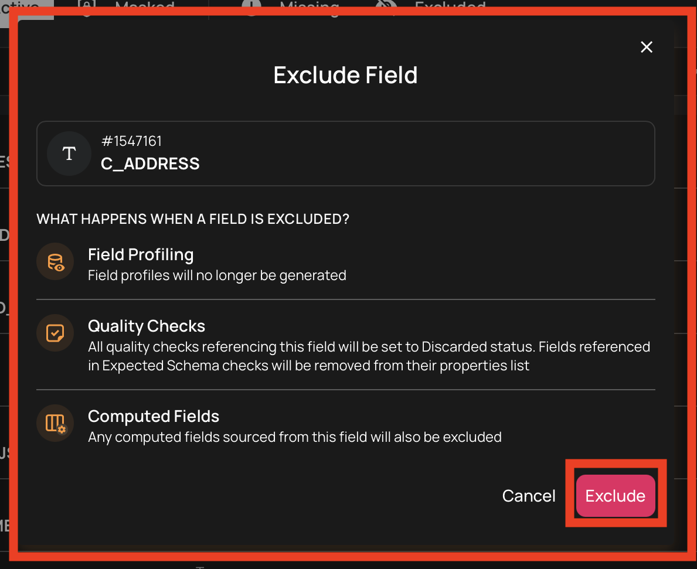
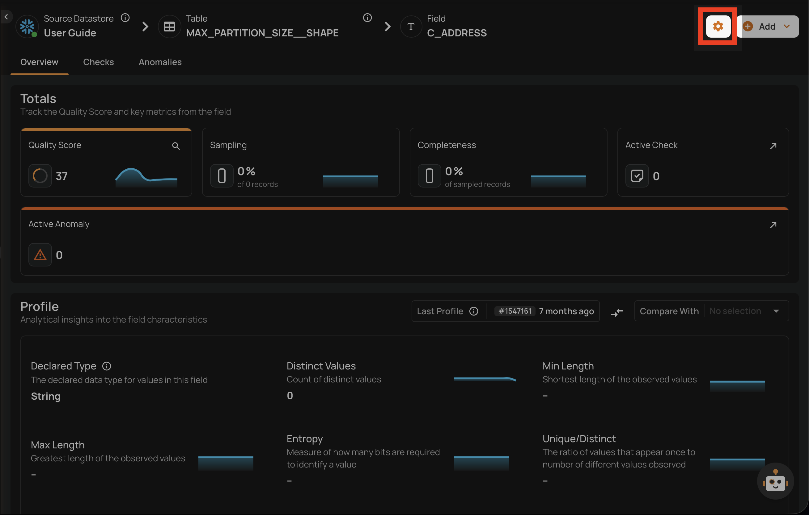
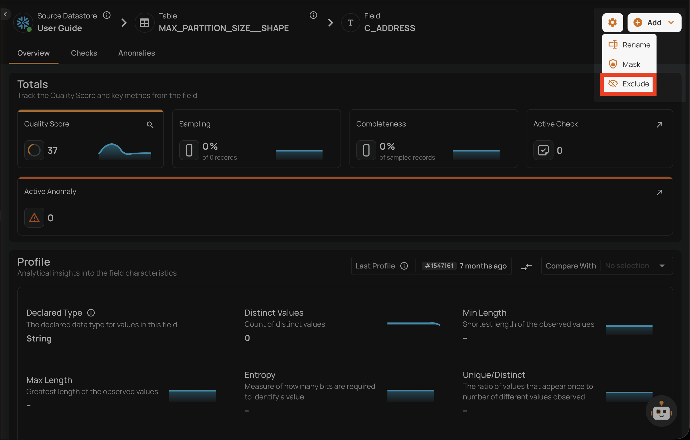
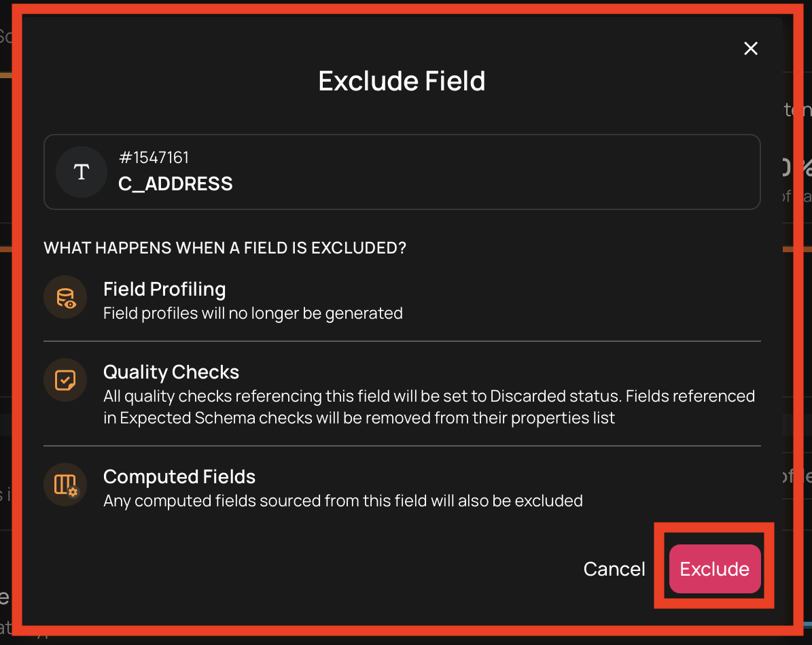
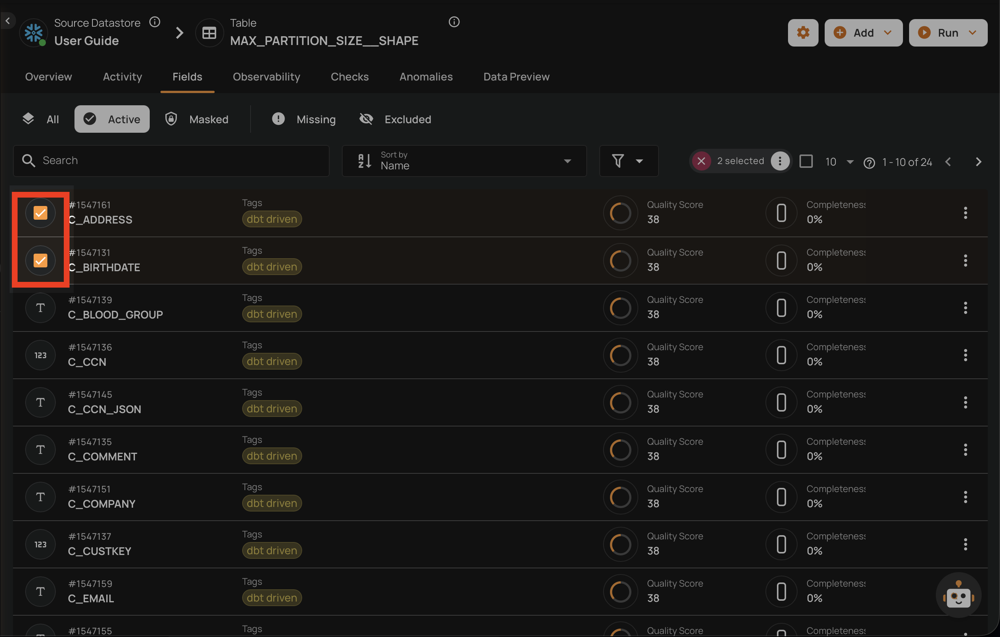
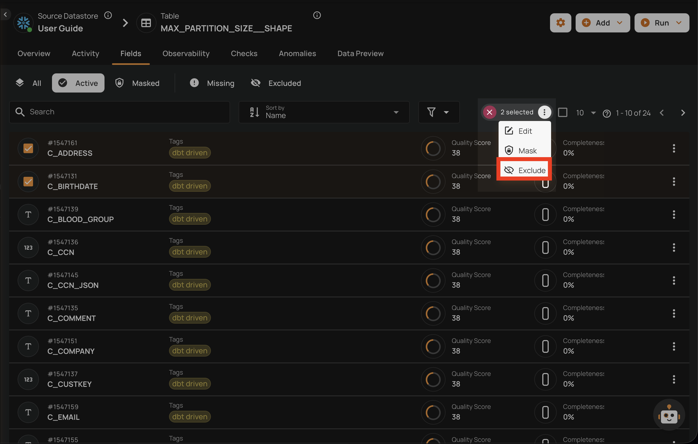
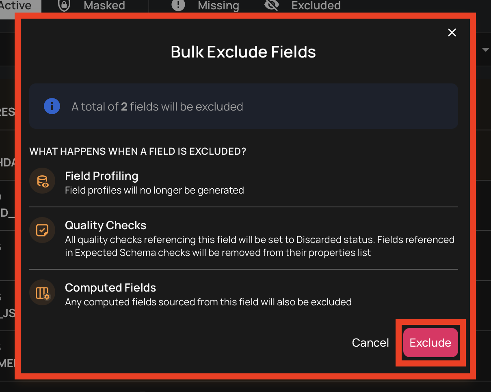

# Exclude a Field

Excluding a field prevents the platform from analyzing or interacting with it. This is useful when a field contains irrelevant data or should not be part of quality monitoring.

Only fields with **Active** or **Masked** status can be excluded.

## What Happens When a Field is Excluded

When you exclude a field:

- **Field Profiling**: The field is no longer profiled
- **Quality Checks**: Associated checks are set to Discarded; [Expected Schema](/checks/expected-schema-check/) checks remove the field from their properties
- **[Computed Fields](/fields/computed-fields/overview/)**: Any computed fields sourced from this field are also excluded (see [Computed Fields and Exclusion](#computed-fields-and-exclusion))

## Exclude from the Field Listing

1. Navigate to the container's field listing.
2. Locate the field you want to exclude.
3. Click the vertical ellipsis menu (**&vellip;**) on the field row.

4. Click the **Exclude** option from the menu.

5. Confirm the exclusion in the dialog.

!!! warning
    This action is reversible through the [restore operation](restore-a-field.md), but previously archived quality checks will **not** be automatically restored.

## Exclude from the Field View

You can also exclude a field directly from its detail page.

1. Navigate to the field's detail page by clicking on the field name in the container's field listing.
2. Click the settings icon (gear icon) in the top-right corner of the field page.

    

3. Click the **Exclude** option from the dropdown menu.

    

4. Confirm the exclusion in the dialog.

    

!!! note
    Excluded fields cannot be used as incremental fields, partition fields, or group by criteria. If a field is currently assigned to one of these roles, it must be removed from that role before it can be excluded.

## Bulk Exclude

You can exclude multiple fields at once from the container's field listing.

1. Navigate to the container's field listing.
2. Select the fields you want to exclude by clicking the checkbox on each field row.

3. Click the **Exclude** action in the selection toolbar that appears at the top.

4. Confirm the bulk exclusion in the dialog.

!!! warning
    Bulk exclusion applies the same side effects as excluding a single field: all associated quality checks (except Expected Schema) are archived and dependent computed fields are excluded recursively for each selected field.

## Computed Fields and Exclusion

[Computed fields](/fields/computed-fields/overview/) have a different relationship with exclusion compared to regular fields. A computed field depends on one or more **source fields** — if any source field becomes unavailable (missing or excluded), the computed field cannot function.

### Computed fields cannot be excluded directly

A computed field's output cannot be manually excluded. If you no longer need a computed field, you must **delete** it instead (see [Delete a Field](delete-a-field.md)). Unlike regular fields, computed fields do not exist in the source data — they are derived from a transformation definition applied to other fields. The concept of "excluding from profiling" does not apply because their values are generated by the platform, not read from the source.

### Excluding a source field automatically excludes its computed fields

When you exclude a regular field that is used as a **source** for a computed field, the computed field's output is automatically excluded as well. This propagates through the entire dependency chain — if the output field is itself a source for another computed field, that one is also excluded.

Importantly, the computed field **definition is preserved** during this cascade. This means:

- The computed field output can be **restored** when the source field is restored
- The transformation definition does not need to be recreated
- Quality checks on the computed field output are **archived** (not deleted)

!!! note
    If a computed field has multiple source fields, excluding **any single** source field is enough to automatically exclude the computed field output.

### Missing source field vs Excluded source field

The behavior differs depending on whether a source field goes **missing** (automatically during profiling) or is **excluded** (manually by a user):

| Aspect | Source Missing (Profile) | Source Excluded (Manual) |
| :--- | :--- | :--- |
| **Computed output status** | Missing | Excluded |
| **Quality checks** | Remain active | Archived (set to Discarded) |
| **Expected Schema** | No changes | Updated to remove the field |
| **Propagation** | Direct dependents only | All levels of the dependency chain |
| **Restoration** | Automatic when source reappears in next profile | Manual — source must be restored first |
| **Definition preserved** | Yes | Yes |

In both cases, the computed field **definition is always preserved**, allowing the computed field to resume when all source fields are available again.

### Deleting a computed field is permanent

When you delete a computed field, both the definition and its output field are **permanently removed**. This is different from the automatic exclusion behaviors above, which are reversible.

| Action | Regular Field | Computed Field |
| :--- | :--- | :--- |
| **Exclude** | Sets status to Excluded; reversible | Not available — use Delete instead |
| **Cascade exclude** (via source) | N/A | Output excluded; definition preserved; reversible |
| **Cascade missing** (via profile) | N/A | Output missing; definition preserved; auto-restores |
| **Delete** | Permanently delete (only if missing, no checks) | Definition + output permanently removed |

!!! info
    The following fields cannot be excluded:

    - **Missing** fields
    - **Already excluded** fields
    - **Computed fields** (use delete instead)
    - **Sub-fields** (children of complex types)
    - **Container identifiers** — fields configured as the partition field or incremental field, which the platform uses to organize and track data processing
