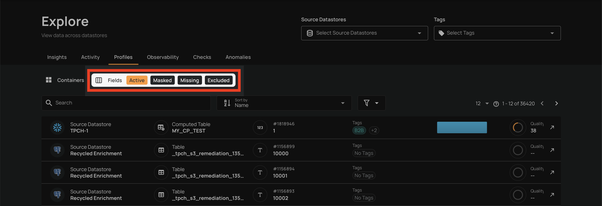
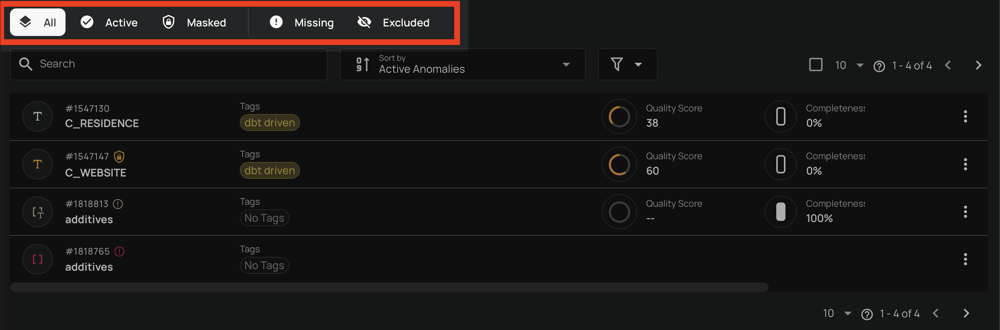

# Filtering by Status

You can filter fields by their status in two different contexts: across all containers in the Explore view or within a specific container.

## Explore Context

When navigating to **Explore**, you can switch between **Containers** and **Fields** tabs. The Fields tab provides subtabs to filter by status:

- **Active**: Shows only active fields across all containers.
- **Masked**: Shows only masked fields across all containers.
- **Missing**: Shows only missing fields across all containers.
- **Excluded**: Shows only excluded fields across all containers.

## Container Context

When viewing fields within a specific container, status tabs are displayed at the top of the field listing:

- **All**: Displays all active and masked fields.
- **Active**: Shows only fields with active status.
- **Masked**: Shows only fields with masked status.
- **Missing**: Shows only fields with missing status.
- **Excluded**: Shows only fields that have been excluded.

There is a visual separator between the **Masked** and **Missing** tabs, grouping the operational statuses (All, Active, Masked) separately from the non-operational statuses (Missing, Excluded).

!!! info
    The **All** tab shows active and masked fields combined. Missing and excluded fields are only visible under their respective tabs.

## Differences Between Contexts

| Feature | Explore | Container |
| :--- | :--- | :--- |
| **Scope** | Fields across all containers and datastores | Fields within a single container |
| **"All" tab** | Not available | Available (shows active + masked) |
| **Bulk operations** | Not available | Supported (mask, unmask, exclude, restore, delete) |
| **Field actions** | View only (navigate to container for actions) | Mask, unmask, exclude, restore, delete |
