# Mask a Field

Masking a field hides its actual values across the platform while keeping the field fully operational. This is useful for fields that contain sensitive data (e.g., PII, financial data) that should be protected but still monitored for quality.

Only fields with **Active** status can be masked. This includes both regular fields and computed fields.

## What Happens When a Field is Masked

When you mask a field:

- **Everywhere in the platform**: Field values are replaced with `***MASKED***` (a placeholder text indicating the value is protected)
- **Data Preview**: Values are hidden in the container preview — users must explicitly reveal them
- **Anomaly Source Records**: Values are not shown by default — users can toggle reveal per record
- **Field Profile Histograms**: Chart values are hidden for masked fields
- **Quality Checks**: Continue to run normally — masking does not affect quality monitoring
- **Profiling and Scanning**: Continue to run normally

!!! info
    Users with **Editor** permission or above can request to view unmasked values. Every reveal action is **audit-logged** for security and compliance purposes.

## Mask a Field from the Container View

1. Navigate to the container's field listing.
2. Locate the field you want to mask.
3. Click the vertical ellipsis menu (**&vellip;**) on the field row.

    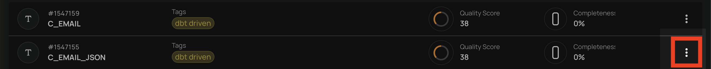

4. Click the **Mask** option from the menu.

    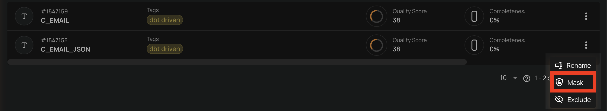

5. Confirm the masking in the dialog.

    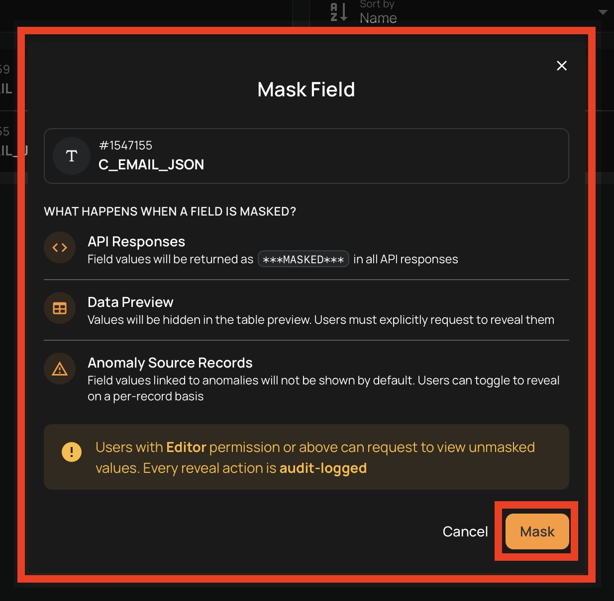

## Mask a Field from the Field View

You can also mask a field directly from its detail page.

1. Navigate to the field's detail page by clicking on the field name in the container's field listing.
2. Click the settings icon (gear icon) in the top-right corner of the field page.

    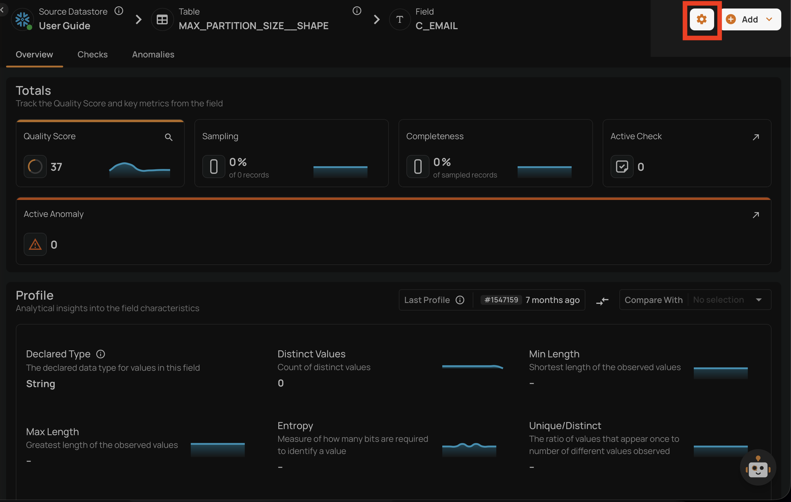

3. Click the **Mask** option from the dropdown menu.

    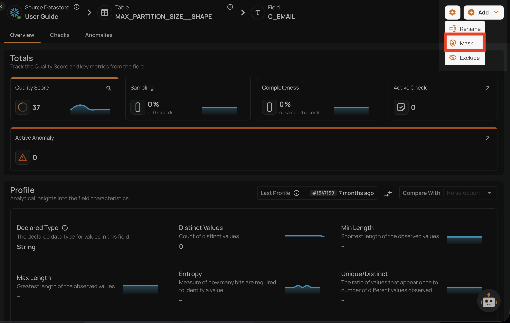

4. Confirm the masking in the dialog.

    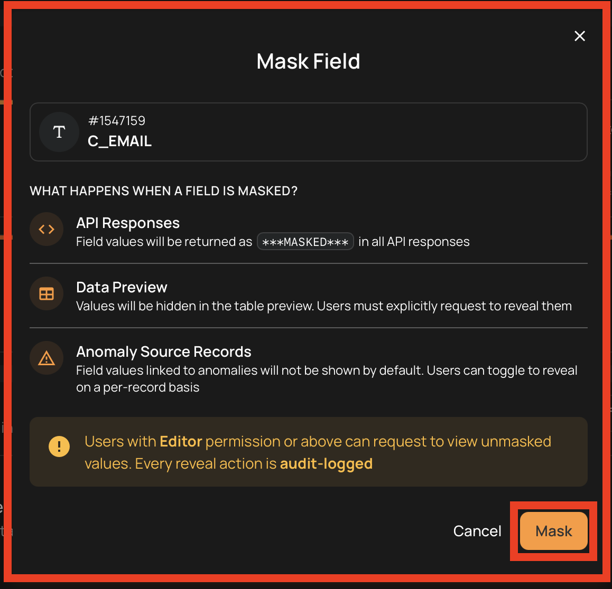

## Bulk Mask

You can mask multiple fields at once from the container's field listing.

1. Navigate to the container's field listing.
2. Select the fields you want to mask by clicking the checkbox on each field row.

    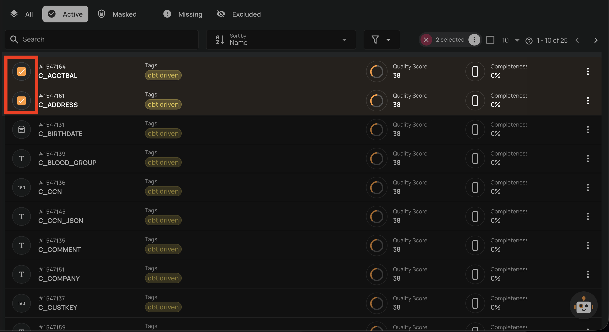

3. Click the **Mask** action in the selection toolbar that appears at the top.

    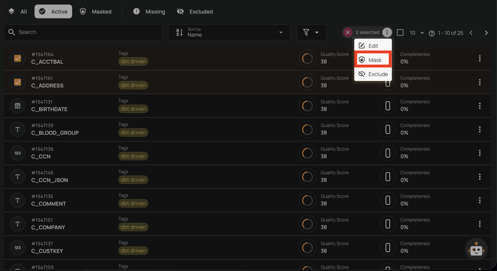

4. Confirm the bulk masking in the dialog.

    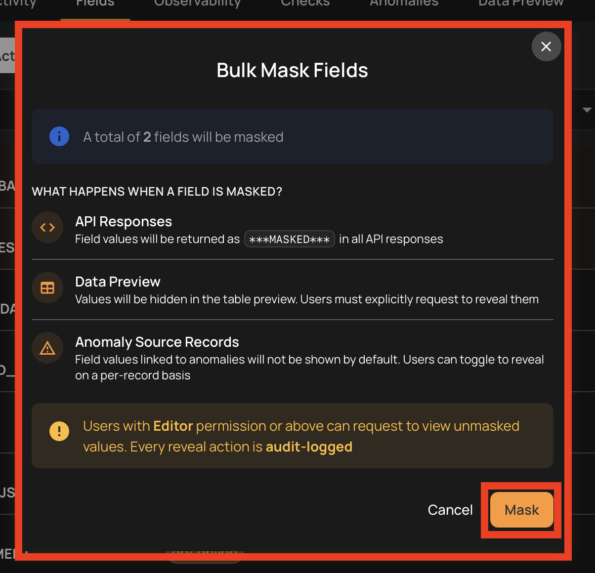

## Unmask a Field

Unmasking a field restores its actual values across the platform, making them visible without requiring explicit reveal actions.

### What Happens When a Field is Unmasked

When you unmask a field:

- **Everywhere in the platform**: Field values are fully visible without masking
- **Data Preview**: Values are shown directly without reveal action
- **Anomaly Source Records**: Values are visible by default

### Unmask from the Container View

1. Navigate to the container's field listing.
2. Click the **Masked** tab to view masked fields.
3. Locate the field you want to unmask.
4. Click the vertical ellipsis menu (**&vellip;**) on the field row.

    

5. Click the **Unmask** option from the menu.

    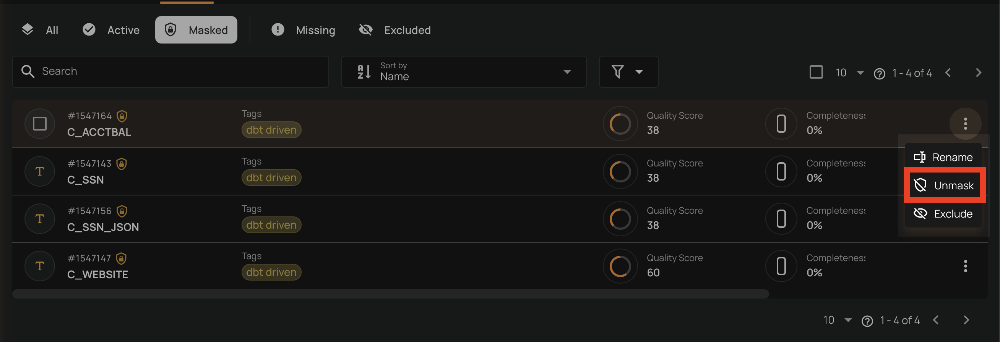

6. Confirm the unmasking in the dialog.

    

### Unmask from the Field View

1. Navigate to the field's detail page by clicking on the field name in the container's field listing.
2. Click the settings icon (gear icon) in the top-right corner of the field page.

    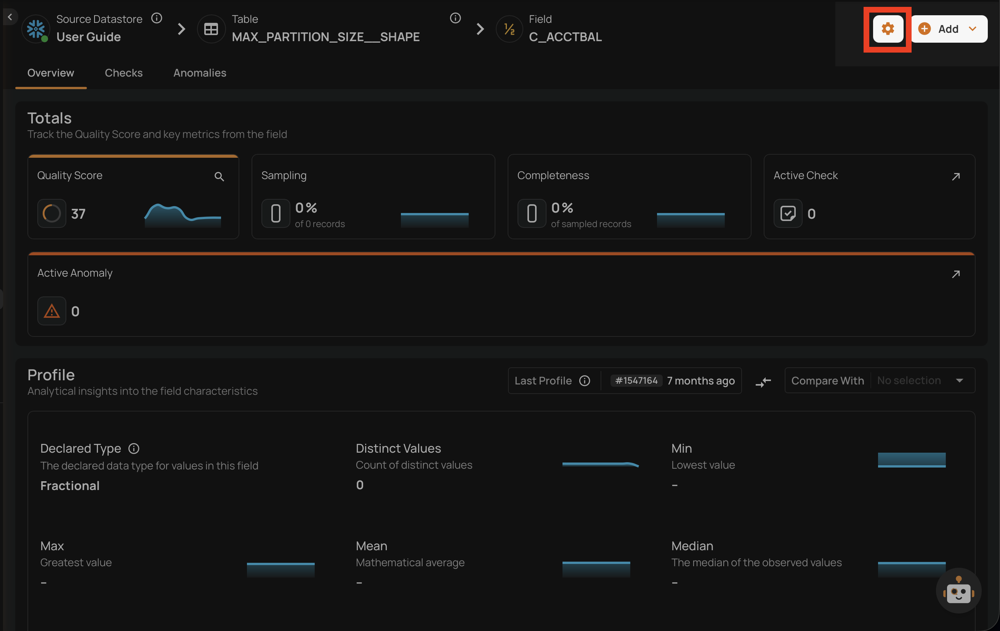

3. Click the **Unmask** option from the dropdown menu.

    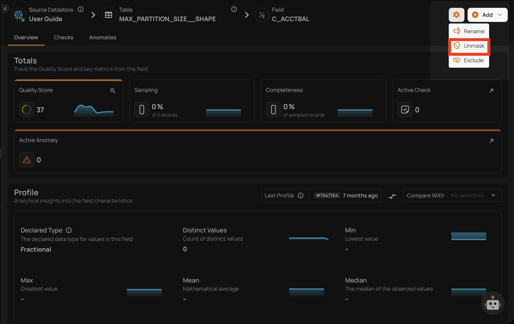

4. Confirm the unmasking in the dialog.

    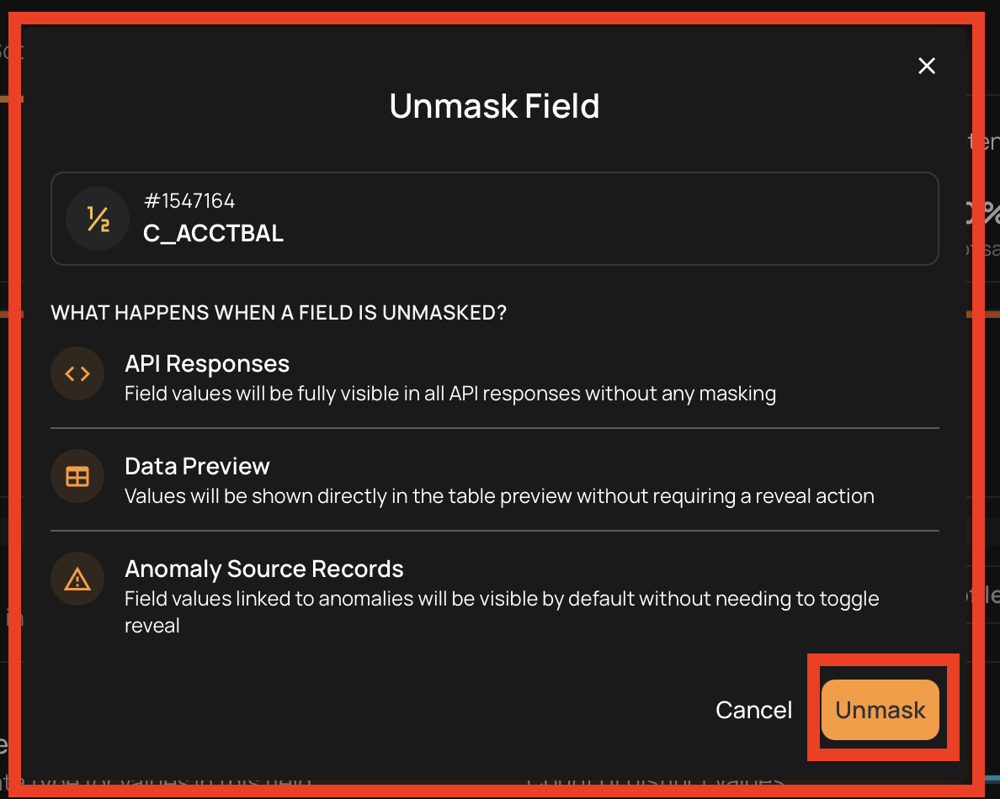

### Bulk Unmask

You can unmask multiple fields at once from the container's field listing.

1. Navigate to the container's field listing.
2. Click the **Masked** tab to view masked fields.
3. Select the fields you want to unmask by clicking the checkbox on each field row.

    

4. Click the **Unmask** action in the selection toolbar that appears at the top.

    

5. Confirm the bulk unmasking in the dialog.

    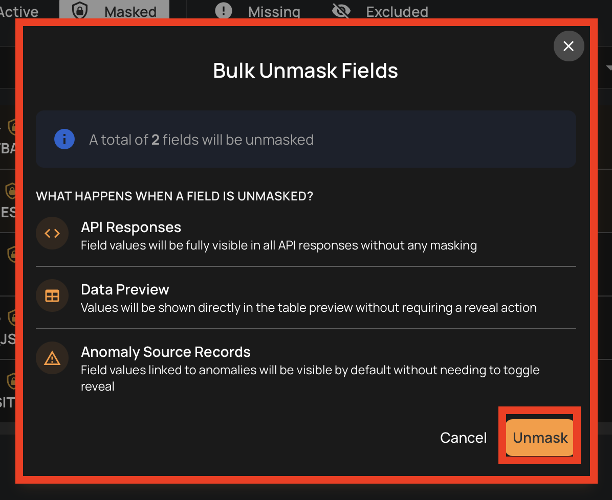

## Viewing Masked Values

Even when a field is masked, users with **Editor** permission can temporarily reveal its values in specific contexts:

### Data Preview

In the container's data preview, masked fields display their values as hidden (`••••••••`). A **Show masked values** button allows you to reveal the values for the current view.

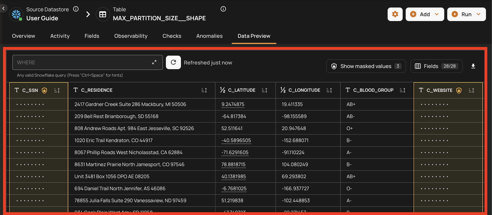

### Anomaly Source Records

In anomaly source records, masked field values are hidden by default. You can toggle the visibility of masked values per record using the reveal control.

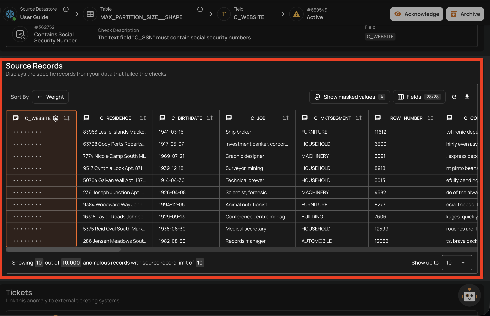

!!! warning
    Every time masked values are revealed, the action is recorded in the **masking audit log** with the user identity, timestamp, IP address, and the specific fields and resources accessed. Administrators can review these logs from the masking audit log page.

!!! note
    The following fields cannot be masked:

    - **Excluded** fields
    - **Missing** fields
    - **Already masked** fields
    - **Container identifiers** — fields configured as the incremental field or partition field, which the platform uses to organize and track data processing
