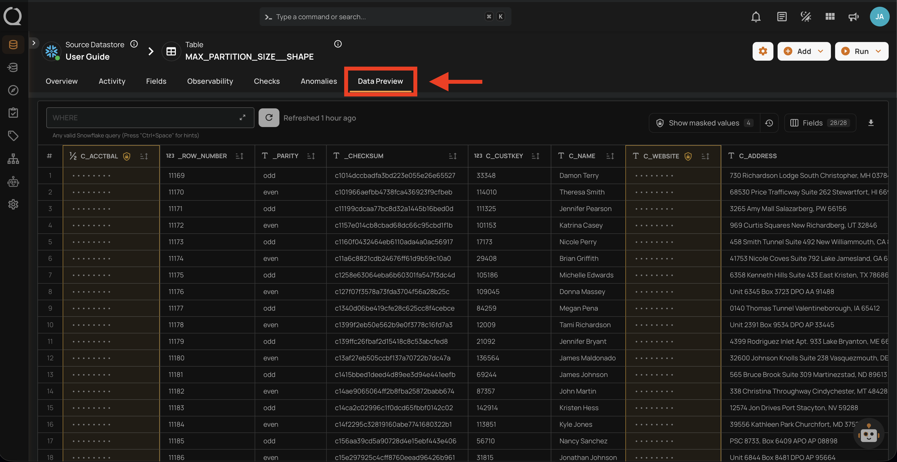
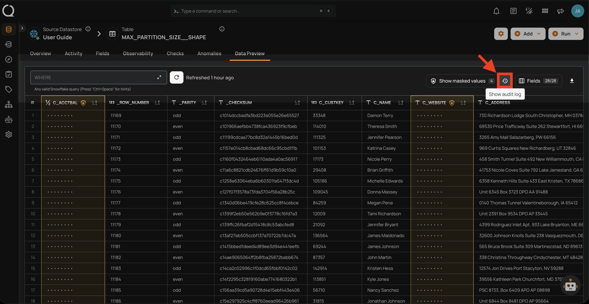
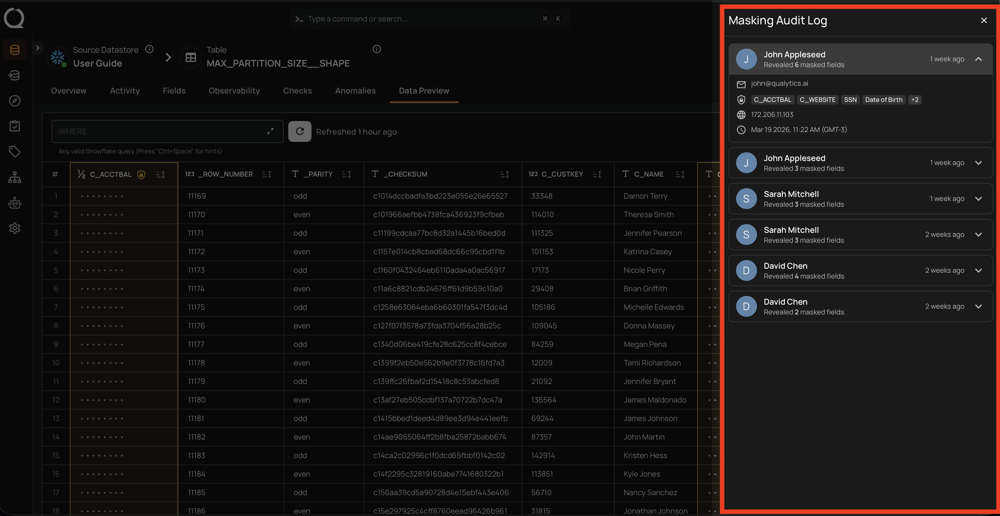
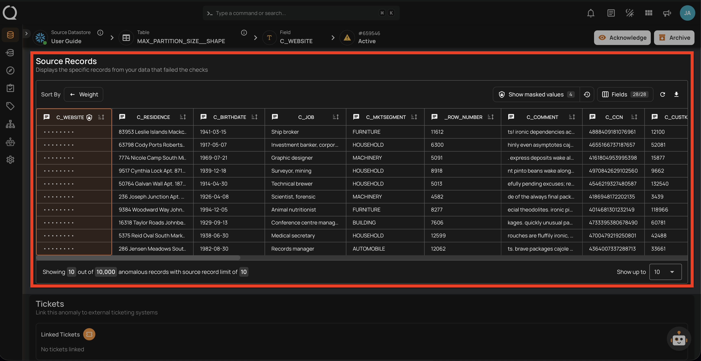
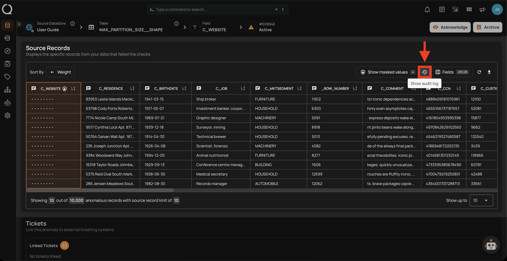
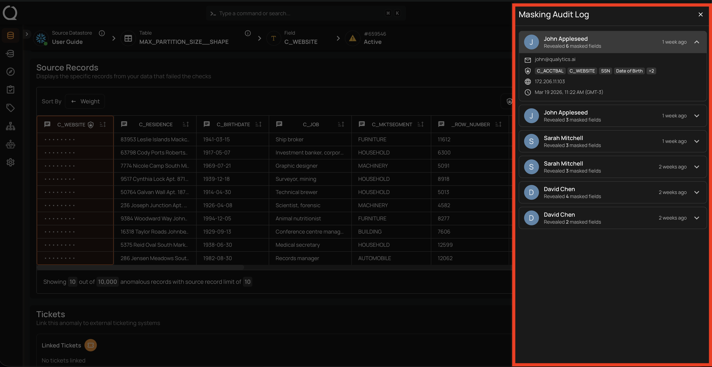

# Audit Masked Field Access

The masking audit log records every instance where masked field values are revealed. Use it to track who accessed sensitive data, when, and from which surface.

!!! tip
    For background on how masking works and where values are obfuscated, see [Field Masking](../concepts/field-masking.md){:target="_blank"}.

## Who Can Access the Audit Log?

Only users with the **Admin** user role can view the masking audit log.

## What Is Recorded?

Every time a user reveals masked values — whether through the UI or the API — an entry is created with the following details:

| Detail | Description |
| :--- | :--- |
| **User** | The name and email of the user who performed the reveal |
| **Action** | The type of action performed (e.g., revealed masked field values) |
| **Timestamp** | The date and time of the reveal action |
| **IP Address** | The IP address of the client that performed the reveal |
| **Fields Accessed** | The list of masked field names whose values were revealed |
| **Resource** | The resource type and ID where the reveal was performed (e.g., container, anomaly) |

## Actions That Generate Audit Entries

| Surface | Action | Audit entry created? |
| :--- | :--- | :--- |
| **Data Preview** | Clicking **Show masked values** | Yes |
| **Anomaly Source Records** | Toggling the reveal control | Yes |
| **Field Profile Histograms** | Using `include_masked` API parameter | Yes |
| **Export Operation** | Using `include_masked` API parameter | Yes |
| **Materialize Operation** | Using `include_masked` API parameter | Yes |
| **Quality Check Dry Runs** | N/A — unconditionally masked, no reveal available | No |
| **Anomaly Assertion Context** | N/A — unconditionally masked, no reveal available | No |

!!! note
    Unmasking a field (changing its status from Masked to Active) is a different action — it does not generate reveal entries because the values become permanently visible. For more on unmasking implications, see [Field Masking — Unmasking a Field](../concepts/field-masking.md#unmasking-a-field){:target="_blank"}.

## Accessing the Audit Log from the UI

You can open the masking audit log from the surfaces where reveal is available.

### From Data Preview

1. Select a container and click the **Data Preview** tab.

    

2. Click the **Show audit log :material-history:** button next to the reveal control.

    

3. The audit log side panel opens, showing a list of reveal events for this container.

    

### From Anomaly Source Records

1. Navigate to the Anomaly Overview page and scroll down to the **Source Records** section.

    

2. Click the **Show audit log :material-history:** button next to the reveal control.

    

3. The audit log side panel opens, showing a list of reveal events for this anomaly.

    

### The Audit Log Side Panel

The audit log side panel displays a chronological list of reveal events. Each entry shows the user who performed the reveal. Clicking on an entry expands it to show the full details, including the action, timestamp, IP address, fields accessed, and the resource where the reveal occurred.

## Accessing the Audit Log via API

Administrators can also query the audit log programmatically. See the [Masking Audit Log API](../concepts/field-status-api.md#masking-audit-log){:target="_blank"} for the endpoint, query parameters, and example requests.

## Related

- [Field Masking](../concepts/field-masking.md){:target="_blank"} — How masking works and where it is applied.
- [Field Masking — Unmasking a Field](../concepts/field-masking.md#unmasking-a-field){:target="_blank"} — What happens when a field is unmasked and best practices.
- [Field Status API — Masking Audit Log](../concepts/field-status-api.md#masking-audit-log){:target="_blank"} — API endpoint for querying audit log entries.
