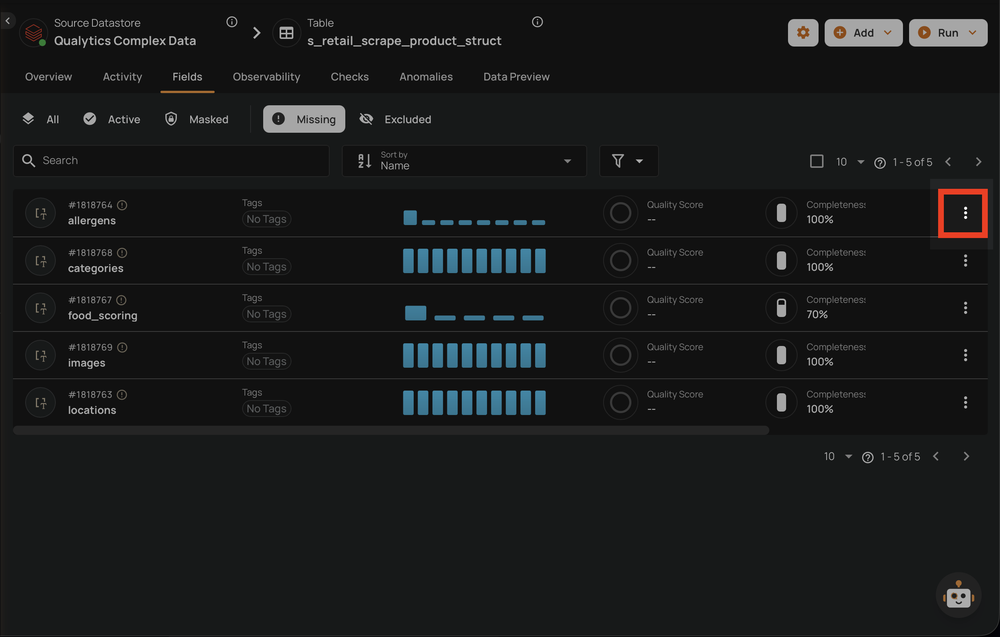
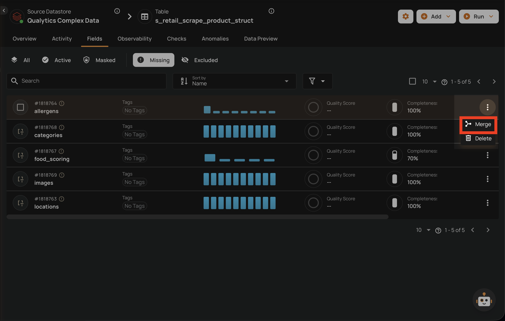
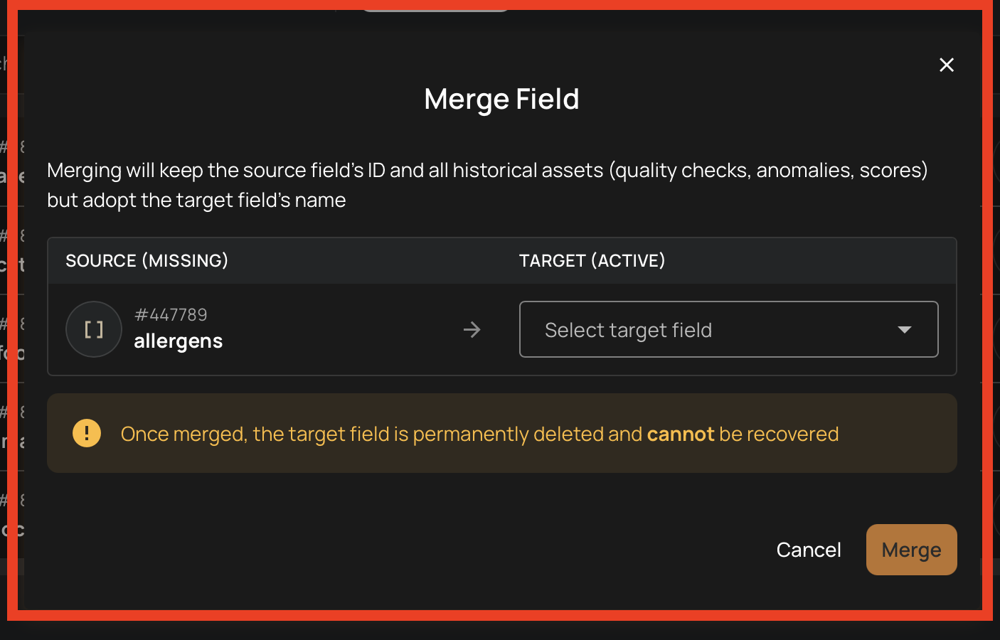
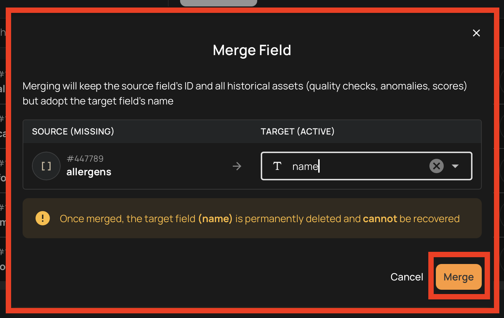
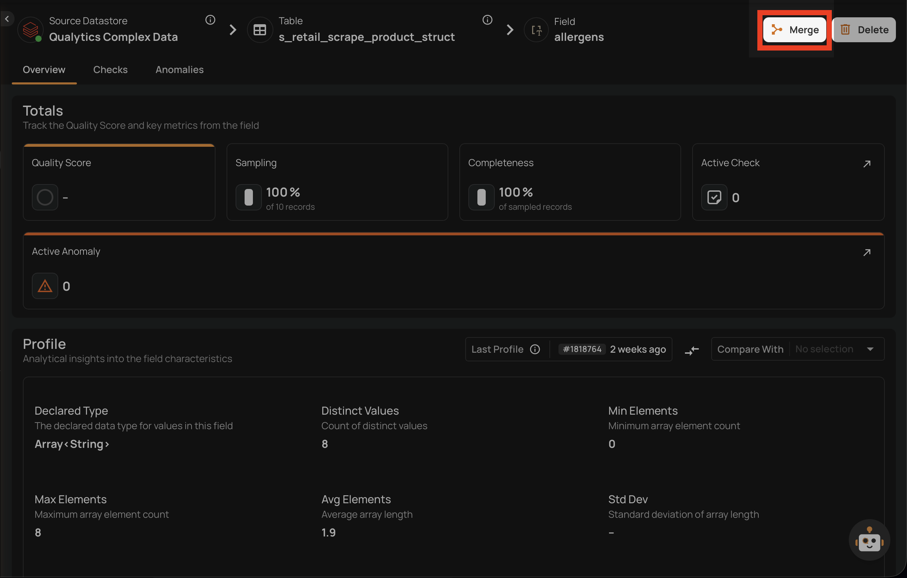
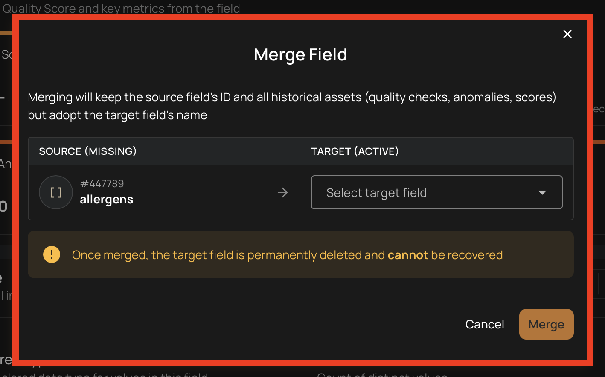
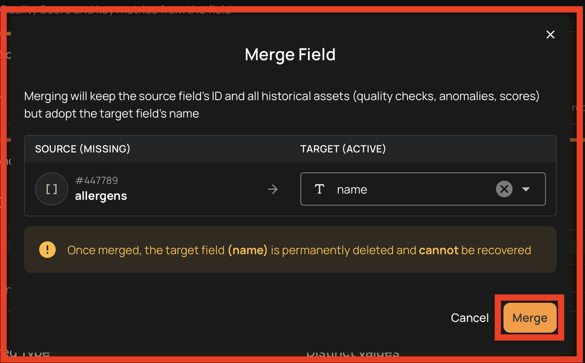

# Merge Fields

The merge operation combines a **Missing** field (the old field with history) with an **Active** field (the new field with the desired name) into a single field, preserving all historical data under the new column name.

This is the recommended approach when a column is renamed in the source data. For a detailed explanation of why and how merging works, see [Merge Fields Concept](../concepts/merge-fields.md){:target="_blank"}.

## When to Merge

After a column rename in your source data, the next profile operation will:

- Mark the original field as **Missing**
- Create a new **Active** field with the updated name

Without merging, the new field starts with no history. Merging transfers all historical profiles, anomalies, and quality checks from the old field to the new one.

## Merge from the Field Listing

1. Navigate to the container's field listing.
2. Click the **Missing** tab to view missing fields.
3. Locate the missing field you want to merge (the old field with history).
4. Click the vertical ellipsis menu (**&vellip;**) on the field row.

    

5. Click the **Merge** option from the menu.

    

6. In the merge dialog, select the **target field** (the new active field whose name you want to keep).

    

7. Confirm the merge.

    

## Merge from the Field View

You can also merge a field directly from its detail page.

1. Navigate to the missing field's detail page by clicking on the field name in the container's field listing.
2. Click the **Merge** button in the top-right corner of the field page.

    

3. In the merge dialog, select the **target field** (the new active field whose name you want to keep).

    

4. Confirm the merge.

    

## What Happens After a Merge

| Step | Action |
| :--- | :--- |
| 1 | The source field (missing) adopts the target field's name |
| 2 | The target field record is removed |
| 3 | The source field status is set to **Active** |
| 4 | All historical field profiles are renamed to match the new field name |
| 5 | Quality checks from the target field are reassociated to the source field |

## Restrictions

- Both fields must belong to the **same container**
- The source field must be **Missing**
- The target field must be **Active**
- A field cannot be merged with itself
- Bulk merge is **not supported** — each merge must be performed individually

!!! tip
    Merge is the recommended approach when dealing with column renames. It preserves your complete quality monitoring history and avoids the need to reconfigure quality checks from scratch on the renamed field.

!!! info
    For more details on what is preserved during a merge and how it works, see [Merge Fields Concept](../concepts/merge-fields.md){:target="_blank"}.
