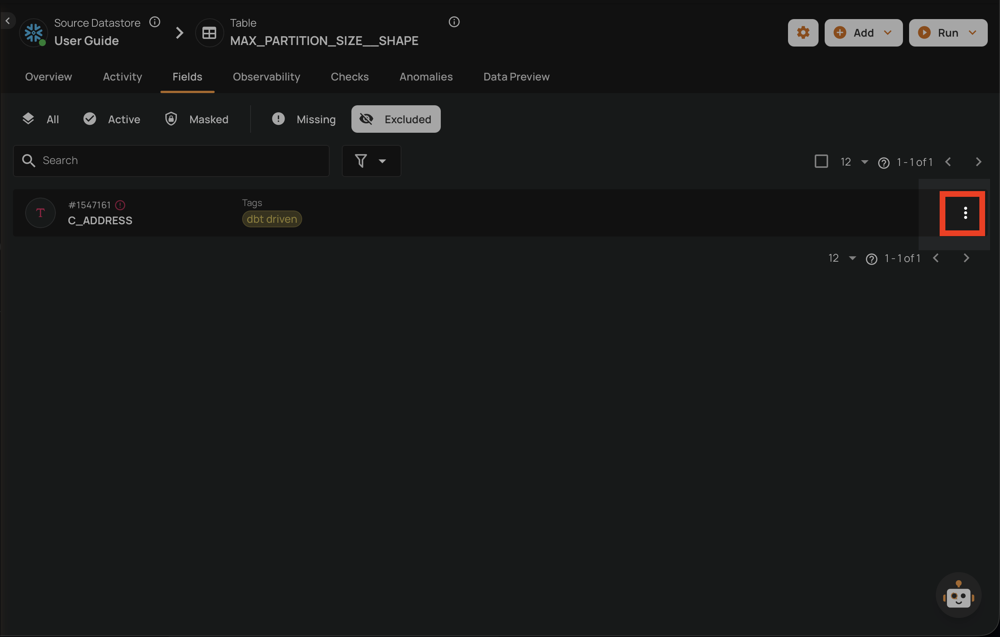
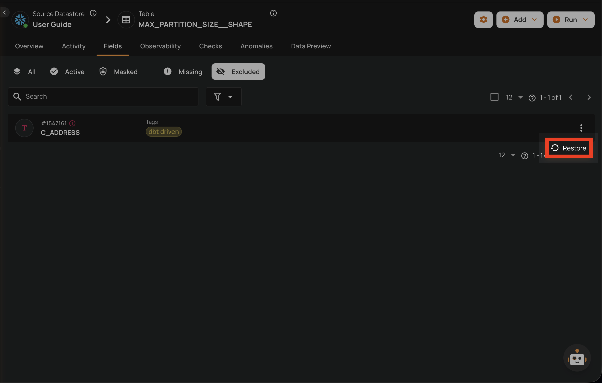
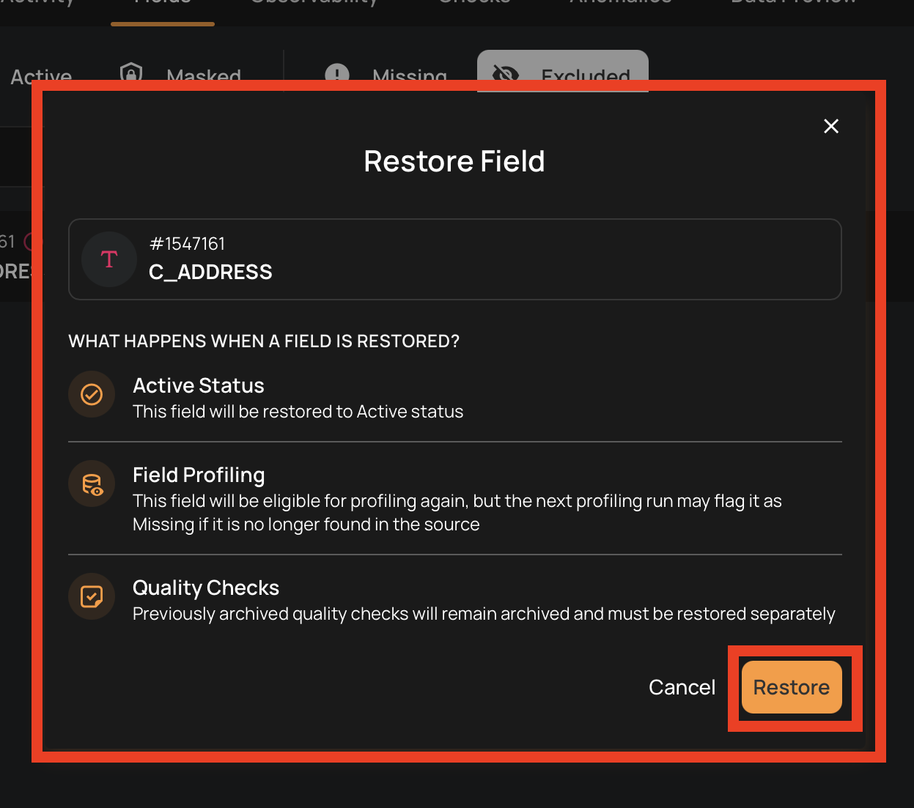
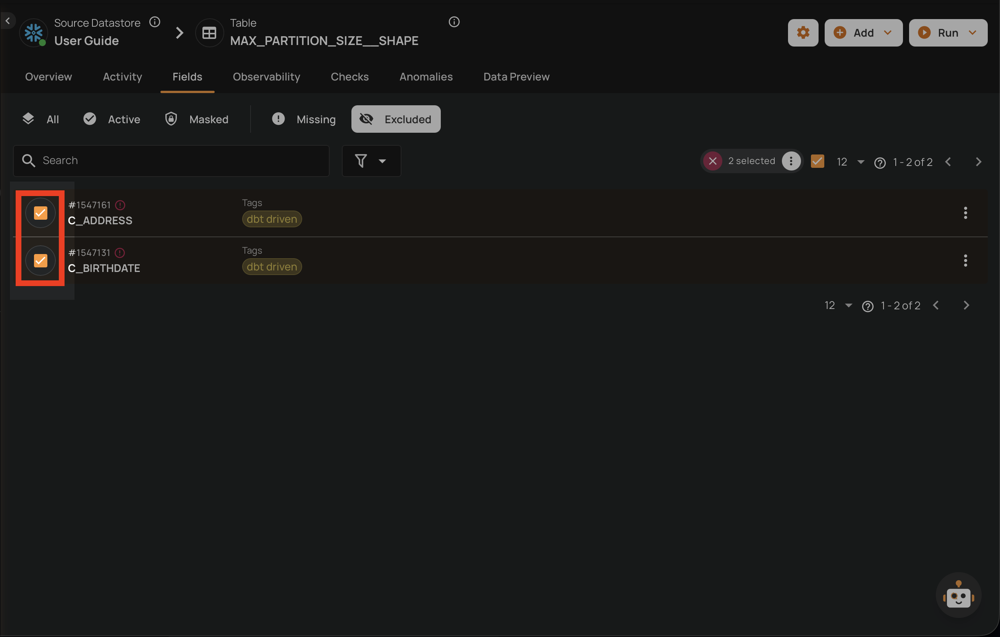
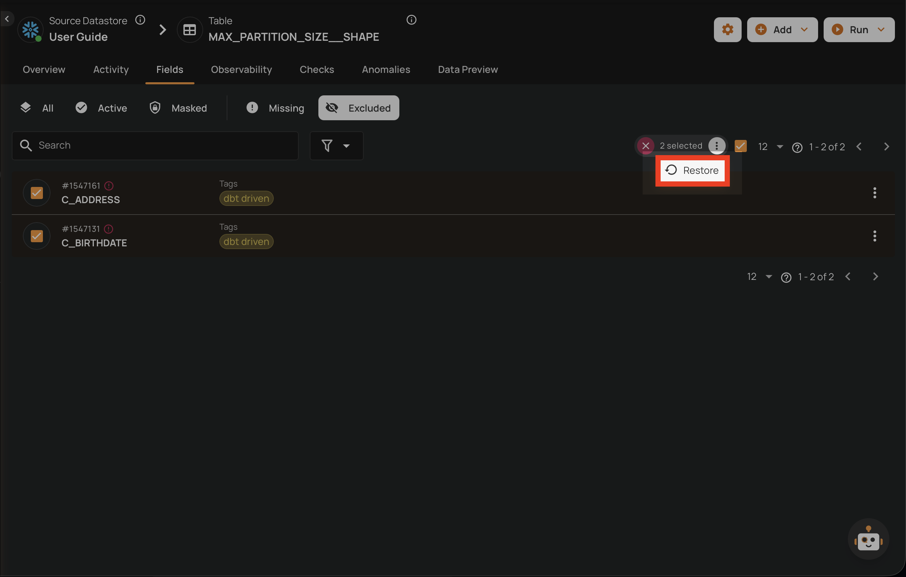
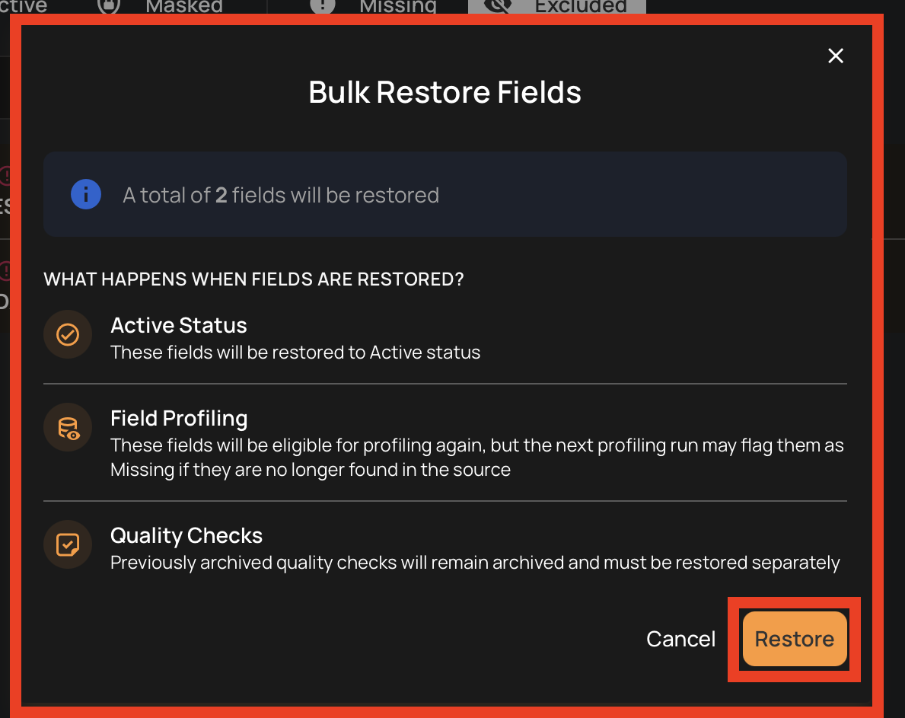

# Restore a Field

Restoring a field changes its status back to **Active**, making it available for profiling and scanning operations again. Only fields with **Excluded** status can be restored.

!!! tip
    To change a **Masked** field back to **Active**, use the [Unmask](mask-a-field.md#unmask-a-field) operation instead.

## What Happens When a Field is Restored

When you restore a field:

- **Active Status**: The field is restored to **Active** status
- **Field Profiling**: The field becomes eligible for profiling again (but may be flagged Missing if not found in the source)
- **Quality Checks**: Previously archived checks remain archived and must be restored separately

## Restore a Field

1. Navigate to the container's field listing.
2. Click the **Excluded** tab to view excluded fields.
3. Locate the field you want to restore.
4. Click the vertical ellipsis menu (**&vellip;**) on the field row.

5. Click the **Restore** option from the menu.

6. Confirm the restoration in the dialog.

!!! note
    Restoring a field makes it active for future profiling and scanning. However, previously archived quality checks are **not** automatically restored. You will need to manually re-enable any checks that were archived during exclusion.

!!! info
    **Missing** fields cannot be manually restored. They are automatically restored to **Active** when the field reappears in the source data during a subsequent profile operation.

## Bulk Restore

You can restore multiple fields at once from the container's field listing.

1. Navigate to the container's field listing.
2. Click the **Excluded** tab to view excluded fields.
3. Select the fields you want to restore by clicking the checkbox on each field row.

4. Click the **Restore** action in the selection toolbar that appears at the top.

5. Confirm the bulk restoration in the dialog.

!!! note
    Restoring fields in bulk follows the same rules as single restore: archived quality checks are **not** automatically restored, and computed fields can only be restored if all their source fields are active.

