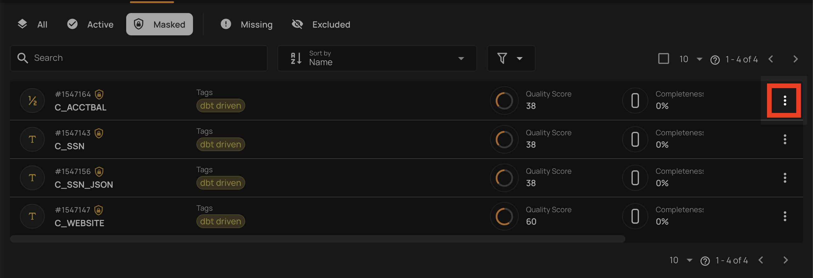
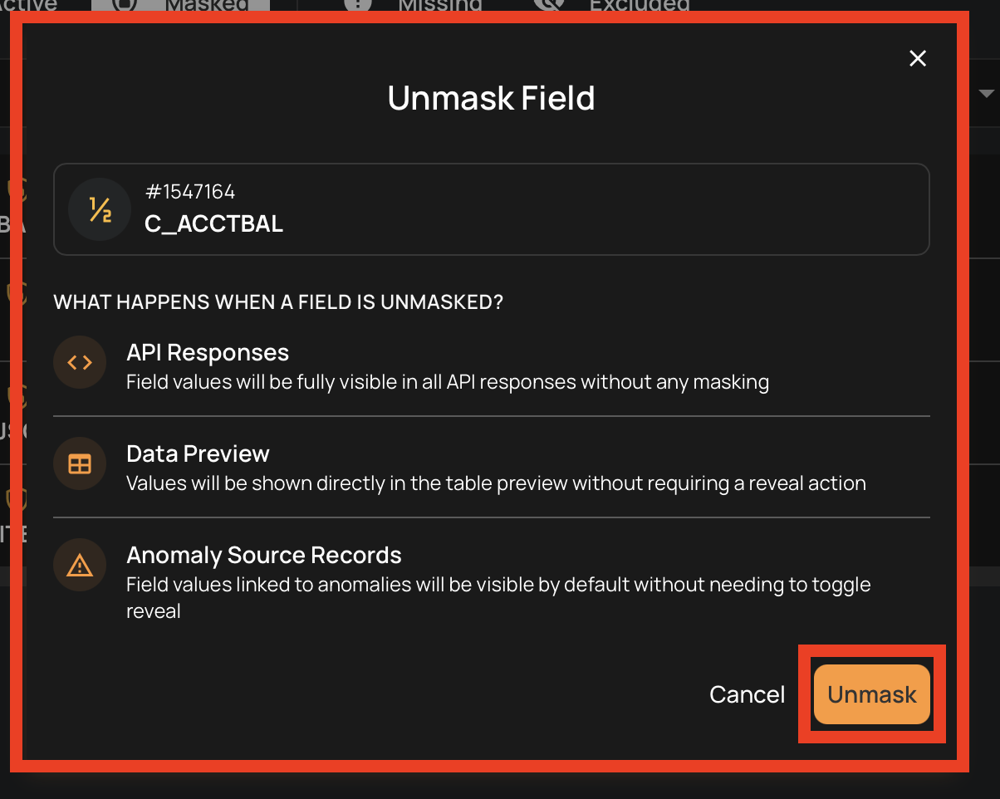
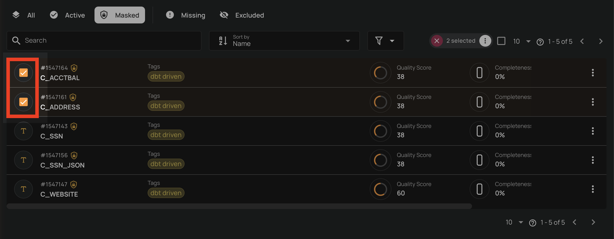
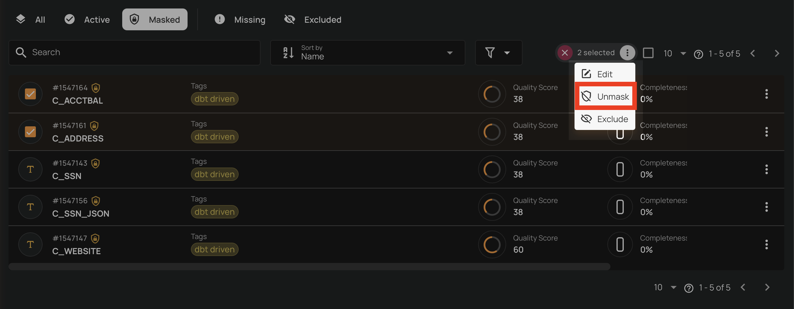

# Unmask a Field

Unmasking a field restores its actual values across the platform, making them visible without requiring explicit reveal actions.

!!! tip
    For a detailed explanation of what happens when a field is unmasked, platform behavior changes, and best practices, see [Field Masking — Unmasking a Field](../concepts/field-masking.md#unmasking-a-field){:target="_blank"}.

## Unmask from the Container View

1. Navigate to the container's field listing.
2. Click the **Masked** tab to view masked fields.
3. Locate the field you want to unmask.
4. Click the **vertical ellipsis :material-dots-vertical:** on the field row.

    

5. Click the **Unmask :material-shield-off-outline:** option from the menu.

    

6. Click the **Unmask** button to confirm the unmasking in the dialog.

    

## Unmask from the Field View

1. Navigate to the field's detail page by clicking on the field name in the container's field listing.
2. Click the **:material-cog:** button in the top-right corner of the field page.

    

3. Click the **Unmask :material-shield-off-outline:** option from the dropdown menu.

    

4. Click the **Unmask** button to confirm the unmasking in the dialog.

    

## Bulk Unmask

You can unmask multiple fields at once from the container's field listing.

1. Navigate to the container's field listing.
2. Click the **Masked** tab to view masked fields.
3. Select the fields you want to unmask by clicking the checkbox on each field row.

    

4. Click the **Unmask :material-shield-off-outline:** action in the selection toolbar that appears at the top.

    

5. Click the **Unmask** button to confirm the bulk unmasking in the dialog.

    
