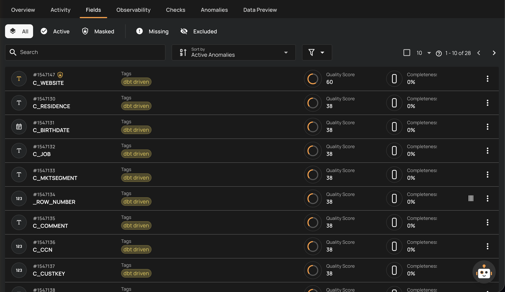

# Field Status Overview

Field Status is a core concept in Qualytics that tracks the lifecycle state of every field within your containers. Understanding field status helps you maintain control over which fields are actively monitored, protect sensitive data through masking, identify fields that may have changed in your source data, and manage your data quality checks more effectively.

## Why Field Status Matters

In data quality management, not every field in a dataset requires the same level of attention. Some fields are critical to business operations and must be continuously monitored, while others may become irrelevant over time or disappear from the source entirely. Some fields contain sensitive data that needs protection while still being quality-checked. Field Status gives you visibility into these changes and the tools to respond accordingly.

With Field Status, you can:

- **Monitor field availability**: Quickly identify when fields disappear from your source data after schema changes.
- **Protect sensitive data**: Mask field values while keeping quality monitoring fully operational.
- **Control quality check scope**: Focus your data quality checks on the fields that matter most by excluding irrelevant ones.
- **Reduce noise**: Prevent unnecessary anomaly alerts on fields that are no longer in use or are not relevant to your analysis.
- **Track field lifecycle**: Understand how your data schema evolves over time through status transitions.

## Key Concepts

- **Active** fields are fully operational — they are included in profiling (collecting metadata and statistics), scanning (detecting anomalies), and quality check evaluations.
- **Masked** fields work exactly like active fields but their actual values are hidden from view by default. Access to the real values is audit-logged.
- **Missing** fields were previously active but are no longer found in the source data. They are automatically restored if they reappear.
- **Excluded** fields have been manually removed from monitoring by a user. Their quality checks are archived and the field is hidden from default listings.

## API & FAQ

| Topic | Description |
| :--- | :--- |
| [Field Status API](concepts/field-status-api.md) | API endpoints for managing field status, viewing masked values, and accessing audit logs. |
| [Field Status FAQ](concepts/field-status-faq.md) | Answers to common questions about field status behavior. |

## Deep Dive

| Topic | Description |
| :--- | :--- |
| [Understanding Field Status](concepts/understanding-field-status.md) | Learn how field status works, its role in data quality, practical scenarios, and best practices. |
| [Status Types](concepts/field-status-types.md) | Detailed reference for all four statuses, how they are assigned, and visual indicators. |
| [Status Lifecycle](concepts/field-status-lifecycle.md) | Status transition diagram and details on what triggers each transition. |
| [Merge Fields](concepts/merge-fields.md) | How to combine a missing field with an active field after a column rename, preserving all history. |

## Managing Field Status

| Task | Description |
| :--- | :--- |
| [Filtering by Status](managing-field-status/filtering-by-status.md) | Use status tabs to find specific fields in Explore and Container views. |
| [Mask a Field](managing-field-status/mask-a-field.md) | Protect sensitive field values while maintaining quality monitoring. |
| [Exclude a Field](managing-field-status/exclude-a-field.md) | Remove a field from quality monitoring, including computed field cascade behavior. |
| [Restore a Field](managing-field-status/restore-a-field.md) | Bring an excluded field back to active monitoring. |
| [Delete a Field](managing-field-status/delete-a-field.md) | Permanently remove a missing or computed field. |
| [Merge Fields](managing-field-status/merge-fields.md) | Combine a missing field with an active field after a column rename, preserving all history. |
