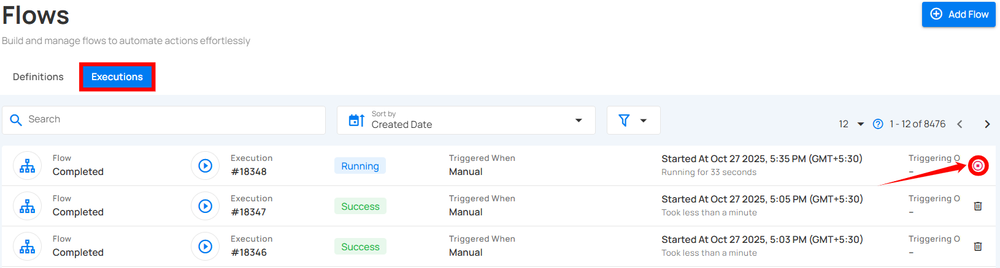

# Abort Flow

Users can abort a flow that is currently triggered or running to stop further execution.

## Abort Specific Flow

Aborting a specific flow allows you to immediately stop a single flow execution that is currently in progress.

**Step 1:** Open the flow execution that is currently in progress and select the **settings** icon.

**Step 2:** Click on the **abort** to stop the execution.

A success message appears confirming the flow is aborted.

Alternatively, you can abort the flow from the Executions tab by clicking the **Abort** icon.

## Abort Flow in Bulk

Aborting flows in bulk allows you to stop multiple running flow executions at once. This is useful when several executions need to be stopped at the same time.

**Step 1:** Hover over the executions list and select the **checkbox** next to the flow executions you want to abort.

When multiple executions are selected, an action toolbar appears showing the total number of selected executions along with available bulk actions.

**Step 3:** Click **Abort** from the action toolbar.

A confirmation prompt appears. Click **Abort** to confirm the action.

After aborting, a success message appears confirming that the selected flow executions have been aborted.