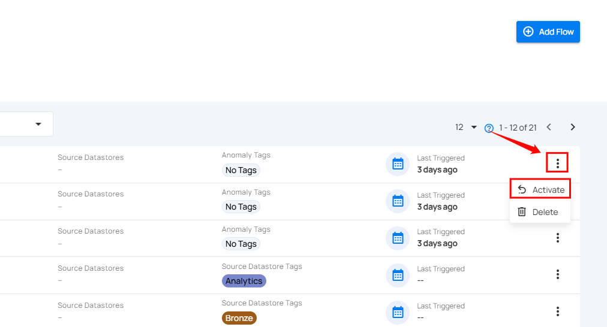

# Activate Flow

Users can reactivate a flow that was previously deactivated. Once reactivated, the flow’s triggers become active again, allowing it to run automatically based on the defined conditions.

**Step 1**: Click the **vertical ellipsis (⋮)** next to the flow that you want to activate, then click on **Activate** from the dropdown menu.

After clicking the **Activate** button, a success notification appears confirming the activation.
