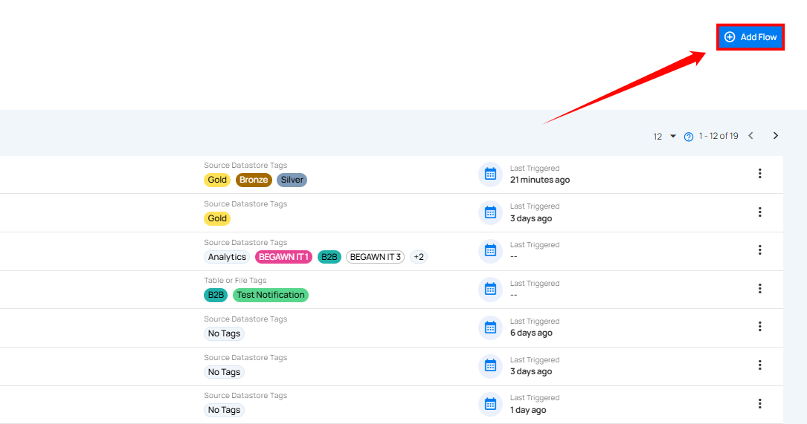

# Add Flow

**Step 1**: Click on the **Add Flow** button from the top right corner.

A modal window, **Add Flow**, will appear, providing options to create a flow. Each flow starts by default with two nodes: **Flow** and **Trigger**.

!!! note
    Once you add a flow, the base nodes are created. For detailed next steps, see the [Flows Documentation](../flows/flow-node.md) and for configuring triggers, refer to [Trigger Guide](../flows/trigger-node.md).