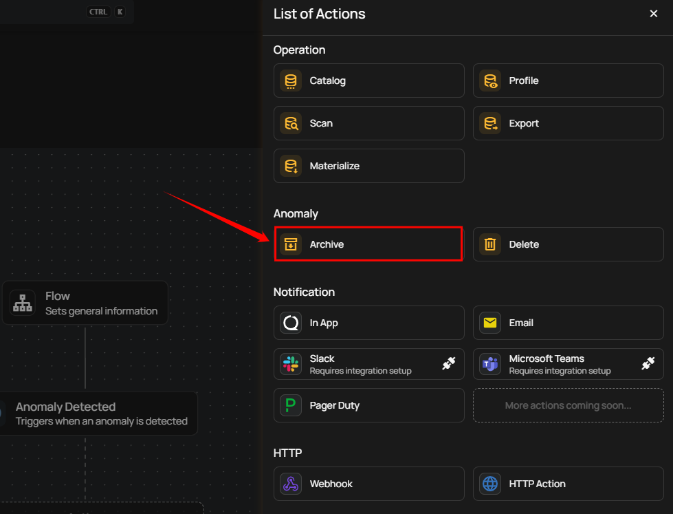
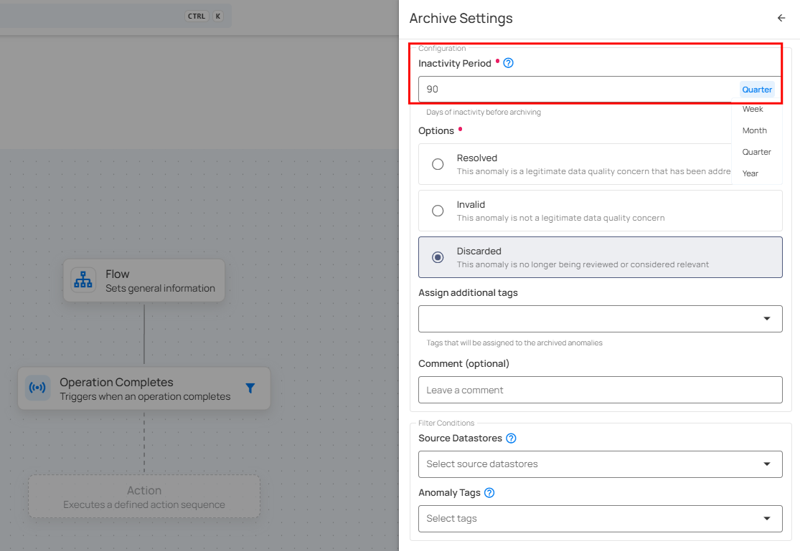
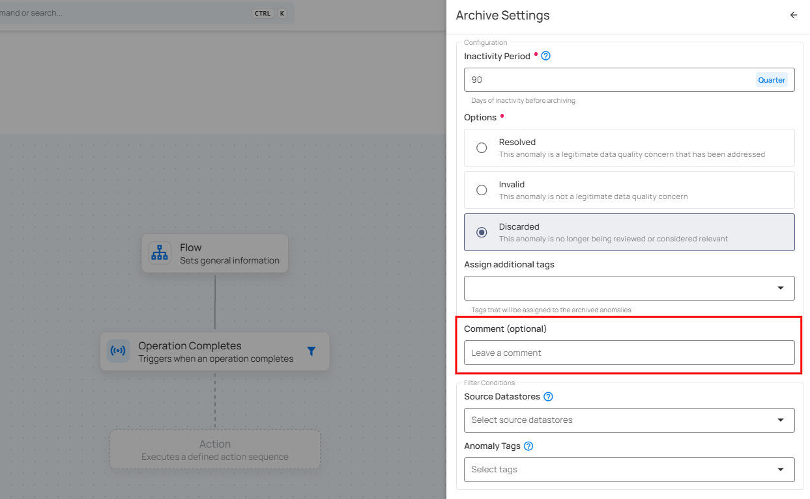
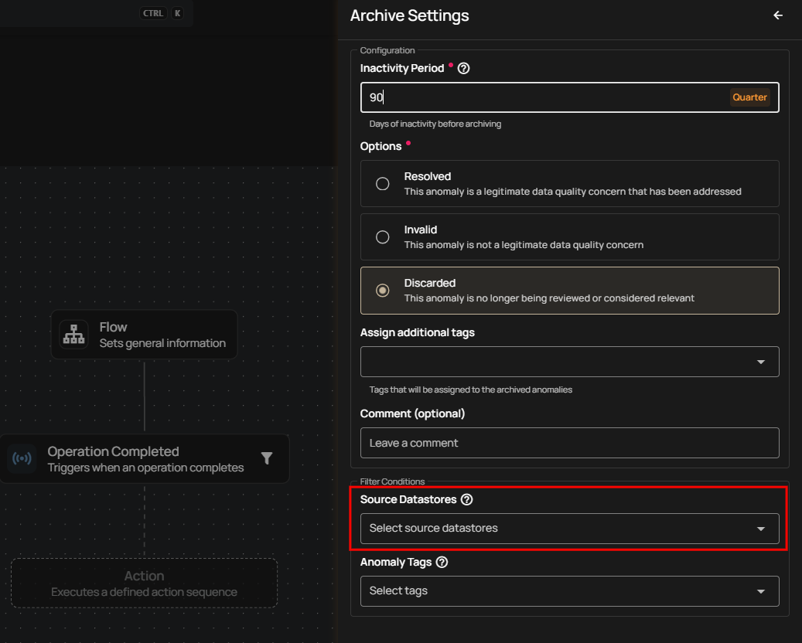

# Anomaly

Flows let you automate how anomalies are cleaned up over time. Under **Anomaly actions**, you can choose between two cleanup options:

- **Archive** → Move inactive anomalies out of the active queue  
- **Delete** → Permanently remove inactive anomalies  

Use these actions to keep your anomaly list lean, relevant, and manageable—without manually closing out each record.

## Archive

Use the **Archive** action to automatically move anomalies into an archived state when they’ve been inactive for a set amount of time. This is ideal for organizations that prefer to keep a historical record but don’t need old anomalies cluttering the active view.

### How It Works

The Archive action identifies anomalies with **no updates or comments** during the chosen **Inactivity Period** and archives them using the reason you specify.

> 💡 **Why archive instead of delete?**  
> Archiving lets you clean up the active queue without losing historical context.

#### Inactivity Period

Choose how long an anomaly must remain untouched before being archived.

Options include:

- Week
- Month
- Quarter
- Year

!!! note
    Anomalies are archived automatically if they have no updates or comments during the selected inactivity period.

#### Archive Reason

Define why these anomalies are being archived:

- **Resolved** — The anomaly represents a valid data quality issue that has been fixed.  
- **Invalid** — The anomaly wasn’t a legitimate issue.  
- **Discarded** — The anomaly is no longer relevant or under review. *(Most common for automation.)*

#### Assign Additional Tags 

Automatically apply tags to anomalies archived through this flow. Useful for labeling cleanup runs (e.g., `auto-archive-q4`).

#### Comment (Optional)

Provide a note that will appear on every archived anomaly, giving future reviewers context.

#### Filter Conditions 

You can narrow down **which anomalies** should be archived:

- **Source Datastores** — Archive anomalies from selected datastores only  
- **Anomaly Tags** — Archive anomalies labeled with specific tags  

##  Delete

The **Delete** action permanently removes anomalies after a set inactivity period. Use this when you don't need to retain historical anomaly records—e.g., for ephemeral data or noise cleanup.

!!! warning
    Delete permanently removes anomalies from the system. This cannot be undone.

### How It Works

The Delete action looks for anomalies that have had **no updates or comments** during the selected **Inactivity Period** and permanently removes them. This helps you clear out old or unnecessary anomalies that you no longer need.

> ⚠️ **Why delete instead of archive?**  
> Delete removes the anomaly completely, which is useful when you don’t need to keep any record of it.

#### Inactivity Period

Define how long an anomaly must remain inactive before deletion.

!!! note 
    Anomalies are deleted if they have no updates or comments during the selected inactivity period.

#### Source Datastores 

Delete anomalies originating from specific datastores.

#### Anomaly Statuses  

Target anomaly states such as:

- Active
- Acknowledged
- Resolved  
- Duplicate
- Invalid  
- Discarded  

#### Anomaly Tags  

Delete anomalies that carry specific tags (e.g., `test-data`, `noise`).

> 💡 Combine filters to delete only *very specific* anomaly types.

## 📘 When to Use Archive vs Delete

| Action | Best for | Keeps history? | Suitable for |
|--------|----------|----------------|--------------|
| **Archive** | Cleaning up long-ignored anomalies while retaining context | ✅ Yes | Audit needs, compliance workflows, long-term reference |
| **Delete** | Removing noise or temporary anomalies completely | ❌ No | Test data cleanup, non-critical anomalies, high-volume events |